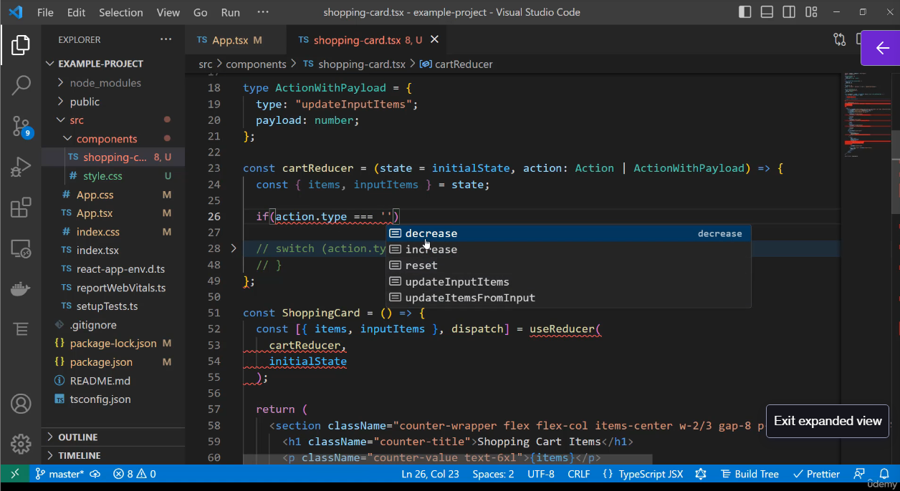
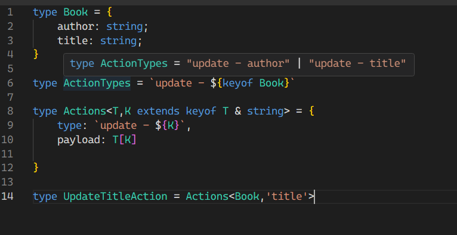
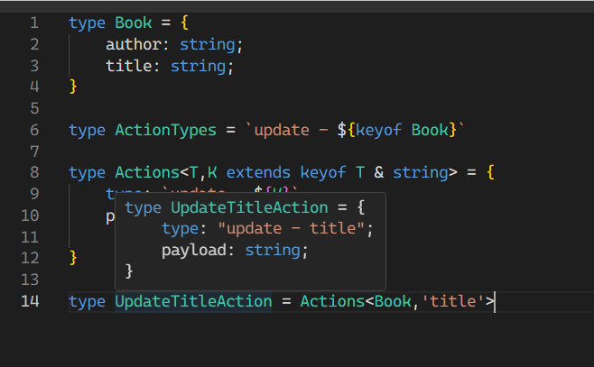
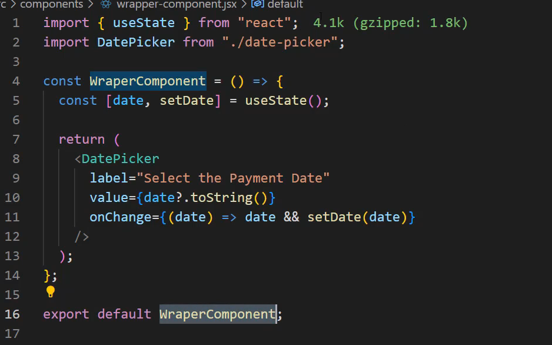
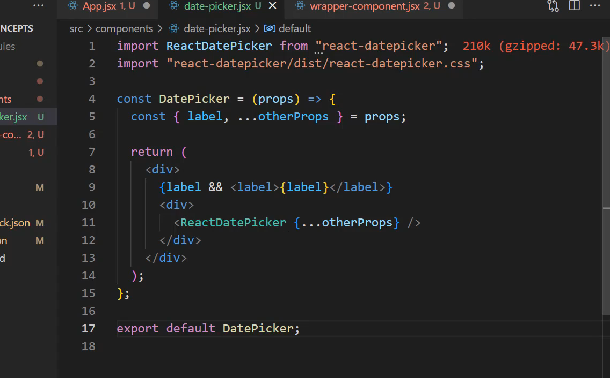

# useState with TypeScript Summary

This covers **TypeScript type handling** with useState, including automatic type inference and manual type definitions.

## Basic Type Inference

```typescript
// TypeScript automatically infers number type from initial value
const [items, setItems] = useState(0);  // items: number, setItems: (value: number) => void
```

TypeScript **automatically detects types** based on initial state - no explicit typing needed in simple cases.

## Manual Type Definition

### String or Number Union Type

```typescript
const [inputItems, setInputItems] = useState<string | number>(0);
// Now accepts both strings and numbers
```


### Common Input Handling Pattern

```typescript
const [inputValue, setInputValue] = useState<string | number>('');

// In onChange handler
<input 
  value={inputValue}
  onChange={(e) => setInputValue(e.target.value)} // string is accepted
/>
```


## Form Integration Example

```typescript
const ShoppingCart = () => {
  const [items, setItems] = useState(0);
  const [inputItems, setInputItems] = useState<string | number>(0);

  const handleSubmit = () => {
    setItems(Number(inputItems)); // Convert to number for state that expects number
  };

  useEffect(() => {
    setInputItems(items); // Sync input with main state
  }, [items]);

  return (
    <form onSubmit={handleSubmit}>
      <input 
        value={inputItems}
        onChange={(e) => setInputItems(e.target.value)}
      />
    </form>
  );
};
```


## Key Interview Points

### Type Inference Benefits

1. **Automatic detection** - TypeScript infers types from initial values
2. **Less boilerplate** - No explicit type annotations needed for simple cases
3. **Type safety** - Prevents incorrect type assignments

### When to Use Manual Types

- **Union types** - When state can hold multiple types (`string | number`)
- **Complex objects** - When initial value doesn't represent full type
- **Form inputs** - Where strings need to coexist with other types


### Input Handling Patterns

```typescript
// Method 1: Union type
const [value, setValue] = useState<string | number>('');
onChange={(e) => setValue(e.target.value)}

// Method 2: Convert on change  
const [value, setValue] = useState(0);
onChange={(e) => setValue(Number(e.target.value))}

// Method 3: HTML5 valueAsNumber
onChange={(e) => setValue(e.target.valueAsNumber)}
```


### Common Pitfalls

- **Empty string conversion** - `Number('')` returns `0`, not undefined
- **Type mismatches** - Passing string to number-only state
- **Form validation** - Need to handle invalid number conversions


### Best Practices

1. **Let TypeScript infer** when possible
2. **Use union types** for flexible input handling
3. **Convert types explicitly** when crossing boundaries
4. **Use `valueAsNumber`** for numeric inputs
5. **Sync related states** with useEffect

This demonstrates **practical TypeScript usage** with React hooks and **form handling patterns**.

# useState with Undefined Initial Values - TypeScript Summary

This covers handling **async data loading** with useState when initial values are unknown, demonstrating proper TypeScript typing for undefined states.

## The Problem with Async Data

```typescript
type Book = {
  id: string;
  title: string;
  author?: string;
};

// ❌ Problem: What initial value to use?
const [book, setBook] = useState(???); // Unknown until API responds
```


## Common Anti-Pattern

```typescript
// ❌ Bad: Using empty object as placeholder
const [book, setBook] = useState({
  title: '',
  author: ''
});

// Problems:
// 1. Loading check won't work: book is never falsy
// 2. TypeScript loses optional property information
// 3. Empty strings aren't the same as "no data"
```


## Correct TypeScript Solution

```typescript
// ✅ Good: Union type with undefined
const [book, setBook] = useState<Book | undefined>(undefined);

useEffect(() => {
  fetchRandomBook().then(setBook);
}, []);

// Now loading check works properly
if (!book) {
  return <Loader />;
}

return <BookComponent book={book} />;
```


## Key Interview Points

### Type Safety Benefits

1. **Explicit undefined handling** - Forces you to handle loading states
2. **Optional properties preserved** - TypeScript maintains `author?` optionality
3. **Runtime safety** - Prevents accessing properties on undefined

### Loading State Pattern

```typescript
const [data, setData] = useState<DataType | undefined>(undefined);
const [loading, setLoading] = useState(true);
const [error, setError] = useState<string | null>(null);

useEffect(() => {
  fetchData()
    .then(setData)
    .catch(err => setError(err.message))
    .finally(() => setLoading(false));
}, []);
```


### Alternative Approaches

```typescript
// Option 1: Separate loading state
const [book, setBook] = useState<Book | null>(null);
const [isLoading, setIsLoading] = useState(true);

// Option 2: Using optional chaining
const [book, setBook] = useState<Book | undefined>();
return <div>{book?.title}</div>; // Safe access

// Option 3: Default values where appropriate
const [books, setBooks] = useState<Book[]>([]); // Empty array is valid initial state
```


### Server Setup Context

- **Express.js backend** running on port 4000
- **Proxy configuration** in package.json: `"proxy": "http://localhost:4000"`
- **CORS handling** for frontend-backend communication
- **REST API endpoints** for CRUD operations


### Best Practices

1. **Use union types** with undefined for async data
2. **Handle loading states explicitly** with conditional rendering
3. **Separate loading/error states** for complex UIs
4. **Avoid empty object placeholders** - they break type safety
5. **Use optional chaining** for safe property access

This pattern is **essential for real-world applications** where data comes from APIs and demonstrates proper **async state management** with TypeScript.


# TypeScript React Exercise - Books Component

This covers implementing a **book list component** with proper TypeScript typing for forms, arrays, and event handlers.

## The Exercise Solution

### 1. State Setup with Array Typing

```typescript
type Book = {
  id: string;
  title: string;
  author?: string;
};

// Proper array typing for useState
const [books, setBooks] = useState<Book[]>([]);
const [count, setCount] = useState<number>(0);
```


### 2. Books Component Props Interface

```typescript
interface BooksProps {
  onSubmit: (e: React.FormEvent<HTMLFormElement>) => void;
  onChange: (e: React.ChangeEvent<HTMLInputElement>) => void;
  count: number;
  children: React.ReactNode; // For the books list
}

const Books: React.FC<BooksProps> = ({ onSubmit, onChange, count, children }) => {
  return (
    <form onSubmit={onSubmit}>
      <input 
        type="number" 
        value={count} 
        onChange={onChange} 
        placeholder="Number of books"
      />
      <button type="submit">Load Books</button>
      {children}
    </form>
  );
};
```


### 3. Main Component Implementation

```typescript
const App = () => {
  const [books, setBooks] = useState<Book[]>([]);
  const [count, setCount] = useState<number>(0);

  const handleSubmit = async (e: React.FormEvent<HTMLFormElement>) => {
    e.preventDefault();
    const fetchedBooks = await fetchBooks(count);
    setBooks(fetchedBooks);
  };

  const handleChange = (e: React.ChangeEvent<HTMLInputElement>) => {
    setCount(Number(e.target.value)); // Convert string to number
  };

  return (
    <Books onSubmit={handleSubmit} onChange={handleChange} count={count}>
      {books.map((book) => (
        <BookComponent key={book.id} title={book.title} author={book.author} />
      ))}
    </Books>
  );
};
```


## Key TypeScript Concepts

### Array State Typing

- **`useState<Book[]>([])`** - Explicitly type array of objects[^1]
- **Empty array initial value** - Valid for arrays unlike objects
- **Type inference** - TypeScript knows `.map()` gives `Book` objects


### Event Handler Typing

```typescript
// Form submission
onSubmit: (e: React.FormEvent<HTMLFormElement>) => void;

// Input changes  
onChange: (e: React.ChangeEvent<HTMLInputElement>) => void;
```


### Props Interface Best Practices

- **Explicit prop types** - Define interface for all component props[^2]
- **React.ReactNode** - Type for children prop
- **Function signatures** - Include parameter and return types[^3]


## Common Patterns

### String to Number Conversion

```typescript
// Option 1: Number constructor
const value = Number(e.target.value);

// Option 2: HTML5 valueAsNumber
const value = e.target.valueAsNumber;

// Option 3: parseInt for integers
const value = parseInt(e.target.value, 10);
```


### Async Data Fetching

```typescript
const handleSubmit = async (e: React.FormEvent<HTMLFormElement>) => {
  e.preventDefault();
  try {
    const data = await fetchBooks(count);
    setBooks(data);
  } catch (error) {
    console.error('Failed to fetch books:', error);
  }
};
```


## Interview Points to Remember

### TypeScript Benefits

1. **Compile-time safety** - Catches type errors before runtime
2. **IntelliSense support** - Better autocomplete and refactoring
3. **Interface contracts** - Clear component API definitions
4. **Type inference** - Reduces boilerplate in many cases[^4]

### React + TypeScript Patterns

- **Generic useState** - `useState<Type[]>()` for arrays
- **Event typing** - Specific event types for different elements[^5]
- **Props interfaces** - Define component contracts clearly
- **Children typing** - Use `React.ReactNode` for flexibility


### Form Handling Best Practices

- **Controlled components** - State drives input values
- **Event prevention** - `e.preventDefault()` for form submission[^6]
- **Type conversion** - Handle string inputs for numeric state
- **Error boundaries** - Handle async operation failures

This exercise demonstrates **real-world TypeScript usage** with React forms, state management, and component composition patterns essential for production applications.


# useState with Event Handlers - TypeScript Exercise Solution

This demonstrates implementing **form handling** and **event typing** in a React TypeScript application.

## Complete Solution

### State Setup with Number Typing

```typescript
const [books, setBooks] = useState<Book[]>([]);
const [count, setCount] = useState<number>(10); // Default value makes it type `number`
```


### Books Component Props Interface

```typescript
import React, { PropsWithChildren, FormEvent, ChangeEvent } from 'react';

type BooksProps = {
  count: number;
  onSubmit: (e: FormEvent<HTMLFormElement>) => void;
  onChange?: (e: ChangeEvent<HTMLInputElement>) => void;
};

const Books: React.FC<PropsWithChildren<BooksProps>> = ({ 
  count, 
  onSubmit, 
  onChange, 
  children 
}) => {
  return (
    <form onSubmit={onSubmit}>
      <input 
        type="number" 
        value={count} 
        onChange={onChange}
        placeholder="Number of books"
      />
      <button type="submit">Load Books</button>
      {children}
    </form>
  );
};
```


### Event Handler Implementation

```typescript
const App = () => {
  const [books, setBooks] = useState<Book[]>([]);
  const [count, setCount] = useState<number>(10);

  const handleSubmit = (e: FormEvent<HTMLFormElement>) => {
    e.preventDefault();
    fetchBooks(count).then(setBooks);
  };

  const handleChange = (e: ChangeEvent<HTMLInputElement>) => {
    setCount(e.target.valueAsNumber); // Or Number(e.target.value)
  };

  return (
    <Books count={count} onSubmit={handleSubmit} onChange={handleChange}>
      {books.map((book) => (
        <Book key={book.id} title={book.title} author={book.author} />
      ))}
    </Books>
  );
};
```


## Key TypeScript Concepts

### Event Handler Typing

- **`FormEvent<HTMLFormElement>`** - For form submissions[^1]
- **`ChangeEvent<HTMLInputElement>`** - For input changes[^2]
- **Generic typing** - Specify the element type for better type safety


### Props with Children Pattern

```typescript
// Method 1: Using PropsWithChildren utility
React.FC<PropsWithChildren<BooksProps>>

// Method 2: Manual children prop
type BooksProps = {
  children: React.ReactNode;
  // other props...
};
```


### Number Input Handling

```typescript
// Option 1: HTML5 valueAsNumber (preferred for number inputs)
setCount(e.target.valueAsNumber);

// Option 2: Number conversion
setCount(Number(e.target.value));

// Option 3: Plus operator
setCount(+e.target.value);
```


## Interview Points to Remember

### TypeScript Form Patterns

1. **Event typing specificity** - Use specific event types for different elements
2. **Optional props** - Use `?` for optional event handlers
3. **PropsWithChildren** - React utility type for components with children
4. **Value conversion** - Handle string-to-number conversion properly

### Performance Considerations

- **State location** - Count state could be in Books component to avoid parent re-renders
- **Event handler stability** - Use useCallback for complex handlers
- **Controlled components** - Value prop should match state


### Common TypeScript Patterns

```typescript
// Import event types
import { FormEvent, ChangeEvent } from 'react';

// Generic event handlers
onSubmit: (e: FormEvent<HTMLFormElement>) => void;
onChange: (e: ChangeEvent<HTMLInputElement>) => void;

// Array state typing
useState<Book[]>([]) // Empty array as initial value
```


### Best Practices

1. **Explicit typing** - Don't rely on `any` types
2. **Import event types** - Import from React for consistency
3. **Optional handlers** - Mark event handlers optional when appropriate
4. **Prevent default** - Always call `e.preventDefault()` in form handlers
5. **Error handling** - Consider async operation error states

This exercise demonstrates **practical TypeScript usage** with React forms, showing how to properly type event handlers and manage state in real-world applications.

# Component Refactoring with TypeScript - State Management Pattern

This demonstrates **refactoring component state** for better performance and using TypeScript's **reverse engineering** approach for type discovery.

## Refactoring for Performance

### Before: Parent State (Performance Issue)

```typescript
// App Component - causes unnecessary re-renders
const [count, setCount] = useState<number>(10);

<Books count={count} onSubmit={handleSubmit} onChange={handleChange}>
```


### After: Local State (Better Performance)

```typescript
// Books Component - state stays local
const Books = ({ setBooks }: BooksProps) => {
  const [count, setCount] = useState<number>(10);
  
  const handleSubmit = (e: FormEvent<HTMLFormElement>) => {
    e.preventDefault();
    fetchBooks(count).then(setBooks);
  };

  const handleChange = (e: ChangeEvent<HTMLInputElement>) => {
    setCount(e.target.valueAsNumber);
  };
  
  return (
    <form onSubmit={handleSubmit}>
      <input value={count} onChange={handleChange} />
      <button type="submit">Load Books</button>
    </form>
  );
};
```


## TypeScript Reverse Engineering Technique

### Finding Complex Types Through Hover

```typescript
// In App component, hover over setBooks to see its signature
const [books, setBooks] = useState<Book[]>([]);

// VS Code shows: React.Dispatch<React.SetStateAction<Book[]>>
// Copy this signature for props typing
```


### Using Discovered Types

```typescript
import { Book } from './types';

type BooksProps = {
  setBooks: React.Dispatch<React.SetStateAction<Book[]>>;
};
```


## Complete Refactored Solution

### Books Component with Local State

```typescript
import React, { useState, FormEvent, ChangeEvent } from 'react';
import { fetchBooks } from './api';
import { Book } from './types';

type BooksProps = {
  setBooks: React.Dispatch<React.SetStateAction<Book[]>>;
};

const Books: React.FC<BooksProps> = ({ setBooks }) => {
  const [count, setCount] = useState<number>(10);

  const handleSubmit = (e: FormEvent<HTMLFormElement>) => {
    e.preventDefault();
    fetchBooks(count).then(setBooks);
  };

  const handleChange = (e: ChangeEvent<HTMLInputElement>) => {
    setCount(e.target.valueAsNumber);
  };

  return (
    <form onSubmit={handleSubmit}>
      <input 
        type="number" 
        value={count} 
        onChange={handleChange} 
        placeholder="Number of books"
      />
      <button type="submit">Load Books</button>
    </form>
  );
};
```


### Simplified App Component

```typescript
const App = () => {
  const [books, setBooks] = useState<Book[]>([]);

  return (
    <div>
      <Books setBooks={setBooks} />
      {books.map(book => (
        <Book key={book.id} title={book.title} author={book.author} />
      ))}
    </div>
  );
};
```


## Key Interview Points

### Performance Benefits

1. **Reduced re-renders** - Parent doesn't re-render on input changes
2. **State isolation** - Count state stays where it's used
3. **Better component boundaries** - Each component manages its own concerns

### TypeScript Discovery Techniques

- **Hover inspection** - Use VS Code's hover to see inferred types
- **Reverse engineering** - Copy types from existing variables
- **IntelliSense utilization** - Let the editor guide type definitions
- **Type debugging** - Use TypeScript errors as learning opportunities


### Advanced TypeScript Patterns

```typescript
// React's built-in dispatcher type
React.Dispatch<React.SetStateAction<T>>

// State setter function signature
(value: T | ((prevState: T) => T)) => void

// Number input handling
e.target.valueAsNumber // Better than Number(e.target.value)
```


### Development Workflow Benefits

1. **Compile-time error detection** - Catch issues before runtime
2. **Editor integration** - Real-time feedback and suggestions
3. **Type safety** - Prevents common JavaScript errors
4. **Refactoring confidence** - Safe code changes with type checking

### Best Practices Learned

- **State co-location** - Keep state close to where it's used
- **Type discovery** - Use existing code to find proper types
- **Performance awareness** - Consider re-render implications
- **TypeScript adoption** - Start new projects with TypeScript from day one

This refactoring demonstrates **real-world TypeScript usage** and shows how **proper state management** combined with **TypeScript's tooling** leads to better performance and maintainability.

# useRef Hook TypeScript Patterns Summary

This covers **proper TypeScript typing** for useRef hook, which can be tricky due to its multiple overloads and implementation details.

## Two Main useRef Patterns

### 1. DOM Element References (Immutable)

```typescript
// ✅ Correct: Specify element type with null initial value
const inputRef = useRef<HTMLInputElement>(null);

// Usage in JSX
<input ref={inputRef} />

// Accessing DOM methods (null-safe)
inputRef.current?.focus();
```


### 2. Mutable Value Storage

```typescript
// ✅ Method 1: Initialize with actual value
const mutableRef = useRef<number>(0);
mutableRef.current = 42; // Mutable

// ✅ Method 2: Specify type with undefined
const mutableRef = useRef<number | undefined>(undefined);
mutableRef.current = 42;

// ✅ Method 3: TypeScript inference
const mutableRef = useRef(0); // Inferred as MutableRefObject<number>
```


## Common TypeScript Issues \& Solutions

### Problem: Cannot Pass Undefined

```typescript
// ❌ Error: Argument of type 'undefined' is not assignable
const inputRef = useRef<HTMLInputElement>(undefined);

// ✅ Solution: Use null for DOM references
const inputRef = useRef<HTMLInputElement>(null);
```


### Problem: Read-Only Current Property

```typescript
// ❌ This creates read-only ref when initialized with null
const mutableRef = useRef<number>(null);
// mutableRef.current = 42; // Error: Cannot assign to read-only property

// ✅ Solution: Initialize with actual value or undefined
const mutableRef = useRef<number>(0);
const mutableRef2 = useRef<number | undefined>(undefined);
```


## useRef Type Definitions (Simplified)

```typescript
// Three overloads in React types:
function useRef<T>(initialValue: T): MutableRefObject<T>;
function useRef<T>(initialValue: T | null): RefObject<T>;  
function useRef<T = undefined>(): MutableRefObject<T | undefined>;

// RefObject vs MutableRefObject
interface RefObject<T> {
  readonly current: T | null; // Read-only
}

interface MutableRefObject<T> {
  current: T; // Mutable
}
```


## Common HTML Element Types

```typescript
// Input elements
const inputRef = useRef<HTMLInputElement>(null);
const textareaRef = useRef<HTMLTextAreaElement>(null);

// Common elements
const divRef = useRef<HTMLDivElement>(null);
const buttonRef = useRef<HTMLButtonElement>(null);
const formRef = useRef<HTMLFormElement>(null);

// Generic element (when unsure)
const elementRef = useRef<HTMLElement>(null);
```


## Practical Usage Patterns

### DOM Manipulation

```typescript
const inputRef = useRef<HTMLInputElement>(null);

const focusInput = () => {
  inputRef.current?.focus(); // Optional chaining for null safety
};

const getValue = () => {
  return inputRef.current?.value || '';
};
```


### Mutable Values (Alternative to State)

```typescript
const countRef = useRef<number>(0);
const timerRef = useRef<NodeJS.Timeout>();

useEffect(() => {
  timerRef.current = setInterval(() => {
    countRef.current += 1;
    console.log(countRef.current);
  }, 1000);

  return () => {
    if (timerRef.current) {
      clearInterval(timerRef.current);
    }
  };
}, []);
```


## Interview Points to Remember

### Key Concepts

1. **Two ref types** - RefObject (read-only) vs MutableRefObject (mutable)
2. **Null initialization** - Required for DOM element references
3. **Optional chaining** - Always use `?.` when accessing DOM refs
4. **Type specification** - Specify HTML element type for better IntelliSense

### Common Patterns

- **DOM refs**: `useRef<HTMLElementType>(null)`
- **Mutable values**: `useRef<Type>(initialValue)` or `useRef<Type | undefined>(undefined)`
- **Timer refs**: `useRef<NodeJS.Timeout>()` for setTimeout/setInterval


### Best Practices

1. **Always null-check DOM refs** before accessing properties
2. **Initialize mutable refs with values** to avoid read-only issues
3. **Use specific HTML element types** for better autocomplete
4. **Cleanup timer refs** in useEffect cleanup functions

This pattern is **essential for DOM manipulation** and **performance optimizations** in React applications, showing mastery of TypeScript's complex type system.

# Custom Hooks TypeScript - Tuple vs Array Return Types

This demonstrates a common TypeScript issue with **custom hooks returning arrays** and the solution using **const assertions**.

## The Problem: Array vs Tuple Return Types

### Custom Hook with Array Return (Problematic)

```typescript
const useURL = () => {
  const [url, setUrl] = useState<string>('');
  
  // ❌ Returns array type - TypeScript sees this as mutable array
  return [url, setUrl];
};

// Usage
const [url, setUrl] = useURL();
// url has type: string | Dispatch<SetStateAction<string>>  ❌
// setUrl has type: string | Dispatch<SetStateAction<string>>  ❌
```


### Why This Happens

When returning an array, TypeScript assumes:

- **Array might be modified** - elements could be pushed, popped, reordered
- **Union type inference** - All elements get combined into union type
- **Loss of positional information** - Can't distinguish between url and setter


## The Solution: Const Assertion

```typescript
const useURL = () => {
  const [url, setUrl] = useState<string>('');
  
  // ✅ Use 'as const' to create tuple type
  return [url, setUrl] as const;
};

// Usage - now properly typed!
const [url, setUrl] = useURL();
// url has type: string  ✅
// setUrl has type: Dispatch<SetStateAction<string>>  ✅

// String methods now work
url.toLowerCase(); // ✅ Autocomplete works
url.match(/pattern/); // ✅ All string methods available
```


## Alternative Solutions

### Explicit Tuple Type

```typescript
const useURL = (): [string, Dispatch<SetStateAction<string>>] => {
  const [url, setUrl] = useState<string>('');
  return [url, setUrl];
};
```


### Object Return (Alternative Pattern)

```typescript
const useURL = () => {
  const [url, setUrl] = useState<string>('');
  
  return { url, setUrl }; // No const assertion needed
};

// Usage
const { url, setUrl } = useURL();
```


## Const Assertion Deep Dive

### What `as const` Does

```typescript
// Without as const
const arr = [1, 'hello']; 
// Type: (string | number)[]

// With as const  
const tuple = [1, 'hello'] as const;
// Type: readonly [1, 'hello']
```


### Benefits of Const Assertion

1. **Immutable types** - Array becomes readonly tuple
2. **Literal types** - Values become literal types instead of general types
3. **Positional preservation** - Each position maintains its specific type
4. **Better IntelliSense** - Proper autocomplete and type checking

## Interview Points to Remember

### Key Concepts

1. **Array vs Tuple** - Arrays are mutable, tuples have fixed structure
2. **Union type issues** - Array elements get combined into union types
3. **Const assertion** - `as const` converts arrays to readonly tuples
4. **Custom hook patterns** - Follow React's tuple return convention

### Common Patterns

```typescript
// React hooks pattern (tuple return)
const useCustomHook = () => {
  // ... hook logic
  return [value, setValue] as const;
};

// Alternative object pattern
const useCustomHook = () => {
  // ... hook logic  
  return { value, setValue };
};
```


### When to Use Each Pattern

- **Tuple return** - Following React convention (useState, useReducer style)
- **Object return** - When you have many values or want named properties
- **Const assertion** - Essential for tuple returns in custom hooks


### Best Practices

1. **Always use `as const`** for tuple returns in custom hooks
2. **Consider object returns** for hooks with multiple values
3. **Maintain consistency** with React's built-in hook patterns
4. **Test your types** by checking autocomplete in your IDE

This pattern is **fundamental for custom hook development** and shows understanding of **advanced TypeScript type inference** and **React patterns**.

# Custom Hooks with Union Types - TypeScript Summary

This demonstrates **strongly typing custom hooks** with **union types** for better state management and autocomplete support.

## The Problem: String-based State

```typescript
// ❌ Problematic: Using generic string type
const useUser = (src: string) => {
  const [state, setState] = useState('fetching'); // Type: string
  
  useEffect(() => {
    setState('fetching');
    fetch(src)
      .then(data => {
        if (!aborted) setState('fetched'); // Any string allowed
      })
      .catch(() => setState('error'));
  }, [src]);
  
  return state; // Type: string - no autocomplete
};

// Usage - no type safety
const state = useUser('/api/user');
if (state === 'fetcing') { } // Typo not caught!
```


## The Solution: Union Type State

```typescript
// ✅ Solution: Define explicit union type
type UserState = 'fetching' | 'fetched' | 'error';

const useUser = (src: string) => {
  const [state, setState] = useState<UserState>('fetching');
  
  useEffect(() => {
    setState('fetching');
    fetch(src)
      .then(data => {
        if (!aborted) setState('fetched'); // Only valid states allowed
      })
      .catch(() => setState('error'));
  }, [src]);
  
  return state; // Type: UserState - full autocomplete
};

// Usage - with type safety
const state = useUser('/api/user');
if (state === 'fetching') { } // Autocomplete + typo detection
```


## Advanced Custom Hook Pattern

```typescript
type LoadingState = 'idle' | 'loading' | 'success' | 'error';

interface UseAsyncResult<T> {
  data: T | null;
  status: LoadingState;
  error: string | null;
}

const useAsync = <T>(asyncFn: () => Promise<T>): UseAsyncResult<T> => {
  const [status, setStatus] = useState<LoadingState>('idle');
  const [data, setData] = useState<T | null>(null);
  const [error, setError] = useState<string | null>(null);

  const execute = useCallback(async () => {
    setStatus('loading');
    setData(null);
    setError(null);

    try {
      const result = await asyncFn();
      setData(result);
      setStatus('success');
    } catch (err) {
      setError(err instanceof Error ? err.message : 'Unknown error');
      setStatus('error');
    }
  }, [asyncFn]);

  return { data, status, error, execute } as const;
};
```


## Key TypeScript Benefits

### Autocomplete and IntelliSense

```typescript
const state = useUser('/api/user');

// ✅ Autocomplete shows: 'fetching' | 'fetched' | 'error'
if (state === '...') { }

// ✅ TypeScript catches typos
if (state === 'fetcing') { } // Error: Did you mean 'fetching'?
```


### Exhaustive Pattern Matching

```typescript
const renderState = (state: UserState) => {
  switch (state) {
    case 'fetching': return <Spinner />;
    case 'fetched': return <UserData />;
    case 'error': return <ErrorMessage />;
    // TypeScript ensures all cases are handled
  }
};
```


## Interview Points to Remember

### Union Type Benefits

1. **Type safety** - Only valid states allowed
2. **Autocomplete** - IDE shows available options
3. **Typo detection** - Catches string literal mistakes
4. **Exhaustive checking** - Ensures all cases handled

### Custom Hook Patterns

- **Define state types explicitly** - Don't rely on string inference
- **Use const assertions** for tuple returns
- **Generic types** for reusable hooks
- **Interface returns** for complex state objects


### Best Practices

```typescript
// ✅ Good: Explicit union types
type Status = 'loading' | 'success' | 'error';
const [status, setStatus] = useState<Status>('loading');

// ✅ Good: Generic hooks for reusability
const useAsync = <T>(fn: () => Promise<T>) => { ... };

// ✅ Good: Interface for complex returns
interface UseUserResult {
  user: User | null;
  loading: boolean;
  error: string | null;
}
```


### Common Use Cases

- **API states** - loading, success, error states
- **Form validation** - valid, invalid, pending states
- **Theme modes** - light, dark, auto modes
- **User permissions** - admin, user, guest roles

This pattern is **essential for robust custom hooks** and demonstrates **advanced TypeScript usage** for state management in React applications.

# Complex Union Types in Custom Hooks - TypeScript Summary

This demonstrates **discriminated unions** for typing complex state objects with different shapes based on status values.

## The Problem: Object State with Varying Properties

```typescript
// ❌ Problematic: Generic object type
const useUser = (src: string) => {
  const [state, setState] = useState({ status: 'fetching' }); // Type too generic
  
  useEffect(() => {
    fetch(src)
      .then(data => setState({ status: 'fetched' }))
      .catch(error => setState({ status: 'error', error })); // Error: 'error' doesn't exist on type
  }, [src]);
  
  return state;
};
```


## The Solution: Discriminated Union Types

```typescript
// ✅ Solution: Define discriminated union type
type UserState = 
  | { status: 'fetching' }
  | { status: 'fetched' }  
  | { status: 'error'; error: Error };

const useUser = (src: string) => {
  const [state, setState] = useState<UserState>({ status: 'fetching' });
  
  useEffect(() => {
    setState({ status: 'fetching' });
    
    fetch(src)
      .then(data => {
        setState({ status: 'fetched' }); // ✅ Valid shape
      })
      .catch(error => {
        setState({ status: 'error', error }); // ✅ Error property allowed
      });
  }, [src]);
  
  return state;
};
```


## Advanced Pattern: Data + Status Union

```typescript
type AsyncState<T> = 
  | { status: 'idle' }
  | { status: 'loading' } 
  | { status: 'success'; data: T }
  | { status: 'error'; error: string };

const useAsyncData = <T>(fetchFn: () => Promise<T>) => {
  const [state, setState] = useState<AsyncState<T>>({ status: 'idle' });
  
  const execute = async () => {
    setState({ status: 'loading' });
    
    try {
      const data = await fetchFn();
      setState({ status: 'success', data });
    } catch (error) {
      setState({ 
        status: 'error', 
        error: error instanceof Error ? error.message : 'Unknown error'
      });
    }
  };
  
  return [state, execute] as const;
};
```


## Type-Safe Pattern Matching

```typescript
const UserComponent = () => {
  const state = useUser('/api/user');
  
  // ✅ TypeScript enforces exhaustive checking
  switch (state.status) {
    case 'fetching':
      return <Loading />;
      
    case 'fetched':  
      return <UserData />; // state is guaranteed to have no error
      
    case 'error':
      return <Error message={state.error.message} />; // state.error exists
      
    default:
      // TypeScript ensures this is unreachable
      const exhaustive: never = state;
      return null;
  }
};
```


## Key Interview Points

### Discriminated Union Benefits

1. **Type safety** - Each branch has correct properties
2. **Exhaustive checking** - TypeScript ensures all cases handled
3. **Intelligent narrowing** - Properties available based on discriminator
4. **Runtime safety** - Prevents accessing undefined properties

### Common Patterns

```typescript
// API Response State
type ApiState<T> = 
  | { loading: true }
  | { loading: false; data: T }
  | { loading: false; error: string };

// Form Validation State  
type ValidationState = 
  | { isValid: true; data: FormData }
  | { isValid: false; errors: string[] };

// Authentication State
type AuthState = 
  | { authenticated: false }
  | { authenticated: true; user: User; token: string };
```


### Advanced Techniques

- **Generic discriminated unions** - Reusable across different data types
- **Nested unions** - Complex state hierarchies
- **Type guards** - Runtime type checking functions
- **Const assertions** - Ensuring literal types for discriminators


### Best Practices

1. **Use descriptive discriminator properties** - `status`, `type`, `kind`
2. **Keep unions flat when possible** - Avoid deep nesting
3. **Provide exhaustive handling** - Use `never` type for unreachable cases
4. **Generic unions for reusability** - Template patterns for common use cases

This pattern is **essential for complex state management** and demonstrates **advanced TypeScript type system usage** for building robust, type-safe React applications.


# Generic Discriminated Unions with Tuples - TypeScript Summary

This demonstrates **advanced tuple typing** with **discriminated unions** where array elements are **correlated** - the first element determines the type of the second element.

## The Problem: Uncorrelated Tuple Types

```typescript
// ❌ Problematic: Elements not correlated
const useUser = <T>(url: string): [string, T | undefined | Error] => {
  // Implementation...
  return [status, data]; // Any combination allowed
};

// Usage - no type correlation
const [status, value] = useUser<User>('/api/user');
if (status === 'error') {
  console.log(value.message); // ❌ Error: message doesn't exist on T | undefined | Error
}
```


## The Solution: Correlated Tuple Union Types

```typescript
// ✅ Solution: Discriminated union of tuples
type UseUserResult<T> = 
  | ['fetching', undefined?]     // Optional undefined for fetching state
  | ['success', T]               // Success must have data of type T
  | ['error', Error];            // Error must have Error object

const useUser = <T>(url: string): UseUserResult<T> => {
  const [status, setStatus] = useState<'fetching' | 'success' | 'error'>('fetching');
  const [data, setData] = useState<T | undefined | Error>();
  
  useEffect(() => {
    setStatus('fetching');
    fetch(url)
      .then(response => response.json())
      .then((result: T) => {
        setStatus('success');
        setData(result);
      })
      .catch((error: Error) => {
        setStatus('error');  
        setData(error);
      });
  }, [url]);
  
  if (status === 'fetching') return ['fetching'];
  if (status === 'success') return ['success', data as T];
  return ['error', data as Error];
};
```


## Type-Safe Destructuring

```typescript
const UserComponent = () => {
  const [status, value] = useUser<User>('/api/user');
  
  // ✅ TypeScript knows value type based on status
  if (status === 'fetching') {
    // value is undefined (or not present)
    return <Loading />;
  }
  
  if (status === 'success') {
    // value is definitely User type
    return <div>Welcome {value.name}!</div>;
  }
  
  if (status === 'error') {
    // value is definitely Error type  
    return <div>Error: {value.message}</div>;
  }
};
```


## Advanced Pattern: Multiple Data Types

```typescript
type AsyncResult<T, E = Error> = 
  | ['idle']
  | ['loading'] 
  | ['success', T]
  | ['error', E];

// Usage with custom error type
type ApiError = { code: number; message: string };
const result: AsyncResult<User[], ApiError> = await fetchUsers();

const [status, data] = result;
if (status === 'error') {
  console.log(data.code); // ✅ data is ApiError type
}
```


## Key Interview Points

### Correlated Types Benefits

1. **Type correlation** - First element determines second element type
2. **Automatic narrowing** - TypeScript infers types from destructuring
3. **Compile-time safety** - Impossible to access wrong properties
4. **Clean API** - Single destructure gives both status and data

### Advanced TypeScript Features

- **Generic discriminated unions** - Templates that work with any data type
- **Optional tuple elements** - `undefined?` for optional values
- **Type narrowing** - TypeScript tracks which branch you're in
- **Tuple vs array distinction** - Fixed-length, ordered types


### Practical Applications

```typescript
// HTTP Response handling
type HttpResult<T> = 
  | ['loading']
  | ['success', T, number] // data + status code
  | ['error', string, number]; // message + status code

// Form validation
type ValidationResult<T> = 
  | ['valid', T]
  | ['invalid', string[]]; // array of error messages

// Database operations
type DbResult<T> = 
  | ['pending']
  | ['success', T, { timestamp: Date }]
  | ['error', { code: string; details: string }];
```


### Best Practices

1. **Use meaningful status strings** - Clear discriminator values
2. **Optional elements for empty states** - `undefined?` for no-data states
3. **Generic error types** - Allow customization of error shapes
4. **Consistent ordering** - Status first, then data/error
5. **Document correlation** - Comment which status goes with which data

This pattern shows **mastery of advanced TypeScript** and is essential for building **type-safe async state management** in React applications.

# TypeScript Discriminated Union with Tuples - Beginner's Guide

This is a great example of a **discriminated union with tuples** in TypeScript - a powerful pattern that creates type-safe APIs! Let me break it down:

## What's Happening

**The Type Definition:**
```typescript
type UseUserResult<T> = 
  | ['fetching', undefined?]     // Tuple: [status, no data yet]
  | ['success', T]               // Tuple: [status, user data]
  | ['error', Error];            // Tuple: [status, error object]
```

This creates three possible return states, each as a **tuple** (fixed-length array):
- When fetching: `['fetching']` or `['fetching', undefined]`
- When successful: `['success', userData]`
- When failed: `['error', errorObject]`

**The Hook Implementation:**
The `useUser` hook manages an API call and returns one of these three states based on what's happening with the request.

## Why This Pattern is Useful

**1. Type Safety at Compile Time**
```typescript
const [status, data] = useUser<User>('/api/user');

if (status === 'success') {
  // TypeScript KNOWS data is of type User here
  console.log(data.name); // ✅ Safe!
}

if (status === 'error') {
  // TypeScript KNOWS data is an Error here  
  console.log(data.message); // ✅ Safe!
}
```

**2. Impossible Invalid States**
Without this pattern, you might have:
```typescript
// ❌ Bad: Can have invalid combinations
{ loading: true, data: someUser, error: null }  // Loading but has data??
{ loading: false, data: null, error: null }     // Not loading but no data or error??
```

With discriminated unions, invalid states literally cannot exist in TypeScript.

**3. Exhaustive Checking**
TypeScript ensures you handle all possible cases:
```typescript
const [status, data] = useUser<User>('/api/user');

switch (status) {
  case 'fetching': 
    return <Spinner />;
  case 'success': 
    return <UserProfile user={data} />; // data is guaranteed to be User
  case 'error':
    return <ErrorMessage error={data} />; // data is guaranteed to be Error
  // TypeScript will error if you forget a case!
}
```

## Key Benefits for Beginners

1. **Prevents bugs** - TypeScript catches type mismatches before runtime
2. **Self-documenting** - The type tells you exactly what to expect
3. **Great autocomplete** - Your editor knows what properties are available
4. **Refactoring safety** - Changes to the type automatically update everywhere it's used

This pattern is commonly used in modern React apps for handling async operations safely!


# Using Typescript with useReducer

The transcript discusses using `useReducer` in React, specifically for a shopping cart example. The focus is on problems caused by **not using TypeScript for type safety** and how TypeScript helps avoid bugs in the reducer logic.

### Key Points

- **useReducer Setup:**
    - You have a reducer function that handles actions like "INCREASE", "DECREASE", "RESET", etc.
    - Actions are objects that describe how to update state (for example: `{ type: "INCREASE" }`).
- **Problems Without TypeScript:**
    - If you misspell an action type (e.g., writing `"INCREASES"` instead of `"INCREASE"`), you won't get any warning. The app may just freeze or not work as expected.
    - The reducer’s action parameter was typed as `any`, so TypeScript can't catch mistakes.
- **Why TypeScript Helps:**
    - If you use TypeScript and define all your action types, TypeScript yells if you mistype.
        - Example:

```typescript
type Action = { type: 'INCREASE' } | { type: 'DECREASE' } | { type: 'RESET' }
```

    - If an action needs extra data (payload), make a separate type:
        - Example:

```typescript
type ActionWithPayload = { type: 'UPDATE_ITEMS', payload: number }
```

        - Combine them:

```typescript
type CartAction = Action | ActionWithPayload;
```

    - Now, if you dispatch an action without the right type or without a payload, TypeScript gives an error before running code.
- **Real-World Example:**
    - If reducer expects `payload: number` but you accidentally send `payload: "abc"`, TypeScript will stop you.
    - In a big codebase, auto-complete helps you pick only valid action types, reducing chance of typos.
- **Fixes in Code:**
    - When using an action with a payload, ensure data type matches (like converting input value to a number).
    - TypeScript even checks which actions require a payload and which do not.

***
- 

### Example for Interviews

Suppose you have a shopping cart reducer:

```typescript
type CartAction =
  | { type: 'INCREASE' }
  | { type: 'DECREASE' }
  | { type: 'RESET' }
  | { type: 'UPDATE_ITEMS'; payload: number };

function cartReducer(state, action: CartAction) {
  switch (action.type) {
    case 'INCREASE':
      return { ...state, items: state.items + 1 };
    case 'UPDATE_ITEMS':
      return { ...state, items: action.payload };
    // ... more cases
    default:
      return state;
  }
}
```

- You get **type-checking** on which actions need payloads, and TypeScript auto-completes valid types.
- Typos or mistakes (like missing payload or wrong type) cause errors at compile time, before the app runs.

***

## **Summary**

- Using `useReducer` with plain JavaScript can lead to silent bugs from typos and bad payloads.
- TypeScript lets you define and enforce reducer action types and payloads, catching mistakes early.
- This makes your code safer and easier to maintain, especially in larger projects.
- **Always type your actions and state when using reducers!** This is a key best practice in React with TypeScript.

## Passing dispatch function as a prop

This transcript explains how to use a reducer with TypeScript in a React app to manage a color picker, and how to pass the `dispatch` function as a prop.

### Key Points

- **Building a Color Picker app**:
  - Users can pick a color (as hex or RGB) and save it.
- **State Management with useReducer:**
  - Instead of using `useState`, the code uses `useReducer` for managing the color state.
  - The reducer has two actions (what can change the state):
    - `UPDATE_HEX`: Changes the color using a hex code
    - `UPDATE_RGB`: Changes the color using an array with RGB (Red, Green, Blue) values
- **Action Type Definitions with TypeScript:**
  - Actions are strongly typed.

```typescript
type UpdateHexAction = { type: "UPDATE_HEX"; payload: { hexColor: string } }
type UpdateRGBAction = { type: "UPDATE_RGB"; payload: { rgb: [number, number, number] } }
type ColorAction = UpdateHexAction | UpdateRGBAction;
```

    - If you make a typo in an action type or payload, TypeScript catches it.
- **Reducer Function Example:**

```typescript
function colorReducer(state: ColorState, action: ColorAction): ColorState {
  if (action.type === "UPDATE_HEX") {
    return { ...state, hexColor: action.payload.hexColor }
  }
  if (action.type === "UPDATE_RGB") {
    // Convert RGB to Hex using a library and update state
    const hexColor = rgbToHex(action.payload.rgb);
    return { ...state, hexColor }
  }
  return state;
}
```

    - TypeScript ensures `action.payload` is correct for each action.
- **Passing Dispatch as a Prop:**
  - The `dispatch` function from `useReducer` is passed down to child components as a prop.
  - This lets other components trigger color changes by dispatching actions.
- **Why TypeScript Helps:**
  - If you pass the wrong type of data or misspell an action, TypeScript will error (“yell at you”).
    - For example: Trying to set `hexColor: 123` instead of a string like `"#FFAA00"` would cause an error.
  - When coding, auto-complete helps you pick the right action type or payload.
  - All component props and state changes are now type-checked.

***

### Example to Help Remember

Suppose we have:

```typescript
type ColorState = { hexColor: string };
type ColorAction =
  | { type: "UPDATE_HEX"; payload: { hexColor: string } }
  | { type: "UPDATE_RGB"; payload: { rgb: [number, number, number] } };

function colorReducer(state: ColorState, action: ColorAction): ColorState {
  switch (action.type) {
    case "UPDATE_HEX":
      return { hexColor: action.payload.hexColor }
    case "UPDATE_RGB":
      return { hexColor: rgbToHex(action.payload.rgb) }   // Assume rgbToHex does the conversion.
    default:
      return state
  }
}
```

And in your component:

```typescript
const [state, dispatch] = useReducer(colorReducer, { hexColor: "#ffffff" })

<MyColorPicker dispatch={dispatch} />
```

- Now, if you try: `dispatch({ type: "UPDATE_HEX", payload: { hexColor: 123 } })`
  → TypeScript will catch that `123` is not a string!

***

## Summary

- Define strong action and state types for your reducer in TypeScript.
- When passing `dispatch` as a prop, specify its type for safety.
- TypeScript catches errors in action types and payload shapes before you run the code.
- This prevents bugs and helps with auto-complete, especially when your app grows.

**Tip for Interviews:**
Always type your reducers and actions in TypeScript—this is how you build safe, maintainable React code!

# Passing dispatch function as a prop for child components

## Simple Overview of What’s Going On

The transcript explains how to **pass the `dispatch` function (from `useReducer`) as a prop** to child components in a React color picker app, making sure it's type-safe using TypeScript.

***

### Key Steps

- **Goal:**
  Let child components update the color by dispatching actions (hex or RGB) handled by a reducer higher up in the app.
- **How it Works:**
  - You create a reducer that knows two actions:
    - `UPDATE_HEX` (updates the color using a hex string)
    - `UPDATE_RGB` (updates using an array of 3 numbers: Red, Green, Blue)
  - The reducer function is used in your main component (like App):

```typescript
const [state, dispatch] = useReducer(colorReducer, initialState);
```

    - You pass the `dispatch` function down as a prop:

```typescript
<SetColors hexColor={state.hexColor} dispatch={dispatch} />
```

    - In `SetColors`, you define the prop type using TypeScript:

```typescript
import { Dispatch } from "react";
type SetColorsProps = {
  hexColor: string;
  dispatch: Dispatch<ColorActions>;
}
```

    - You export your `ColorActions` types so all components use the correct shape.
- **Child Components Usage:**
  - Child components like `HexToRGB` or others receive the `dispatch` prop and can trigger updates:

```typescript
dispatch({
  type: 'UPDATE_RGB',
  payload: { rgb: [red, green, blue] },
});
```

    - TypeScript gives auto-complete for action types and payload structure.
    - Bugs like wrong action type or missing property will be caught by TypeScript.
- **Helper Functions:**
  - You can create helper functions that dispatch actions when an input changes.

```typescript
function updateRGB(r: number, g: number, b: number) {
  dispatch({ type: "UPDATE_RGB", payload: { rgb: [r, g, b] } });
}
```

    - Add `onChange` to each color input, and convert values to numbers before dispatching.
- **Small Fixes:**
  - When converting RGB to hex, manually add `#` in front (since the library just returns the digits: `"FFAABB"` → `"#FFAABB"`).

***

### Example (Interview Memory Aid)

```typescript
// App.tsx
const [state, dispatch] = useReducer(colorReducer, initialState);
<SetColors hexColor={state.hexColor} dispatch={dispatch} />

// SetColors.tsx
type SetColorsProps = {
  hexColor: string;
  dispatch: Dispatch<ColorActions>;
}
<HexToRGB dispatch={dispatch} />

// HexToRGB.tsx
dispatch({
  type: "UPDATE_RGB",
  payload: { rgb: [255, 255, 0] }
});
```

- **TypeScript makes sure action types and payloads are correct everywhere you use them.**
- Passing `dispatch` down as a prop (prop drilling) is a good step before using Context API.

***

## **Summary**

- Pass your reducer's `dispatch` function down to child components via props for typed, centralized state changes.
- Define and export the action types once, then use them everywhere for 100% type safety.
- TypeScript offers auto-complete and catches mistakes instantly when you use the dispatch prop.
- Always add/convert values properly and fix small logic bugs (like adding a hashtag for hex codes).

**Tip for interviews:**
Passing down typed dispatch lets any component safely trigger reducer changes, and prepares you to scale up with Context if needed!

# Using Template Literal Types

## What's Happening in the Transcript (In Simple Words)

This transcript explains how to use a powerful TypeScript feature called **Template Literal Types**. It's a way to create very specific string types that must follow a certain pattern, making your code safer and cleaner.

### Key Points

- **What are Template Literal Types?**
  They are like regular JavaScript template strings (using backticks `````), but used to define a `type`. This allows you to enforce a specific format for a string.
- **Example 1: Hex Color Type**
  Instead of just using `string` for a hex color, you can force it to start with a `#`.

```typescript
type HexColor = `#${string}`;
```

Now, if you try to assign `"FFAA00"` to a variable of type `HexColor`, TypeScript will give an error because it's missing the `#`.
- **Example 2: Dynamic Action Types**
  You can build complex types dynamically. If you have a list of formats, you can combine them with a prefix to create action types automatically.

```typescript
type ColorFormats = "hex" | "rgb";
// This creates the type: "update-hex" | "update-rgb"
type ColorActionTypes = `update-${ColorFormats}`;
```

This is much cleaner than manually writing out every single action type. It ensures consistency and reduces typos.
- **Example 3: Smarter Type Guards**
  You can make functions that check types more informative. Instead of just returning `true` or `false`, a type guard can tell TypeScript the exact type of the variable if the check passes.

```typescript
function isHexColor(str: string): str is HexColor {
  return str.startsWith("#");
}

let myColor = "#FFAA00";
if (isHexColor(myColor)) {
  // Inside this 'if' block, TypeScript now knows myColor is a HexColor, not just a string.
}
```

This is useful when working with data from an API where you're not sure of the exact type.

***

### Example for Interviews

Imagine you need to handle different image file types, but only with a specific prefix.

```typescript
// Define the allowed image formats
type ImageFormat = "jpeg" | "png" | "gif";

// Create a type that must start with 'image/' followed by one of the formats
type ImageMimeType = `image/${ImageFormat}`;

// Now, let's test it
let myImage: ImageMimeType = "image/png"; // This is valid
// let anotherImage: ImageMimeType = "image/webp"; // ERROR! 'webp' is not in ImageFormat.
// let notAnImage: ImageMimeType = "audio/mp3"; // ERROR! Doesn't match the pattern.

function processImage(image: ImageMimeType) {
  // TypeScript guarantees 'image' will follow the `image/[format]` pattern.
  console.log(`Processing ${image}`);
}
```

This ensures that the `processImage` function only ever receives correctly formatted strings, preventing bugs.

***

## **Summary**

- **Template Literal Types** let you define string types that must match a specific pattern.
- This feature is great for:
  - Enforcing formats (like hex codes starting with `#`).
  - Dynamically creating a set of related string types (like API endpoints or action names).
  - Writing smarter functions (type guards) that help TypeScript understand your code better.
- Using them makes your code more robust, readable, and less prone to errors from typos or incorrect string formats.

## Action and Reducer Types

- This transcript demonstrates how to make UI elements (like saved color swatches) interactive by **passing the `dispatch` function from `useReducer` down as a prop** to child components. This allows any component to trigger state changes in a type-safe way using TypeScript.

### Key Points

- **The Goal:** Make it so when a user clicks on a saved color swatch, it updates the main color picker's value.
- **The Method (Prop Drilling):**
  - The main `App` component, where the `useReducer` hook lives, passes its `dispatch` function as a prop to the `<SavedColors>` component.
  - The `<SavedColors>` component then passes that same `dispatch` prop down to each individual `<SavedColor>` swatch component.
- **Typing with TypeScript:**
  - To ensure this is done safely, the `dispatch` prop is typed in each component that receives it.
  - The type is `Dispatch<ColorActions>`, where `Dispatch` is imported from React and `ColorActions` is the union type of all possible actions your reducer can handle (e.g., `UPDATE_HEX` | `UPDATE_RGB`).
- **Implementation in the Child Component:**
  - In the `<SavedColor>` component, an `onClick` handler is added.
  - This handler calls the `dispatch` function it received as a prop, sending an action with the correct type and payload.

```typescript
<div
  onClick={() =>
    dispatch({
      type: 'UPDATE_HEX',
      payload: { hexColor: props.hexColor },
    })
  }
/>
```

    - TypeScript provides auto-complete and error-checking, making sure the action `type` and `payload` are correct.
- **The Result:**
  - Clicking a swatch now dispatches an `UPDATE_HEX` action.
  - The main reducer in the `App` component catches this action and updates the application's central color state.

***

### Example for Interviews

Imagine you have a `Header` component that needs to log a user out. The main state is managed in `App.tsx`.

```typescript
// In App.tsx
const [state, dispatch] = useReducer(authReducer, initialState);
<Header dispatch={dispatch} />

// In Header.tsx
type HeaderProps = {
  dispatch: Dispatch<AuthAction>;
};

function Header({ dispatch }: HeaderProps) {
  return (
    <button
      onClick={() => dispatch({ type: 'LOGOUT' })}
    >
      Log Out
    </button>
  );
}
```

- By passing the typed `dispatch` function, the `Header` component can safely trigger a state change without needing to know the implementation details of the reducer. It just needs to know what actions it can send.

***

## **Summary**

- To allow child components to update a central state managed by `useReducer`, pass the `dispatch` function down to them as a prop.
- Always use TypeScript to type the `dispatch` prop (`Dispatch<YourActions>`) to ensure type safety and prevent bugs.
- This pattern, while simple, is fundamental for managing state in React and is a stepping stone to more advanced patterns like the Context API.

# Using the Context API

## Simple Explanation of the Transcript

This transcript explains how to stop "prop drilling" (passing props through many layers of components) by using **React's Context API**. It shows how to share state and the `dispatch` function from `useReducer` across the entire app so any component can access them directly.

### Key Points

- **The Problem:** Passing the `dispatch` function down as a prop from component to component is messy and hard to manage. This is called "prop drilling."
- **The Solution: Context API:**
  - Create a central "context" to hold the shared data (`hexColor` and the `dispatch` function).
  - Wrap your application with a "Provider" that makes this data available to all child components.
  - Any child component can then "consume" this data directly using the `useContext` hook, without needing props.
- **The TypeScript Challenge with `createContext`:**
  - When you first create a context with `createContext()`, you need to provide a default value.
  - However, the `dispatch` function only exists *inside* a React component (when you call `useReducer`). You can't access it at the top level where `createContext` is called.
  - **The "Trick" to solve this:** Use a TypeScript type assertion (`as`). You create an empty object but tell TypeScript to treat it as if it has the correct shape (e.g., `{ hexColor: string, dispatch: Function }`). This is like saying, "Trust me, TypeScript, when this is actually used, it will have the right values."

```typescript
type ColorContextState = {
  hexColor: string;
  dispatch: Dispatch<ColorActions>;
};

// The "trick" is to use 'as' to solve the default value problem
const ColorContext = createContext({} as ColorContextState);
```

- **Creating a Custom Provider:**
  - A component (e.g., `ColorProvider`) is created.
  - **The `useReducer` logic is moved inside this provider.**
  - The provider then renders `<ColorContext.Provider>` and passes the actual `hexColor` and `dispatch` function into the `value` prop.
- **Using the Context:**
  - In any component that needs access (like a color swatch), you simply use the `useContext` hook.

```typescript
const { dispatch } = useContext(ColorContext);
```

    - Now you can call `dispatch` directly in an `onClick` handler, without it ever being passed as a prop.

***

### Example for Interviews

Imagine you have a theme (light/dark) that many components need to access.

```typescript
// 1. Create the context with a type assertion
type ThemeContextType = {
  theme: 'light' | 'dark';
  toggleTheme: () => void;
};
const ThemeContext = createContext({} as ThemeContextType);

// 2. Create a provider to hold the logic
function ThemeProvider({ children }) {
  const [theme, setTheme] = useState('light');
  const toggleTheme = () => setTheme(theme === 'light' ? 'dark' : 'light');

  return (
    <ThemeContext.Provider value={{ theme, toggleTheme }}>
      {children}
    </ThemeContext.Provider>
  );
}

// 3. A child component consumes the context
function MyButton() {
  const { theme, toggleTheme } = useContext(ThemeContext);
  
  return (
    <button onClick={toggleTheme} className={theme}>
      Current theme: {theme}
    </button>
  );
}
```

This avoids passing `theme` and `toggleTheme` through every intermediate component.

***

## **Summary**

- Use the **Context API** to avoid "prop drilling" and share state (like `dispatch`) globally.
- When creating a context that includes a function from a hook (like `dispatch`), use a TypeScript type assertion (`as`) for the default value.
- Move your `useReducer` logic into a custom **Provider component**.
- Use the `useContext` hook in any child component to access the shared state directly. This leads to much cleaner and more maintainable code.

# Key Utility Types

This transcript provides a quick tour of several powerful **utility types** in TypeScript. These are built-in helpers that let you manipulate and create new types from existing ones, leading to cleaner and more robust code.

### Key Utility Types Explained

- **`keyof`**:
  This utility creates a new type that is a union of all the keys of an object type.

```typescript
type MyObject = { key1: string; key2: number };
// Resulting type is "key1" | "key2"
type MyObjectKeys = keyof MyObject;
```

- **Indexed Access Types (`TypeName['key']`)**:
  You can access the type of a specific property within another type.

```typescript
type MyObject = { a: string; b: number };
// Resulting type is string
type TypeOfA = MyObject['a'];
```

You can also combine this with `keyof` to get a union of all value types in an object.

```typescript
// Resulting type is string | number
type AllValueTypes = MyObject[keyof MyObject];
```

- **Union (`|`) and Intersection (`&`)**:
  - **Union (`|`)** combines two types into one that can be either of them. It merges them and removes duplicates.
  - **Intersection (`&`)** creates a new type containing only the properties that are common to both types.
- **Conditional Types (`extends ? TrueType : FalseType`)**:
  These act like an if-else statement for types. They check if a type extends another and return a different type based on the result.

```typescript
// This type checks if T is a string. If yes, it's type string; otherwise, it's type number.
type IsString<T> = T extends string ? string : number;
```

- **Mapped Types (`in`)**:
  These allow you to create new types by iterating over the keys of an existing type or union. This is useful for transforming properties.

```typescript
type Keys = 'a' | 'b' | 'c';
// Creates a type: { a: boolean; b: boolean; c: boolean; }
type BooleanObject = { [Key in Keys]: boolean };
```

- **`Pick<Type, Keys>`**:
  Creates a new type by "picking" a set of properties (specified by `Keys`) from an existing `Type`.

```typescript
type MyObject = { a: string; b: number; c: boolean };
// Creates a type: { a: string; c: boolean; }
type PickedObject = Pick<MyObject, 'a' | 'c'>;
```

- **`Omit<Type, Keys>`**:
  The opposite of `Pick`. It creates a new type by removing a set of properties (specified by `Keys`) from an existing `Type`.

```typescript
type MyObject = { a: string; b: number; c: boolean };
// Creates a type: { b: number; }
type OmittedObject = Omit<MyObject, 'a' | 'c'>;
```


***

### **Summary**

TypeScript's utility types are essential tools for transforming and manipulating existing types. They allow you to create new, precise types without repetitive boilerplate code. By using helpers like `keyof`, `Pick`, `Omit`, and conditional types, you can build flexible, maintainable, and highly type-safe applications.

# Generics in Typescript

This transcript introduces **Generics** in TypeScript, a powerful feature for creating reusable, type-safe components (like types or functions) that can work with a variety of data types instead of just one.

### The Core Idea of Generics

Generics allow you to write a function or type that uses a placeholder type, often denoted as `<T>`. When you use that function or type, you specify the actual type you want to work with, and TypeScript enforces safety based on that specific type.

***

### Deconstructing the Example

The example in the transcript builds a flexible, generic action type for updating properties of a `Book`.

1. **The Base Type (`Book`):**
   This is the data model we are working with.

```typescript
type Book = {
  author: string;
  title: string;
  price: number;
};
```

2. **The Generic `Actions` Type:**
   This is the core of the example. It's a reusable type that can create an action for *any* object (`T`) and *any* of its keys (`K`).
- 

```typescript
type Actions<T, K extends keyof T & string> = {
  type: `update-${K}`;
  payload: T[K];
};
```
- 

    - **`<T, K...>`**: These are the generic placeholders. `T` will be our object type (like `Book`), and `K` will be one of its keys (like `"title"`).
    - **`K extends keyof T & string`**: This is a **generic constraint**. It means that whatever you pass as `K` *must* be a key of `T` and it also *must* be a string. This prevents you from using an invalid key.
    - **`type: \`update-\${K}\``**: The action's `type` is dynamically created using the key (`K`). If `K` is `"title"`, the type becomes `"update-title"`.
    - **`payload: T[K]`**: This is the magic. It's an **Indexed Access Type**. It looks up the type of the property `K` on the object `T`.
        - If `K` is `"title"`, `T[K]` becomes `Book["title"]`, so the payload must be a `string`.
        - If `K` is `"price"`, `T[K]` becomes `Book["price"]`, so the payload must be a `number`.
3. **Using the Generic Type:**
   Now you can easily create specific, type-safe actions without repeating code.

```typescript
// T is Book, K is 'title'.
// Payload type is automatically set to string.
type UpdateTitleAction = Actions<Book, 'title'>;

// T is Book, K is 'price'.
// Payload type is automatically set to number.
type UpdatePriceAction = Actions<Book, 'price'>;
```


### Why Use Generics?

- **Reusability**: You write one generic `Actions` type and reuse it for any property, or even for other data models like `User` or `Product`.
- **Type Safety**: TypeScript ensures you can't create an action for a key that doesn't exist. It also guarantees the payload type is correct for the given key.
- **Maintainability**: If you add a new field to `Book`, you can instantly create a new action for it without writing new boilerplate code.

***

### Summary

**Generics** are like creating a blueprint for a type or function. You define the structure once with placeholder types (`<T>`) and then create specific, type-safe versions by filling in those placeholders. This leads to highly reusable, safe, and clean code, especially when dealing with complex data structures and actions like in React reducers or API handlers.

# Type Inference using Generics

This transcript focuses on the power of **TypeScript Generics** and, more importantly, **Type Inference**. It explains how to write flexible, reusable code (like functions and data structures) that can work with any data type, and how TypeScript can automatically figure out the types for you, reducing boilerplate.

### Key Points

- **Generic Data Structures:** You can create type-safe data structures that work for any type. The example used is a `LinkedList<T>`, where `T` is a placeholder for any type (like `string` or `number`).

```typescript
type LinkedList<T> = {
  value: T;
  next?: LinkedList<T>;
};
```

If you create a `LinkedList<string>`, TypeScript ensures every `value` in that list is a string.
- **Generic Functions:** Instead of writing separate functions for different types (e.g., one to build a string list, another for a number list), you can write a single generic function.
```tsx
type LinkedList<T> = {
    value: T,
    next?: LinkedList<T>
}

const TextLinkedList : LinkedList<string> = {
    value: '123',
    next: {
        value: '111'
    }

}
```
```typescript
// This function works for ANY type T
function buildLink<T>(value: T): LinkedList<T> {
  return { value };
}
```

- **The Magic of Type Inference:** This is the main takeaway. You often don't need to tell TypeScript what the type is. It infers it from the context.
  - When you call `buildLink('hello')`, TypeScript sees the input is a `string`, so it automatically knows `T` is `string` and the return type is `LinkedList<string>`.
  - When you call `buildLink(123)`, it infers `T` as `number` and returns a `LinkedList<number>`.
- **The "Ethical Point"**: **Let TypeScript do the work.** If you find yourself writing repetitive type declarations or duplicating functions for different types, it's a sign that you could probably use a generic to simplify your code.

***

### Example for Interviews

A classic and simple example of a generic function with type inference is a function that fetches data.

```typescript
// A generic function to fetch and return data
async function fetchData<T>(url: string): Promise<T> {
  const response = await fetch(url);
  return response.json();
}

// TypeScript infers the return types based on how you use it
type User = { id: number; name: string };
type Product = { id: string; price: number };

// `user` is automatically typed as 'Promise<User>'
const user = fetchData<User>('/api/user/1');

// `product` is automatically typed as 'Promise<Product>'
const product = fetchData<Product>('/api/products/abc');
```

You write the `fetchData` function once, and it becomes a type-safe utility for fetching any kind of data, with TypeScript automatically inferring the correct return type.

***

### **Summary**

- **Generics (`<T>`)** create reusable, type-safe "blueprints" for functions and types.
- TypeScript's **type inference** is extremely powerful; it automatically deduces what `T` should be based on the arguments you pass to a function.
- By using generics, you can avoid duplicating code for different types, leading to a cleaner and more maintainable codebase.
- The core principle is to write less code and trust TypeScript to figure out the types for you wherever possible.

## Using generics inside React's createContext

This transcript explains how to create a more robust and type-safe way to use React's Context API by creating a generic `createContext` function. This avoids the common and unsafe practice of using the `as` keyword to work around the default value issue.

### The Problem with the Standard `createContext`

- When you use `React.createContext`, you need to provide a default value.
- However, if you want your context to hold state from a hook like `useReducer`, you can't access the `dispatch` function at the top level of your file where `createContext` is defined.
- The common workaround is to provide an empty object and use a type assertion like `as MyContextType`. This is **not type-safe** because it lies to TypeScript. If you forget to wrap your app in the provider, your app might crash at runtime, and TypeScript won't have warned you.


### The Generic Solution: A Safer `createContext`

The transcript proposes building a custom, generic function that creates a context and a provider for you. This approach is safer and more reusable.

Here's how it works:

1. **Create a Generic Function**: A function called `createContext<T>()` is created.
  - `T` is a placeholder for whatever state you want to store in your context (e.g., `{ hexColor: string; dispatch: Function }`).
  - The function is constrained so that `T` must be an object.
2. **Create Context with `undefined`**: Inside this function, `React.createContext` is called with `undefined` as its default value. This is the key step—we no longer need to fake a default value.

```typescript
const context = React.createContext<T | undefined>(undefined);
```

3. **Create a Custom Hook**: The function then creates a custom hook (e.g., `useContext`).
  - This hook calls the real `React.useContext` internally.
  - **Crucially, it checks if the context value is `undefined`**. If it is, that means the component is not wrapped in the corresponding provider, so it **throws an error**.
  - This runtime check guarantees that if your code proceeds, the context value is **always defined**.

```typescript
function useCustomContext() {
  const c = React.useContext(context);
  if (c === undefined) {
    throw new Error('useCustomContext must be used within a Provider.');
  }
  return c; // TypeScript now knows 'c' is of type 'T', not 'T | undefined'
}
```

4. **Return a Tuple**: The main `createContext<T>()` function returns an array-like tuple containing the custom hook and the provider.

```typescript
return [useCustomContext, context.Provider];
```

This mimics the familiar `[value, setValue]` pattern from `useState`.

### How to Use the Generic Function

```typescript
// Define the shape of your context state
type ColorContextState = {
  hexColor: string;
  dispatch: React.Dispatch<any>;
};

// Create the context and provider using your generic function
const [useColorContext, ColorProvider] = createContext<ColorContextState>();

// In your main app, use the Provider and move the useReducer logic inside
function AppProvider({ children }) {
  const [state, dispatch] = useReducer(colorReducer, initialState);
  const value = { hexColor: state.hexColor, dispatch };

  return <ColorProvider value={value}>{children}</ColorProvider>;
}

// In any child component, use the custom hook
function MyComponent() {
  const { hexColor, dispatch } = useColorContext(); // Safe, no 'undefined' check needed here
  // ...
}
```


### Summary

By creating a generic `createContext` function, you build a reusable and **type-safe** pattern for using React's Context API. This approach:

- **Eliminates the need for `as`**: No more lying to TypeScript.
- **Provides clear runtime errors**: If you forget to use the provider, your app will fail immediately with a helpful error message.
- **Is Reusable**: You can use this same `createContext` function to create any number of different contexts in your application.

# React Safe Context - Simple Explanation

This is about making React's Context API safer and easier to use. Let me break it down super simply:

## The Problem

When you use React Context normally, you run into this annoying issue:

```typescript
// ❌ Problem: You need a default value, but you don't have one yet!
const MyContext = React.createContext(???); // What do I put here?

// So people do this hack:
const MyContext = React.createContext({} as MyContextType); // This is lying to TypeScript!
```

**Why is this bad?** If you forget to wrap your app with the Provider, your app crashes, but TypeScript doesn't warn you.

## The Simple Solution

Create a helper function that does the heavy lifting for you:

```typescript
function createSafeContext<T>() {
  // 1. Create context with undefined (it's okay now!)
  const Context = React.createContext<T | undefined>(undefined);
  
  // 2. Create a safe hook that checks if context exists
  function useContext() {
    const context = React.useContext(Context);
    if (!context) {
      throw new Error('You forgot to add the Provider!'); // Clear error message
    }
    return context; // Now TypeScript knows it's definitely there
  }
  
  // 3. Return both the hook and provider
  return [useContext, Context.Provider];
}
```

## How to Use It

```typescript
// Step 1: Define what your context should look like
type MyState = {
  count: number;
  setCount: (n: number) => void;
};

// Step 2: Create your safe context
const [useMyContext, MyProvider] = createSafeContext<MyState>();

// Step 3: Use it in your app
function App() {
  const [count, setCount] = useState(0);
  
  return (
    <MyProvider value={{ count, setCount }}>
      <MyComponent />
    </MyProvider>
  );
}

// Step 4: Use the hook anywhere (no undefined checks needed!)
function MyComponent() {
  const { count, setCount } = useMyContext(); // Always safe!
  return <button onClick={() => setCount(count + 1)}>{count}</button>;
}
```

## Why This is Better

1. **No more lying to TypeScript** with `as`
2. **Clear error messages** if you forget the Provider
3. **No `undefined` checks** needed in your components
4. **Reusable** - use this pattern for any context

It's like having a safety net that catches your mistakes and gives you helpful error messages!

# Implementing the generic 'createContext'

This transcript explains how to implement the generic `createContext` function built in the previous lesson and, more importantly, discusses the architectural benefits of **encapsulation** through custom hooks.

### What's Happening in the Code

1. **Replacing the Old Context**:
  * The old, unsafe context logic that used the `as` keyword is removed.
  * The new, generic `createContext` function is imported.
  * It's used to create a custom hook (`useContext`) and a `ContextProvider` for the color state.

```typescript
// In context.tsx
const [useContext, ContextProvider] = createContext<ColorContextState>();
```

2. **Updating Component Usage**:
  * All components that previously used `React.useContext` are updated to use the new custom `useContext` hook.
  * This simplifies the components, as they no longer need to know *which* context to consume; they just use the provided hook.

### The Power of Encapsulation

The main takeaway from this lesson is the principle of **encapsulation**.

- **Hiding the Implementation**: By creating a custom `useContext` hook, the underlying state management logic (the Context API) is hidden from the rest of the application.
- **Single Source of Truth**: All the logic related to the context (creating it, providing it, and consuming it) is now contained within a single file (`context.tsx`).

**Why is this so powerful?**

If you ever decide to switch your state management library (e.g., move from Context API to Redux, Zustand, or something else), you **only have to change the code inside your custom hooks**. The rest of your application components remain untouched because they were just calling your hook, not the library's functions directly.

### Taking Encapsulation Even Further

The transcript suggests an even better pattern: creating highly specific custom hooks for each piece of state or action.

Instead of one general `useContext` hook that returns everything, you create:

1. **A hook for reading state**:

```typescript
// Returns only the hex color string
export function useHexColor() {
  const { hexColor } = useContext();
  return hexColor;
}
```

2. **A hook for dispatching actions**:

```typescript
// Returns only the dispatch function
export function useDispatch() {
  const { dispatch } = useContext();
  return dispatch;
}
```


### Example for Interviews

This is a fantastic pattern to discuss in interviews.

- **Decoupled Components**: A component that only needs to display the color will call `useHexColor()`. It is completely "decoupled" from the dispatch logic. A component that only dispatches actions will call `useDispatch()`.
- **Extreme Maintainability**: If you switch to Redux:
  - You rewrite `useHexColor` to use `useSelector` from `react-redux`.
  - You rewrite `useDispatch` to use `useDispatch` from `react-redux`.
  - **Zero changes are needed in any other component.**


### Summary

This lesson moves beyond just solving the `as` keyword problem. It introduces a professional architectural pattern for building scalable and maintainable React applications.

1. **Use a generic `createContext` function** for type safety.
2. **Encapsulate your state logic** within a single file.
3. **Export custom hooks** (`useHexColor`, `useDispatch`) instead of the context itself.

This approach makes your components cleaner, more focused, and incredibly easy to refactor in the future, as they are not tied to a specific state management library.


# Generic Type Helper

This transcript explains how to create a custom **generic type helper** in TypeScript to make code cleaner, reduce repetition, and improve readability.

### The Problem: Repetitive and Confusing Syntax

The code has a specific pattern that is used in multiple places to create a "flexible" type. This type allows for both specific, predefined string values (for autocomplete) and *any other* string.

The syntax looks like this:

```typescript
type Menu = 'home' | 'about' | 'contact';
type ButtonVariants = 'primary' | 'secondary';

// This syntax is repeated and can be confusing
type FlexibleMenu = Menu | (string & {});
type FlexibleButton = ButtonVariants | (string & {});
```

The expression `(string & {})` is a trick to tell TypeScript, "I want the benefits of a specific union type (`Menu`), but also allow any other `string`." The issue is that this pattern is repeated and isn't very descriptive.

### The Solution: A Generic Type Helper

To solve this, the video shows how to create a generic type helper. A type helper is like a function for your types.

```typescript
// Create a reusable, generic type helper
type FlexibleAutocomplete<T> = T | (string & {});
```

- **`<T>`**: This is a generic placeholder. It can stand for any type you pass into it.
- **The Logic**: The helper takes a type `T` and combines it with the `(string & {})` pattern.


### How to Use the Helper

Now, you can refactor the original types to use this new, cleaner helper:

```typescript
// The logic is now encapsulated in the helper
type FlexibleMenu = FlexibleAutocomplete<Menu>;
type FlexibleButton = FlexibleAutocomplete<ButtonVariants>;
```

The functionality is exactly the same, but the code is now much easier to read and maintain.

### Benefits of This Approach

1. **DRY (Don't Repeat Yourself)**: The confusing `(string & {})` logic is written only once inside the helper.
2. **Readability**: The name `FlexibleAutocomplete` is much more descriptive and self-documenting than the raw syntax. You can add comments to the helper to explain its purpose for other developers.
3. **Maintainability**: If you ever need to change the logic for how you create these flexible types, you only have to update it in one place: the `FlexibleAutocomplete` helper.

***

### **Summary**

The core idea is to identify repetitive patterns in your type definitions and encapsulate them into a **generic type helper**. This common practice in TypeScript leads to code that is cleaner, more descriptive, and easier to manage, especially in large projects.

# Creating another complex type helper

This transcript explains how to refactor a complex and repetitive TypeScript type into smaller, reusable, and more descriptive **generic type helpers**.

### The Problem: A Complex "All or Nothing" Prop Type

The goal is to enforce a rule on a component's props: a user must either provide a specific group of props (e.g., both `value` and `onChange`) or none of them.

The original implementation looks like this:

```typescript
type InputProps = {
  label: string;
} & (
  // This part is complex and not reusable
  | {
      value: string;
      onChange: (value: string) => void;
    }
  | {
      value?: undefined;
      onChange?: undefined;
    }
);
```

This works, but it's hard to read, and you have to copy-paste this entire structure every time you need this "all or nothing" logic for another component.

### The Solution: Composable Type Helpers

The video demonstrates how to break this logic into two smaller, composable helpers.

1. **`OptionalProps<T>` Helper**:
   This helper's job is to take a type `T` and transform it into a new type where all of its properties are optional and have the type `undefined`.

```typescript
// Takes a type and makes all its properties optional and of type 'undefined'
type OptionalProps<T> = Partial<Record<keyof T, undefined>>;
```

    - `keyof T`: Gets all the keys from the input type `T`.
    - `Record<..., undefined>`: Creates a new object type where all those keys have the type `undefined`.
    - `Partial<...>`: Wraps the result to make all the new properties optional (adds the `?`).
2. **`TightProps<T>` Helper**:
   This is the main helper. It combines the mandatory version of the props with the optional version.

```typescript
// Defines the "all or nothing" logic
type TightProps<T> = T | OptionalProps<T>;
```

    - It takes a generic type `T` (the part of the props that must be provided together).
    - It creates a union type: either you provide `T` (all props required) OR you provide `OptionalProps<T>` (all props are optional and can be `undefined`).

### How to Use the Helpers

With these helpers, the original `InputProps` type becomes much cleaner and more descriptive:

```typescript
// The new, cleaner version
type InputProps = {
  label: string;
} & TightProps<{
  value: string;
  onChange: (value: string) => void;
}>;
```


### Benefits of This Approach

- **Reusability**: You can now use the `TightProps` helper for any component that needs this "all or nothing" validation, without duplicating code.
- **Readability**: The code is self-documenting. `TightProps` clearly communicates the intention of the type.
- **Maintainability**: The complex logic is isolated within the helpers. If you need to adjust how the validation works, you only need to change it in one place.


### Summary

The key takeaway is to identify complex or repetitive patterns in your TypeScript types and encapsulate them into smaller, well-named **generic type helpers**. This practice leads to a codebase that is significantly cleaner, more reusable, and easier for you and your team to understand and maintain.

# Using generic constraints in type helpers

This transcript explains how to make generic type helpers more robust by using **generic constraints**. A constraint is a rule that limits what kind of types can be used with a generic parameter.

### The Problem: The Generic Type is Too Permissive

The `TightProps<T>` helper created in the previous lesson works, but it has a flaw: the generic parameter `T` can be *any* type (`string`, `number`, `null`, etc.).

```typescript
// The problem: You can pass a non-object type to T, which doesn't make sense.
type Test = TightProps<number>; // This should be an error, but it isn't.
```

The helper is only intended to work with object types, so this flexibility is undesirable and could lead to confusing errors.

### The Solution: Using `extends` for Constraints

To fix this, you add a constraint to the generic parameter `T` using the `extends` keyword. This ensures that `T` must conform to a specific shape.

The best way to ensure `T` is an object is to use the `Record` utility type:

```typescript
// The fix: Add a constraint using `extends`
type TightProps<T extends Record<string, any>> = T | OptionalProps<T>;
```

- **`T extends Record<string, any>`**: This is the constraint. It tells TypeScript: "Whatever type is passed as `T` **must** be an object with `string` keys and values of `any` type."

Now, if you try to use `TightProps` with a non-object type, TypeScript will immediately throw an error, because types like `number` or `string` do not "extend" (or fit the shape of) `Record<string, any>`.

```typescript
// After adding the constraint:
type Test1 = TightProps<{ value: string }>; // This is valid.
type Test2 = TightProps<number>; // ERROR! 'number' does not satisfy the constraint 'Record<string, any>'.
```


### Example for Interviews

A simple and common example of a generic constraint is a function that needs to access a specific property on an object.

```typescript
// This function can take any object, as long as it has a 'name' property that is a string.
function greet<T extends { name: string }>(item: T) {
  console.log(`Hello, ${item.name}!`);
}

// Valid calls:
greet({ name: 'Alice', age: 30 });
greet({ name: 'Bob' });

// Invalid call: This object doesn't have a 'name' property.
// greet({ age: 40 }); // ERROR!

// Invalid call: The 'name' property is not a string.
// greet({ name: 123 }); // ERROR!
```

The constraint `T extends { name: string }` guarantees that `item.name` will always exist and be a string, making the function type-safe.

### Summary

- **Generic constraints** are used to add rules to your generic types, making them more specific and safer.
- The `extends` keyword is used to define these rules.
- A common constraint to ensure a type is an object is `extends Record<string, any>`.
- Using constraints prevents your generic helpers from being used with incorrect types, catching errors early and making your code more predictable and robust.

# Typing a hook with Generics

This transcript explains how to make a custom `useLocalStorage` hook type-safe by using **TypeScript generics**.

### The Problem: A Non-Generic and Unsafe Hook

The initial `useLocalStorage` hook has a few problems:

- **Not Generic**: You can't specify what kind of data you want to store (e.g., a string, a number, or a complex object).
- **Unsafe `set`**: The `set` function accepts a `value` of type `any`, which means you could accidentally store data in the wrong format without any warning from TypeScript.
- **Unsafe `get`**: The `get` function returns `any | null`. When you retrieve data, TypeScript doesn't know its type, forcing you to guess or use type assertions, which can lead to bugs.

Here is the "before" state:

```typescript
const useLocalStorage = (identifier: string) => {
  const set = (key: string, value: any) => {
    // ... logic to set item in local storage
  };

  const get = (key: string): any | null => {
    // ... logic to get item from local storage
    return value;
  };

  return { set, get };
};

// Usage
const client = useLocalStorage('student');
// The type of 'level' is 'any', which is not helpful.
const level = client.get('level'); 
```


### The Solution: Adding Generics for Type Safety

The solution involves modifying the `useLocalStorage` hook to accept a generic type parameter `<T>`.

1. **Make the Function Generic**:
   The function signature is changed to include `<T,>`. The trailing comma is a requirement in `.tsx` files to distinguish a generic declaration from a JSX tag.

```typescript
const useLocalStorage = <T,>(identifier: string) => { ... };
```

2. **Strongly Type the `set` Function**:
   The `value` parameter in the `set` function is changed from `any` to `T`. Now, TypeScript will ensure that you can only store data that matches the type you specified.

```typescript
const set = (key: string, value: T) => {
  localStorage.setItem(`${identifier}_${key}`, JSON.stringify(value));
};
```

3. **Strongly Type the `get` Function's Return Value**:
   The return type of the `get` function is changed from `any | null` to `T | null`. This tells TypeScript that the function will either return data of type `T` or `null` if nothing is found.

```typescript
const get = (key: string): T | null => {
  const value = localStorage.getItem(`${identifier}_${key}`);
  return value ? JSON.parse(value) : null;
};
```


### The Final, Type-Safe Hook

With these changes, the `useLocalStorage` hook is now fully type-safe.

```typescript
// The generic hook
const useLocalStorage = <T,>(identifier: string) => {
  const set = (key: string, value: T) => {
    localStorage.setItem(`${identifier}_${key}`, JSON.stringify(value));
  };

  const get = (key: string): T | null => {
    const value = localStorage.getItem(`${identifier}_${key}`);
    return value ? (JSON.parse(value) as T) : null;
  };

  return { set, get };
};

// Usage
type Level = 'Beginner' | 'Intermediate' | 'Advanced';

// Tell the hook we are storing a 'Level' type
const client = useLocalStorage<Level>('student');

// TypeScript knows 'level' is of type 'Level | null'. No more 'any'!
const level = client.get('level'); 

// This would cause a TypeScript error because 'Expert' is not a valid 'Level'.
// client.set('level', 'Expert');
```


### Summary

By adding a **generic parameter `<T>`** to the custom hook, you transform it from an unsafe utility into a powerful, reusable, and type-safe function. TypeScript can now infer the correct types for setting and getting data, catching potential bugs at compile time and providing a much better developer experience.


# Inferring Generic Types

This transcript demonstrates a common scenario in TypeScript: how to make a custom hook generic so that it can **infer types automatically** from its initial value.

### The Problem: A Custom Hook That Doesn't Infer Types

The transcript presents a custom hook, `useStateObject`, which is a variation of React's `useState` but returns an object (`{ value, set }`) instead of an array.

The initial implementation has a flaw: it uses `any` and doesn't infer the type of the state from the `initial` argument.

```typescript
// The flawed version
const useStateObject = (initial: any) => {
  const [value, set] = useState(initial);
  return { value, set };
};

// Usage
const example = useStateObject({ name: 'Alice' });

// Problem: TypeScript sees the type of 'example' as:
// { value: any; set: React.Dispatch<any> }
// It doesn't know that 'value' should be '{ name: string }'.
```

This is not type-safe and defeats the purpose of using TypeScript.

### The Solution: Adding a Generic Parameter

The fix is surprisingly simple: add a generic parameter `<T>` to the hook and use it to type the `initial` argument.

```typescript
// The corrected, generic version
const useStateObject = <T,>(initial: T) => {
  const [value, set] = useState(initial);
  return { value, set };
};
```

- **`<T,>`**: This declares a generic parameter `T`. The trailing comma is needed in `.tsx` files.
- **`initial: T`**: The `initial` argument is now of type `T`.


### The Power of Type Inference

This is where TypeScript's **type inference** shines.

- When you call `useStateObject({ name: 'Alice' })`, TypeScript looks at the argument `{ name: 'Alice' }`.
- It infers that the type of this object is `{ name: string }`.
- Because the `initial` argument is typed as `T`, TypeScript automatically sets `T` to be `{ name: string }`.
- The `useState` hook inside is now effectively `useState<{ name: string }>(...)`.
- Therefore, the returned `value` is correctly typed as `{ name: string }`, and the `set` function is typed as `React.Dispatch<React.SetStateAction<{ name: string }>>`.

```typescript
// With the fix
const example = useStateObject({ name: 'Alice' });

// TypeScript correctly infers the type of 'example' as:
// {
//   value: { name: string; };
//   set: React.Dispatch<React.SetStateAction<{ name: string; }>>;
// }
```


### Explicit vs. Inferred Generics

- **Inferred (Recommended)**: You don't need to specify the type manually. TypeScript figures it out.

```typescript
const example = useStateObject({ name: 'Alice', age: 30 }); // T is inferred as { name: string; age: number; }
```

- **Explicit**: You can still specify the type if you need to be more strict or if inference isn't possible.

```typescript
const example = useStateObject<{ name: string }>({ name: 'Alice' });
// Now if you pass an 'age' property, TypeScript will error because it doesn't match the explicit type.
// const example2 = useStateObject<{ name: string }>({ name: 'Alice', age: 30 }); // ERROR!
```


### Summary

The key takeaway is that by adding a single generic parameter `<T>` to your custom hooks and using it for the initial state, you enable TypeScript's powerful **type inference**. This allows your hooks to be both flexible and fully type-safe, automatically adapting to the data you provide without requiring manual type annotations.

# Generic Components

This transcript explains how to make a React component **generic** to ensure type safety between related props, specifically for a reusable list component.

### The Problem: Unsafe and Unrelated Props

The example shows a `ProductList` component designed to render any list of items. It takes two props:

- `rows`: An array of data to be rendered.
- `renderRow`: A function that defines how to render each individual item in the `rows` array.

The initial implementation has a major flaw: it uses `any`, which breaks type safety.

```typescript
// The flawed props type
type ProductListProps = {
  rows: any[]; // The component doesn't know the shape of the data
  renderRow: (row: any) => React.ReactNode; // The render function doesn't know the type of the row
};
```

This leads to two issues:

1. **No Type Inference**: Inside the `renderRow` function, the `row` parameter is of type `any`. This means you get no autocompletion for properties (like `row.id` or `row.title`) and no error if you try to access a property that doesn't exist (e.g., `row.nonExistentProp`).
2. **Disconnected Props**: TypeScript has no way of knowing that the items in the `rows` array and the `row` parameter in `renderRow` are supposed to have the same type.

### The Solution: Creating a Generic Component

To fix this, the `ProductList` component is made generic. This connects the types of the `rows` prop and the `renderRow` prop.

1. **Make the Props Type Generic**:
   The `ProductListProps` type is updated to accept a generic parameter `<T>`. This `T` will represent the type of a single item in the list.

```typescript
// The corrected, generic props type
type ProductListProps<T> = {
  rows: T[]; // 'rows' is now an array of type T
  renderRow: (row: T) => React.ReactNode; // 'renderRow' now accepts a parameter of type T
};
```

2. **Make the Component Function Generic**:
   The component function itself is also made generic. The syntax `<T,>` is used in `.tsx` files to declare the generic parameter.

```typescript
// The generic component function
function ProductList<T,>(props: ProductListProps<T>) {
  const { rows, renderRow } = props;
  // ...
}
```


### How It Works: Type Inference in Action

Now, when you use the `ProductList` component, TypeScript's **type inference** automatically connects everything.

```typescript
const products = [
  { id: 1, title: 'Laptop' },
  { id: 2, title: 'Mouse' },
];

// When you pass 'products' to the 'rows' prop...
<ProductList
  rows={products}
  renderRow={(row) => {
    // ...TypeScript infers that T is '{ id: number; title: string }'.
    // Therefore, 'row' inside this function is correctly typed!
    // You get autocompletion for 'row.id' and 'row.title'.
    // Accessing 'row.nonExistentProp' would now cause a compile-time error.
    return <li>{row.title}</li>;
  }}
/>
```


### When to Make a Component Generic

The key takeaway is to consider making a component generic **whenever you have two or more props whose types are dependent on each other**. In this case, the type of the items in the `rows` array directly determines the type of the `row` parameter in the `renderRow` function. Using generics enforces this relationship and provides full type safety.

### Summary

By making the `ProductList` component **generic**, you create a reusable, flexible, and fully type-safe component. TypeScript can infer the data type from the `rows` prop and automatically apply it to the `renderRow` function, giving you autocompletion and preventing common errors. This is a powerful pattern for building robust and reusable UI components in React with TypeScript.


# When to use Generics
This transcript provides an excellent lesson in TypeScript architecture: **don't over-engineer with complex generics when a simpler pattern will do.** It demonstrates refactoring a component's props from a generic conditional type to a much cleaner and more common pattern: a **discriminated union**.

### The Problem: Over-Engineering with Generics and Conditional Types

The initial implementation uses a generic `<T>` and a conditional type to enforce that if a `Popup` component has a `variant` of `'with-controls'`, it must also have `label` and `onClick` props.

The "before" state is complex and hard to read:

```typescript
type AllowedVariants = 'with-controls' | 'no-controls';

// This is powerful but difficult to read and maintain.
type PopupProps<T extends AllowedVariants> = {
  isOpen: boolean;
  variant: T;
} & (T extends 'with-controls'
  ? { label: string; onClick: () => void }
  : {}); // If not 'with-controls', add no extra props.

function Popup<T extends AllowedVariants>(props: PopupProps<T>) {
  /* ... */
}
```

While this works, it's unnecessarily complicated for this common scenario.

### The Simpler Solution: Using a Discriminated Union

The transcript refactors this logic into a **discriminated union**. This is a standard TypeScript pattern for modeling props that can have different shapes based on a specific property (the "discriminant"). Here, `variant` is the discriminant.

The props are redefined as a union of two distinct object types:

```typescript
type PopupProps = {
  isOpen: boolean; // Common prop
} & (
  // Branch 1: The 'with-controls' variant
  | {
      variant: 'with-controls';
      label: string;
      onClick: () => void;
    }
  // Branch 2: The 'no-controls' variant
  | {
      variant: 'no-controls';
    }
);

// No more generics needed on the component itself!
function Popup(props: PopupProps) {
  /* ... */
}
```

**How it works:**

- If you set `variant: 'with-controls'`, TypeScript knows you are in the first branch of the union and will require you to also provide `label` and `onClick`.
- If you set `variant: 'no-controls'`, TypeScript knows you are in the second branch and will give you an error if you try to add `label` or `onClick`.

This achieves the exact same functionality as the generic version but is far more readable and idiomatic.

### Example for Interviews

A classic use case for a discriminated union is a `Button` component that can be either a link (`<a>`) or a button (`<button>`).

```typescript
type ButtonProps = {
  children: React.ReactNode;
} & (
  // If 'as' is 'button', it can have an 'onClick' handler.
  | {
      as: 'button';
      onClick: () => void;
    }
  // If 'as' is 'a', it must have an 'href'.
  | {
      as: 'a';
      href: string;
    }
);
```

This ensures you can't have a `<button>` with an `href` or an `<a>` with an `onClick` handler, making your component props type-safe and logical.

### Summary

The key lesson is to **always prefer simplicity and readability** when writing types. While generics and conditional types are powerful tools, they can lead to overly complex code. For modeling different "variants" or "states" of a component's props, a **discriminated union** is often the cleanest, most idiomatic, and most maintainable solution in TypeScript.

# Type versus Interface

This text provides a clear explanation of the differences between using `type` and `interface` in TypeScript, along with recommendations on when to use each.

### Core Concepts

- **`interface`**: Primarily used to define the shape of objects and classes. Think of it as a "contract" or a "blueprint" that an object must follow.
- **`type`**: More versatile. It can define the shape of an object, but also be used for other things like unions, tuples, primitives, or creating aliases for complex types.

***

### Key Differences

| Feature | `interface` | `type` |
| :-- | :-- | :-- |
| **Primary Use** | Defining the shape of objects and classes. | Defining any kind of type, including objects, unions, primitives, and function types. |
| **Extensibility** | **Open**. Interfaces can be "reopened" and added to later, a feature known as **declaration merging**. This makes them flexible. | **Closed**. Once a type is defined, it cannot be changed or added to. |
| **Best For** | Public APIs and object-oriented patterns where consumers might need to extend your definitions. | Creating aliases for complex types (like unions) and defining props/state in React components. |


***

### When to Choose Which

- **Use `interface` when:**
  - You are defining a "contract" for an object or class.
  - You anticipate that you or other developers might need to extend the definition in the future. This is common when building libraries or public APIs.

**Example:**

```typescript
interface User {
  id: number;
  name: string;
}

// Extending the interface
interface Admin extends User {
  role: 'admin';
}
```

- **Use `type` when:**
  - You need to define a union, tuple, or a primitive alias.
  - You want to create a fixed, unchangeable shape.
  - **For React props and state.** Using `type` provides a more constrained and consistent contract for your components.

**Example:**

```typescript
type Status = 'loading' | 'success' | 'error';

type UserProps = {
  id: number;
  name: string;
  status: Status;
};
```


### Summary

The general guideline is to use **`interface` for defining the structure of objects**, especially when you need them to be extensible. Use **`type` for everything else**, particularly for creating union types and for defining React component props and state, where a stricter, closed definition is often preferred.

# Function overloading in Typescript

This transcript explains **function overloading** in TypeScript, a feature that allows a single function to have multiple call signatures, enabling it to behave differently based on the arguments it receives.

### What is Function Overloading?

Function overloading means you can define several different ways to call a single function. You declare multiple function "signatures" (the types of arguments and the return type) on top of one single implementation. TypeScript then picks the correct signature based on how you call the function.

This is especially useful for creating flexible APIs, such as a function that can either return a value directly or return another function (a pattern known as currying or partial application).

***

### The `add` Function Example: A Deep Dive

The main example in the transcript is an `add` function with two distinct behaviors:

1. **If called with two numbers**, it returns their sum immediately.
  - `add(3, 2)` should return `5`.
2. **If called with one number**, it returns a *new function* that waits for the second number.
  - `add(3)` should return a function `(b: number) => number`.
  - When that new function is called, e.g., `(5)`, it completes the addition: `3 + 5` returns `8`.

This is achieved with the following structure:

#### 1. The Overload Signatures (The "What")

These signatures declare the possible ways to call the function. They have no body.

```typescript
// Signature 1: For when two arguments are provided.
function add(a: number, b: number): number;

// Signature 2: For when one argument is provided.
function add(a: number): (b: number) => number;
```


#### 2. The Implementation Signature (The "How")

This is the single, actual function implementation that handles the logic for all signatures. Its signature must be general enough to be compatible with all the overloads.

```typescript
function add(a: number, b?: number): number | ((b: number) => number) {
  // ... implementation logic ...
}
```

- `b?: number`: The second argument `b` is marked as optional (`?`) because it might not be provided (as in the second overload).
- `number | ((b: number) => number)`: The return type is a **union** of all possible return types from the overloads.


#### 3. The Implementation Logic

Inside the function, you check the arguments to decide which logic to execute.

```typescript
function add(a: number, b?: number): number | ((b: number) => number) {
  // If the second number 'b' is not provided...
  if (b === undefined) {
    // ...return a new function that waits for 'b'.
    return (b: number) => {
      return a + b;
    };
  }
  // Otherwise, if both 'a' and 'b' are provided...
  return a + b; // ...return their sum directly.
}
```


### Usage and Type Safety

With this setup, TypeScript provides full type safety and autocompletion for both scenarios:

```typescript
// TypeScript knows this returns a number.
const sum = add(3, 4); // sum is of type number

// TypeScript knows this returns a function.
const addFive = add(5); // addFive is of type (b: number) => number

// TypeScript knows this also returns a number.
const result = addFive(10); // result is 15
```


### Summary

**Function overloading** in TypeScript is a powerful technique for creating a single, versatile function that can handle multiple calling patterns in a type-safe way. By defining multiple signatures on top of a single implementation, you can build flexible and intuitive APIs while still getting the full benefits of TypeScript's static analysis.

# Higher Order Component Pattern

This transcript introduces the concept of **component patterns** in React, starting with the **Higher-Order Component (HOC)** pattern. It sets up a practice exercise to refactor a component that has mixed logic (data fetching/calculation and presentation) into a cleaner structure using an HOC.

### The Problem: A Tightly Coupled Component

The example project has a `MousePosition` component that does two things:

1. **Logic**: It contains all the logic for tracking the mouse's X and Y coordinates on the screen, including a `useReducer` and a memoized `useCallback` handler.
2. **Presentation**: It is also responsible for *displaying* the X and Y coordinates.

This is a common but problematic pattern because the component is **tightly coupled**. Its presentational part cannot be reused without also bringing in the mouse-tracking logic.

### The Solution: Separating Concerns with a Higher-Order Component (HOC)

The goal of the exercise is to refactor this into two separate, more reusable parts:

1. **A Presentational Component**: This is a "dumb" component that only knows how to display data. It will receive the `x` and `y` coordinates as props and render them. It contains no complex logic. The transcript suggests naming it `DisplayMousePosition`.
2. **A Higher-Order Component (HOC)**: An HOC is a function that takes a component as an argument and returns a *new* component with additional props or behavior. In this case:
  - The HOC will be named `withMouseMove`.
  - It will contain all the mouse-tracking logic (the `useReducer`, `useEffect`, event listeners, etc.).
  - It will then render the original component that was passed into it, injecting the calculated `x` and `y` values as props.

### How the HOC Pattern Works

The basic structure of an HOC is:

```typescript
// The HOC is a function that takes a component...
function withExtraProps(WrappedComponent) {
  // ...and returns a new component.
  return function NewComponent(props) {
    const extraProp = 'some-value';
    // It renders the original component with the original props AND the new props.
    return <WrappedComponent {...props} extraProp={extraProp} />;
  };
}
```

In the context of the exercise, the `withMouseMove` HOC will manage the mouse position state and pass it down to the `DisplayMousePosition` component.

### TypeScript Concepts Mentioned

- **`Partial<T>`**: A utility type that takes an object type `T` and makes all of its properties optional. This is used for the reducer's payload, allowing for partial updates to the state.
- **`useCallback`**: A React hook used to memoize functions. It prevents a function from being recreated on every render unless its dependencies change. This is a performance optimization.
- **`Omit<T, K>`**: A utility type that creates a new type by removing a set of keys `K` from an original type `T`. The transcript hints that this might be useful when creating the HOC to manage props correctly.


### Summary

The core lesson is about **separation of concerns**. A component should ideally do one thing well. The **HOC pattern** is a classic way to achieve this in React by extracting reusable logic (like data fetching, subscriptions, or tracking mouse movements) into a wrapper function, leaving the original component to focus purely on presentation. This makes both the logic and the UI more reusable and easier to test independently.

# Implementation of HOC

This transcript provides a step-by-step implementation of the **Higher-Order Component (HOC)** pattern to refactor the `MousePosition` component. The goal is to separate the mouse-tracking logic from the presentation of the coordinates.

Here's a breakdown of the solution:

### 1. The Presentational Component (`DisplayMouseMove`)

This is a "dumb" component whose only job is to display data. It is stateless and receives all its data and functions via props.

- **Purpose**: To render the UI that shows the X and Y coordinates.
- **Props (`DisplayMouseMoveProps`)**:
  - `x: number`: The X coordinate to display.
  - `y: number`: The Y coordinate to display.
  - `onMouseMove: MouseEventHandler<HTMLDivElement>`: The event handler to be attached to the `div`. This is a standard React type for mouse move events.
- **Implementation**: It's a simple functional component that takes these props and renders a `div` with the coordinate information.

```typescript
// In DisplayMouseMove.tsx

import { MouseEventHandler } from 'react';

// Define the shape of the props
export type DisplayMouseMoveProps = {
  x: number;
  y: number;
  onMouseMove: MouseEventHandler<HTMLDivElement>;
};

// The "dumb" presentational component
export const DisplayMouseMove = ({ x, y, onMouseMove }: DisplayMouseMoveProps) => {
  return (
    <div onMouseMove={onMouseMove}>
      The mouse position is ({x}, {y})
    </div>
  );
};
```


***

### 2. The Higher-Order Component (`withMousePosition`)

This is the core of the pattern. It's a function that contains the logic and injects it into any component it wraps.

- **Purpose**: To handle the logic of tracking the mouse position and pass the `x` and `y` coordinates to a wrapped component.
- **Structure**: It's a function that takes a component as an argument and returns a new component.
- **Generics and Typing**:
  - `withMousePosition<T extends {}>(WrappedComponent: React.ComponentType<...>)`: The HOC is generic. `<T>` represents the original props of the component being wrapped.
  - **The Returned Component's Props**: The new component it returns has props of type `Omit<T, keyof DisplayMouseMoveProps>`. This is a crucial step. It means: "Take the original props of the wrapped component (`T`) and *remove* the ones that this HOC is providing (`x`, `y`, `onMouseMove`)". This ensures that when you use the final wrapped component, you don't (and can't) pass `x` or `y` yourself.
- **Logic Inside**:
  - It uses `useState` to manage the `position` state (`{ x: 0, y: 0 }`).
  - It uses `useCallback` to create a memoized `updatePosition` function. This function gets the mouse coordinates from the event and updates the state.
- **Rendering**:
  - It renders the `WrappedComponent` that was passed in.
  - It spreads any pass-through props (`...props`). The `as T` is a type assertion to satisfy TypeScript.
  - It **injects** the calculated props: `x={position.x}`, `y={position.y}`, and `onMouseMove={updatePosition}`.

```typescript
// In withMousePosition.tsx

// ... imports (useState, useCallback, etc.)

function withMousePosition<T extends {}>(
  WrappedComponent: React.ComponentType<DisplayMouseMoveProps & T>
) {
  // It returns a new component
  return function (props: Omit<T, keyof DisplayMouseMoveProps>) {
    const [position, setPosition] = useState({ x: 0, y: 0 });

    const updatePosition = useCallback((event: React.MouseEvent<HTMLDivElement>) => {
      setPosition({ x: event.clientX, y: event.clientY });
    }, [setPosition]);

    // Render the original component with injected props
    return (
      <WrappedComponent
        {...(props as T)}
        x={position.x}
        y={position.y}
        onMouseMove={updatePosition}
      />
    );
  };
}
```


***

### 3. Putting It All Together

In the main `App.tsx` file, you use the HOC to create the final, enhanced component.

```typescript
// In App.tsx

// 1. Import the HOC and the presentational component
import { withMousePosition } from './hoc/withMousePosition';
import { DisplayMouseMove } from './hoc/DisplayMouseMove';

// 2. Create the enhanced component by wrapping
const MousePositionWithLogic = withMousePosition(DisplayMouseMove);

// 3. Render the final component
function App() {
  return (
    <div>
      <MousePositionWithLogic />
    </div>
  );
}
```


### Benefits of This Pattern

As mentioned in the transcript, this pattern provides several advantages:

- **Separation of Concerns**: The logic for tracking the mouse is completely separate from the UI that displays it.
- **Reusability**:
  - The `withMousePosition` HOC can be used to inject mouse coordinates into *any* component, not just `DisplayMouseMove`.
  - The `DisplayMouseMove` component can be used to display coordinates from any source, not just the mouse tracker.
- **Testability**: It is much easier to test the "dumb" `DisplayMouseMove` component in isolation (e.g., in Storybook) by simply passing it mock props.


# Using RenderProps Pattern
This transcript explains the **render props** pattern, another common method in React for sharing reusable logic between components. It solves the same "mouse position" problem from the previous lesson but uses a different approach than a Higher-Order Component (HOC).

### What is the Render Props Pattern?

The core idea of the render props pattern is to have a component (the "wrapper") that encapsulates some logic (like tracking state or fetching data). Instead of wrapping another component, it takes a function as its `children` prop. It then calls this function with the results of its logic, allowing the parent component to decide how to render the UI.

In short: A component with a `children` prop that is a function.

***

### 1. The Wrapper Component (`RenderMousePosition`)

This component contains all the business logic but has no UI of its own.

- **Purpose**: To track the mouse's X and Y coordinates.
- **State Management**: It uses `useState` to manage the `position` state (`{ x: 0, y: 0 }`).
- **Event Handling**: It has an `updatePosition` function that updates the state whenever the mouse moves.
- **The `children` Prop**: This is the key to the pattern. The `children` prop is typed as a function that:
  - Receives an object with the calculated `x` and `y` values.
  - Returns a `React.ReactNode` (i.e., some JSX to be rendered).

```typescript
type RenderMousePositionProps = {
  children: (props: { x: number; y: number }) => React.ReactNode;
};
```

- **Rendering Logic**:
  - It renders a `div` that listens for the `onMouseMove` event.
  - Inside the `div`, it calls its `children` prop as a function, passing the current `position.x` and `position.y` to it.

```typescript
// In RenderMousePosition.tsx
// ... state and event handler logic ...

return (
  <div onMouseMove={updatePosition}>
    {/* Call the children function with the calculated state */}
    {children({ x: position.x, y: position.y })}
  </div>
);
```


***

### 2. The Presentational Component (`DisplayMousePosition`)

This is a simple, "dumb" component that only knows how to display the coordinates. It's identical to the one used in the HOC example.

- **Purpose**: To render the UI text showing the mouse position.
- **Props**: It receives `x: number` and `y: number`.

***

### 3. Putting It All Together in `App.tsx`

This is where the pattern becomes clear. The `RenderMousePosition` component is used, and its children are defined as a function.

```typescript
// In App.tsx

// 1. Import the components
import { RenderMousePosition } from './render-props/RenderMousePosition';
import { DisplayMousePosition } from './render-props/DisplayMousePosition';

function App() {
  return (
    // 2. Use the wrapper component
    <RenderMousePosition>
      {/* 3. Provide a function as its child. This function receives the state. */}
      {( { x, y } ) => (
        // 4. Use the received state to render the UI.
        <DisplayMousePosition x={x} y={y} />
      )}
    </RenderMousePosition>
  );
}
```

**How it works:**

1. `RenderMousePosition` tracks the mouse coordinates.
2. On every mouse move, it re-renders and calls its `children` function, passing the new `x` and `y` values.
3. The `DisplayMousePosition` component receives these new values as props and updates the UI.

### Summary

The **render props** pattern is a powerful way to achieve a clean separation of concerns.

- **Logic is encapsulated** in the `RenderMousePosition` component.
- **Rendering is controlled** by the parent component (`App`), which decides what to do with the data it receives.

Compared to HOCs, render props can sometimes be more explicit and easier to trace, as the relationship between the logic provider and the UI is clearly visible in the JSX tree, avoiding the "wrapper hell" that can occur with nested HOCs.

# Using custom hooks for reusable logic

This transcript explains the **custom hook** pattern, which is the modern and most common way to share reusable logic in React applications. It refactors the same "mouse position" problem from the previous lessons into a clean, simple, and highly effective structure.

### What is a Custom Hook?

A custom hook is a JavaScript function whose name starts with `use` (e.g., `useMousePosition`). It allows you to extract component logic into reusable functions. Unlike HOCs or render props, custom hooks don't create extra components in the tree; they simply let you "hook into" React's state and lifecycle features from your own functions.

***

### 1. The Custom Hook (`useMousePosition`)

The core of this pattern is a single function that encapsulates all the stateful logic.

- **Purpose**: To manage the state and logic for tracking the mouse's X and Y coordinates.
- **Structure**: It's a function that starts with `use`.
- **State Management**: It uses `useState` internally to keep track of the mouse's `position`.
- **Event Handling**: It uses `useCallback` to create a memoized `updatePosition` function. This function is responsible for updating the state when the mouse moves.
- **Return Value**: It returns an object (or an array) containing the state and the functions needed by the component. In this case, it returns `{ x, y, onMouseMove }`.

```typescript
// In hooks/useMousePosition.ts

import { useState, useCallback, MouseEvent } from 'react';

// The custom hook encapsulates all the logic.
export const useMousePosition = () => {
  const [position, setPosition] = useState({ x: 0, y: 0 });

  // The logic to update state is inside the hook.
  const updatePosition = useCallback((event: MouseEvent<HTMLDivElement>) => {
    setPosition({ x: event.clientX, y: event.clientY });
  }, []);

  // Return the state and the event handler for the component to use.
  return {
    x: position.x,
    y: position.y,
    onMouseMove: updatePosition,
  };
};
```


***

### 2. Consuming the Custom Hook

Using the custom hook in a component is clean and straightforward. The component simply calls the hook and gets back the state and functions it needs.

- The component remains a simple "presentational" or "UI" component.
- All the complex logic is abstracted away into the hook.

```typescript
// In App.tsx

import { useMousePosition } from './hooks/useMousePosition';

function App() {
  // 1. Call the custom hook to get the logic and state.
  const { x, y, onMouseMove } = useMousePosition();

  // 2. Use the returned values to render the UI.
  return (
    <div onMouseMove={onMouseMove}>
      The mouse position is ({x}, {y})
    </div>
  );
}
```


### Why Custom Hooks are Often the Best Pattern

The custom hook pattern is generally preferred over HOCs and render props for several reasons:

- **Simplicity**: It's just a function. There's no nesting of components or "wrapper hell" in the React DevTools.
- **Readability**: The logic is clearly separated, and the component's intent is obvious. You can see exactly where the state is coming from just by looking at the hook call (`const { x, y } = useMousePosition()`).
- **Composability**: You can easily use multiple custom hooks within a single component, combining different pieces of logic without complex nesting.
- **Type Safety**: TypeScript works seamlessly with custom hooks, providing excellent type inference for the returned values.


### Summary

The **custom hook** pattern is the modern standard for sharing stateful logic in React. It offers the cleanest separation of concerns, avoids unnecessary component nesting, and provides a simple, direct way for components to access reusable logic. By encapsulating state and effects within a `use...` function, you create code that is highly reusable, testable, and easy to understand.

# Creating mutually exclusive props

This transcript demonstrates a powerful TypeScript pattern for creating mutually exclusive props on a React component. The goal is to ensure that a `Button` component can be either `primary` or `secondary`, but not both.

### The Problem: Ambiguous and Conflicting Props

Without any constraints, a component can be given conflicting props, leading to ambiguous states and potential bugs. For example:

```jsx
// What should this button look like? Primary or secondary?
<Button primary secondary>Click Me</Button>
```

The desired behavior is for TypeScript to throw an error in this situation, forcing the developer to choose only one variant.

### The Solution: Combining Discriminated Unions with `never`

The solution involves creating a **discriminated union** of prop types where the conflicting props are explicitly disallowed in the other branches using the `never` type.

Here’s a breakdown of the steps:

#### 1. The Helper Function (`buildClassNames`)

First, a helper function is created to dynamically build the CSS class string.

- It takes an object where keys are class names (`'primary'`, `'secondary'`) and values are booleans.
- It loops through the object and returns a string containing the keys whose values are `true`.
- This separates the styling logic from the component itself.


#### 2. The Base Prop Type

A base type is created for the props that are common to all variants of the button.

```typescript
type ButtonBaseProps = {
  children: string; // In this example, children are always strings.
};
```


#### 3. The Variant Prop Types (The Core of the Pattern)

This is where the magic happens. Separate types are created for each button variant.

- **`PrimaryButtonProps`**:
  - `primary: boolean`: This prop is required.
  - `secondary?: never`: This is the key. It says that if `primary` is present, the `secondary` prop **must never** be provided.
- **`SecondaryButtonProps`**:
  - `secondary: boolean`: This prop is required.
  - `primary?: never`: Similarly, if `secondary` is present, `primary` must not be.

```typescript
type PrimaryButtonProps = {
  primary: boolean;
  secondary?: never; // 'secondary' is disallowed
};

type SecondaryButtonProps = {
  secondary: boolean;
  primary?: never; // 'primary' is disallowed
};
```


#### 4. The Final Component Prop Type

The final `ButtonProps` type is created by combining the base props with a union of the variant props.

```typescript
type ButtonProps = ButtonBaseProps & (PrimaryButtonProps | SecondaryButtonProps);
```

This means a valid `ButtonProps` object must have `children` AND conform to *either* `PrimaryButtonProps` *or* `SecondaryButtonProps`.

#### 5. The Component Implementation

The `Button` component receives the combined `ButtonProps` and uses the `buildClassNames` helper to apply the correct styles.

```typescript
const Button = (props: ButtonProps) => {
  const { children, ...rest } = props;
  const classNames = buildClassNames(rest);

  return <button className={classNames}>{children}</button>;
};
```


### The Result: Type-Safe and Mutually Exclusive Props

With this setup, TypeScript enforces the desired exclusivity:

```jsx
// Valid:
<Button primary>Primary</Button>
<Button secondary>Secondary</Button>

// Invalid: TypeScript will throw an error.
<Button primary secondary>Invalid</Button> 
// Error: Types of property 'secondary' are incompatible. Type 'true' is not assignable to type 'never'.
```


### Summary

This pattern is a robust way to enforce **mutually exclusive props** in React components using TypeScript. By defining a union of specific prop shapes and using the `never` type to explicitly forbid conflicting props, you can create highly predictable, self-documenting, and bug-resistant components.


# Requiring props composition

This transcript explains an advanced TypeScript pattern for **requiring a specific composition of props** on a React component. The goal is to enforce a rule where one prop (`expanded`) can only be provided if another prop (`short`) is also present. This is achieved by using **function overloading** on the React component.

### The Problem: Conditionally Dependent Props

The example involves a `TextSpan` component that can show either a shortened or a full version of a string. It has two boolean props: `short` and `expanded`.

The desired rules are:

- A user can provide *neither* `short` nor `expanded`.
- A user can provide *only* the `short` prop.
- If a user provides the `expanded` prop, they **must also** provide the `short` prop.

Without any constraints, a developer could mistakenly pass `expanded` without `short`, which might break the component's logic or lead to an unintended UI state.

### The Solution: Function Overloading

Since React functional components are just functions, you can apply function overloading to them. This involves defining multiple different "signatures" (i.e., valid sets of props) for the component.

Here's a breakdown of the steps:

#### 1. Define the Prop Variants as Types

First, you create distinct `type` aliases for each valid combination of props.

```typescript
// The base props that are always present.
type TextSpanBaseProps = {
  children: string;
};

// The props for when the component is expanded.
// This is the key: it REQUIRES 'short' to be present.
type ExpandedTextProps = TextSpanBaseProps & {
  expanded: boolean;
  short: boolean; // 'short' is mandatory here
};

// The props for when the component is only short (or not expanded).
type ShortOnlyTextProps = TextSpanBaseProps & {
  short?: boolean;
  expanded?: never; // 'expanded' is disallowed if 'short' isn't explicitly required
};
```


#### 2. Create the Overload Signatures

Next, you declare the component function multiple times, once for each valid prop type. These are just signatures and have no implementation body.

```typescript
// Overload 1: For the expanded case
function TextSpan(props: ExpandedTextProps): JSX.Element;

// Overload 2: For the short-only or default case
function TextSpan(props: ShortOnlyTextProps): JSX.Element;
```

TypeScript will now check any usage of `<TextSpan>` against these valid signatures.

#### 3. Write the Single Implementation

Finally, you provide a single implementation of the function. Its prop type must be general enough to be compatible with all the overload signatures.

```typescript
function TextSpan(props: TextSpanBaseProps & { short?: boolean; expanded?: boolean }) {
  const { children, short, expanded, ...otherProps } = props;
  
  // Component logic here...
  const shouldShorten = short && !expanded;

  return (
    <span {...otherProps}>
      {shouldShorten ? shortString(children, 50) : children}
    </span>
  );
}
```


### The Result: Type-Safe Prop Composition

With this pattern, TypeScript enforces the rules at compile time:

```jsx
// Valid:
<TextSpan short={true} expanded={true}>Some long text...</TextSpan>
<TextSpan short={true}>Some long text...</TextSpan>
<TextSpan>Some long text...</TextSpan>

// Invalid: TypeScript will throw an error because 'expanded' is provided without 'short'.
<TextSpan expanded={true}>Some long text...</TextSpan>
// Error: No overload matches this call.
```


### Bonus: Passing Native HTML Attributes

The transcript also shows how to allow standard HTML attributes (like `id`, `className`, `aria-*`, etc.) to be passed to the component and applied to the underlying element (e.g., a `div` or `span`).

This is done by intersecting your custom prop types with `React.ComponentPropsWithoutRef<'element'>`.

```typescript
// Example: Allowing all standard props for a <span> element
type TextSpanBaseProps = {
  children: string;
} & React.ComponentPropsWithoutRef<'span'>;
```

Now, you can pass any valid `<span>` attribute to `<TextSpan>`, and it will be applied correctly.

### Summary

**Function overloading** is an advanced but powerful pattern in TypeScript for enforcing complex relationships between a component's props. By defining multiple valid prop "signatures," you can create highly robust components that guide developers toward correct usage and prevent invalid prop combinations at compile time.


# Render Props Pattern

This transcript explains the **Render Props** pattern in React, using the example of creating a reusable `ListHandler` component. This pattern is particularly useful for sharing stateful logic and allowing consumers of a component to provide their own rendering logic (JSX).

### The Core Idea of Render Props

The render props pattern involves a component that encapsulates logic (like managing a list, fetching data, etc.) and exposes that logic to its children via a prop that is a function. The consumer of the component then uses this function prop to define *how* the data should be rendered.

In this example, the `ListHandler` component will manage the iteration over a list of items, but it will delegate the responsibility of rendering each individual item to its parent.

***

### Breakdown of the Implementation

#### 1. The `ListHandler` Component (The Logic Wrapper)

This is a generic component responsible for mapping over an array and rendering its items.

- **Props**: It's designed to be reusable and accepts three key props:
  - `items`: An array of data (e.g., a list of books, users, etc.).
  - `keyExtractor`: A function that takes an item from the array and returns a unique value (like an ID) to be used as the `key` for each element in the list. This is essential for React's reconciliation process.
  - `renderItem`: This is the **render prop**. It is a function that takes an item from the array and returns the JSX that should be rendered for that specific item.
- **Implementation**:
  - The component takes the `items` array and calls `.map()` on it.
  - For each `item` in the array:
    - It calls `keyExtractor(item)` to get the unique key.
    - It calls `renderItem(item)` to get the JSX for that item.
    - It renders a `div` with the calculated `key` and the JSX from `renderItem`.

```jsx
// Simplified ListHandler component
const ListHandler = ({ items, keyExtractor, renderItem }) => {
  return (
    <div>
      {items.map((item, index) => (
        <div key={keyExtractor(item)}>
          {renderItem(item, index)}
        </div>
      ))}
    </div>
  );
};
```


#### 2. The `DisplayBooks` Component (The Consumer)

This component uses the `ListHandler` to display a list of books. It is responsible for providing the data and the rendering logic.

- **Data**: It imports the book data from a JSON file and slices it to get the first five books.
- **Using `ListHandler`**:
  - It passes the `booksData` to the `items` prop.
  - It provides a `keyExtractor` function that returns `book.id` for each book.
  - It provides a `renderItem` function. This function receives a single `book` object and returns a styled component displaying the `book.title`. This is where the consumer defines the specific UI for each list item.

```jsx
```


_`styled-components`_
// Simplified usage in DisplayBooks component
const DisplayBooks = () => {
const booksData = books.slice(0, 5);

      return (
        <ListHandler
          items={booksData}
          keyExtractor={(book) => book.id}
          renderItem={(book) => <StyledBook>{book.title}</StyledBook>}
        />
      );
    };
    ```

### Why Use the Render Props Pattern?

- **Separation of Concerns**: The logic of iterating and managing a list (`ListHandler`) is completely separate from the presentation of each item (`DisplayBooks`).
- **Reusability**:
  - The `ListHandler` can be used to render *any* type of list (books, users, products, etc.) because it's not tied to a specific data structure or UI.
  - The `DisplayBooks` component focuses solely on how to display books.
- **Flexibility**: The consumer has full control over the rendering. You could easily have another component, `DisplayUsers`, that uses the same `ListHandler` but provides a different `renderItem` function to display user profiles.


### Summary

The **render props** pattern is a powerful technique for creating flexible and reusable components in React. It allows you to encapsulate stateful logic in a wrapper component while giving the consumer complete control over the rendered output by passing a rendering function as a prop. This leads to clean, decoupled, and highly maintainable code.


# Wrapper Component Pattern

This instructional transcript explains the Wrapper Component pattern in React.

### Key concepts and steps outlined

1. **Wrapper Component Concept**:
  * Acts as a forwarder that wraps a given component (e.g., a third-party library component like a date picker).
  * Adds extra UI elements or functionality, such as displaying a label above the component.
  * Enables centralized control and easy replacement of third-party components inside the app.
2. **Practical Example**:
  * Uses the popular `react-datepicker` library to showcase the date picker.
  * Creates a wrapper component named `DatePicker` that wraps the `react-datepicker` component.
  * Accepts props like `label` and passes all other props down to the wrapped date picker.
  * Renders a label element if the `label` prop is provided.
3. **Usage**:
  * Demonstrates consuming the `DatePicker` wrapper in a separate component (e.g., `WrapperComponent`).
  * Manages state (selected date) and passes `value`, `onChange` handler, and `label` to `DatePicker`.
  * Shows how easily multiple instances with different labels can be rendered.
4. **Benefits**:
  * Wrapper components improve reusability and extendability.
  * Changes to third-party libraries are localized inside the wrapper.
  * Consumers get consistent APIs and UI enhancements without repeating code.

Overall, it shows a clean, simple way to enhance third-party components responsibly in React using wrapper components.
- 
- 

# Polymorphic Component Pattern

This transcript introduces the **polymorphic component** pattern in React, a technique that allows a single component to render as different HTML elements based on a prop. This provides flexibility and reusability, especially for common UI elements like buttons or text containers.[^1]

### Core Concept

A polymorphic component lets the consumer decide what underlying HTML tag or custom component it should render. This is typically achieved using a special prop, conventionally named `as`. For example, a single `Button` component could be rendered as a standard `<button>` or as an `<a>` tag, while retaining its styling and functionality.[^2][^3][^4]

### Implementation

The implementation demonstrated in the transcript involves these key steps:

1. **Accepting the `as` Prop**: The component is designed to accept an `as` prop, which specifies the desired element type (e.g., `'a'`, `'div'`, or even another React component).
2. **Determining the Rendered Element**: Inside the component, a variable with a capitalized name (e.g., `Component`) is created. This variable is assigned the value of the `as` prop. If the `as` prop is not provided, it falls back to a default element, such as `'button'`.[^2]
3. **Rendering the Component**: The component then renders the element stored in the `Component` variable, passing down any `children` and other props using the spread operator.
4. **Conditional Styling**: Using a library like `styled-components`, different styles can be applied conditionally based on the element being rendered. The transcript shows an example where a button has one style and a link (`<a>` tag) has another, all within the same styled wrapper.[^5][^6]

An example of the implementation logic:

```jsx
const Button = ({ as, children, ...otherProps }) => {
  // The 'as' prop determines the element, with a fallback to 'button'.
  const Component = as || 'button';

  return (
    <StyledButtonWrapper>
      <Component {...otherProps}>
        {children}
      </Component>
    </StyledButtonWrapper>
  );
};
```


### Benefits of the Polymorphic Pattern

* **Flexibility and Reusability**: It allows a single component to be used in various semantic contexts without duplicating code. For instance, a styled button can be used for a form submission (`<button>`) or as a navigation link (`<a>`).[^7]
* **Maintainability**: Styles and logic are centralized in one component. Changes made to the component will be reflected everywhere it is used, regardless of what element it renders as.
* **Extensibility**: The `as` prop is not limited to basic HTML elements; it can also accept other custom React components, allowing for complex compositions.

# Type Inference

This transcript highlights a fundamental and powerful feature of TypeScript, especially when used with React: **type inference**.

### Core Concept: Type Inference

Type inference is TypeScript's ability to automatically figure out the data type of a variable, function return value, or expression without the developer having to explicitly write it out. This makes the code cleaner and less verbose while still maintaining full type safety.

The transcript demonstrates this with a few examples:

- A file with a `.tsx` extension is immediately recognized as a TypeScript file, even if it contains mostly plain JavaScript.[^2]
- When you create a simple React functional component, TypeScript correctly infers its type as a function that returns a JSX element.
- For a basic function like `const test = () => 5 - 3;`, TypeScript infers that `test` is a function that returns a `number`. If you change it to return a string, the inferred type updates accordingly.


### Let TypeScript Do the Work

The main takeaway is that you should trust TypeScript's inference capabilities and only provide explicit types when necessary. You don't need to manually type every single variable or function.[^5]

**You should step in and provide explicit types when:**

1. **TypeScript cannot infer the type.** This often happens with function parameters, complex object structures, or data coming from an external source like an API.
2. **You want to be more specific.** Sometimes TypeScript might infer a general type (like `string`), but you want to constrain it to a more specific union type (e.g., `'primary' | 'secondary'`).
3. **Defining component props.** It is a best practice to explicitly define the shape of a component's props using a `type` or `interface` to create a clear contract for how the component should be used.[^2]

### Type Inference in React

In React, type inference is particularly useful with:

- **`useState`**: TypeScript can infer the type of the state from its initial value.

```typescript
// TypeScript infers 'count' as 'number' and 'setCount' as 'React.Dispatch<React.SetStateAction<number>>'
const [count, setCount] = useState(0); 
```

- **Component Props**: While you should define the props type, TypeScript will use that definition to infer types throughout the component, such as when destructuring props.[^1]
- **Generic Components**: As seen in other examples, when you use a generic component, TypeScript can often infer the generic type argument from the props you pass to it.


### Summary

TypeScript's type inference is a powerful feature that simplifies code by automatically detecting types. The best practice is to rely on inference as much as possible and only provide explicit type annotations when TypeScript can't figure out the type on its own or when you need to enforce a more specific contract.


# Defining types for Props

This transcript provides a clear, beginner-friendly introduction to typing props for a React functional component in TypeScript.

### The Problem: Untyped Props

When you pass a prop to a React component without defining its type, TypeScript doesn't know what to expect. While TypeScript can often infer the return type of a function, it cannot infer the types of its parameters, including a component's `props` object. As a result, it will treat the props as `any`, which defeats the purpose of using TypeScript and eliminates type safety.[^6][^8]

If you pass a prop to a component that isn't declared to accept it, TypeScript will throw an error, correctly identifying that the component's expected arguments don't match what was provided.

### The Solution: Defining Prop Types

To solve this, you must explicitly tell TypeScript the "shape" of the props object your component expects.[^4]

There are a few ways to do this, but the transcript highlights the most common and recommended approach:

1. **Create a `type` alias or `interface`**:
   It is a best practice to define the shape of your props in a dedicated `type` alias or `interface`. This keeps your component's function signature clean and makes the prop types reusable. The convention is to name this type after the component, followed by `Props` (e.g., `ClassInfoProps`).

```typescript
type ClassInfoProps = {
  name: string;
  course?: string; // The '?' makes this prop optional
};
```

2. **Apply the Type to the `props` Argument**:
   You then use this type to annotate the `props` argument of your functional component.

```typescript
const ClassInfo = (props: ClassInfoProps) => {
  // ...
};
```

3. **Destructuring for Cleaner Code**:
   It is very common to destructure the props directly in the function's parameter list. This makes the code inside your component cleaner as you can access props directly by their name (`name`) instead of through the `props` object (`props.name`).[^1]

```typescript
const ClassInfo = ({ name, course }: ClassInfoProps) => {
  return (
    <div>
      <h1>Instructor: {name}</h1>
      {course && <p>Course: {course}</p>}
    </div>
  );
};
```


### Alternative: Using `React.FC`

Another method, which is less common now but still valid, is to use the generic type `React.FC` (short for `React.FunctionComponent`).

```typescript
const ClassInfo: React.FC<ClassInfoProps> = ({ name }) => {
  // ...
};
```

While `React.FC` explicitly types the return value and implicitly includes the `children` prop, many developers in the React community prefer the simpler, more direct approach of typing the `props` argument without `React.FC` due to its verbosity.

### Summary

Typing component props is a fundamental aspect of using TypeScript with React. The standard and recommended method is to create a dedicated `type` or `interface` that defines the shape of the props object and then apply that type to the component's `props` parameter. This ensures full type safety, enables autocompletion, and makes your components self-documenting.


# Converting a React Component from Javascript to Typescript

This transcript provides a practical guide on converting a React component from JavaScript to TypeScript, focusing on how to properly type props, including event handlers and optional props with default values.

### Migrating from JavaScript to TypeScript

The first step in converting a React component is to change the file extension from `.js` or `.jsx` to `.tsx`. This signals to the development environment that the file should be processed by the TypeScript compiler. Once renamed, TypeScript's static analysis will begin, often highlighting areas that need explicit type definitions.

### Typing Component Props

In JavaScript, developers often use the `prop-types` library to perform runtime checks on props. In TypeScript, this is replaced with static, compile-time type definitions, which are more robust.[^1]

The recommended practice is to define a `type` alias or `interface` that describes the shape of the component's props. This type is then applied to the props argument of the functional component.[^2]

**Example**:
A JavaScript component using `prop-types`:

```jsx
// JavaScript with prop-types
import PropTypes from 'prop-types';

function Dashboard({ inputName, handleChange }) {
  // ...
}

Dashboard.propTypes = {
  inputName: PropTypes.string.isRequired,
  handleChange: PropTypes.func.isRequired,
};
```

The same component converted to TypeScript:

```typescript
// TypeScript with a type alias
type DashboardProps = {
  inputName: string;
  handleChange: React.ChangeEventHandler<HTMLInputElement>;
};

const Dashboard = ({ inputName, handleChange }: DashboardProps) => {
  // ...
};
```


### Typing Event Handlers

A common challenge is finding the correct type for event handlers. React provides a rich set of built-in types for various events. A helpful trick, as shown in the transcript, is to hover over the event prop (e.g., `onChange`) on a native JSX element (like `<input>`) in a modern code editor like VS Code. The editor's tooltip will reveal the exact type that React expects.

For an `onChange` event on an `<input>` element, the correct type is `React.ChangeEventHandler<HTMLInputElement>`.

### Optional and Default Props

You can define props that are not required by the parent component. This is useful for props that have a sensible default value.

To handle this in TypeScript, you need to do two things:

1. **Mark the prop as optional in the type definition**: Add a `?` after the prop name to indicate that it is optional.
2. **Provide a default value in the component**: Use default parameter syntax in the component's function signature to assign a fallback value.

**Example**:

```typescript
type ClassInfoProps = {
  name: string;
  course?: string; // 'course' is now optional
};

const ClassInfo = ({ name, course = "React with TypeScript" }: ClassInfoProps) => {
  // If the 'course' prop is not provided, it will default to "React with TypeScript".
  return (
    <div>
      <p>Instructor: {name}</p>
      <p>Course: {course}</p>
    </div>
  );
};
```

By marking the `course` prop as optional in `ClassInfoProps`, you prevent TypeScript from throwing an error if it's not passed, and the default value ensures the component always has a valid string to render.

# Defining Types for Children

This transcript explains how to properly type the `children` prop in a React functional component, which is a common requirement for creating flexible and reusable components. It also covers how to extend this typing to include other custom props.

### The Challenge of Typing `children`

A component's `children` prop can be very flexible. It might be:

* A single string or number (a primitive).
* A single React element (e.g., `<p>Hello</p>`).
* An array of multiple elements.
* A mix of primitives and elements.

Using `any` is not a good solution as it sacrifices type safety. Other specific types like `JSX.Element` are too restrictive; for example, `JSX.Element` does not allow strings or numbers as children and expects only a single element.[^1]

### The Solution: `React.ReactNode` and `React.PropsWithChildren`

There are two primary, recommended ways to correctly type the `children` prop in TypeScript:

1. **`React.ReactNode`**:
   This is the most versatile and accurate type for `children`. It correctly represents everything that React can render: `string`, `number`, `boolean`, `null`, `undefined`, a React element, or an array of these types.

```typescript
type CardProps = {
  children: React.ReactNode;
};

const Card = ({ children }: CardProps) => {
  return <div>{children}</div>;
};
```

2. **`React.PropsWithChildren<T>`**:
   This is a utility type that is often preferred when your component accepts other props in addition to `children`. It's a generic type that takes your custom props type as an argument and returns a new type that includes `children: React.ReactNode`.[^1]

**How to use it:**
* First, define a type for your component's specific props (e.g., `CardProps`).
* Then, use `React.PropsWithChildren` to wrap your custom props type.

```typescript
import { PropsWithChildren } from 'react';

// 1. Define your component-specific props
type CardProps = {
  color?: 'crimson' | 'green' | 'blue';
};

// 2. Use PropsWithChildren to add the 'children' prop
const Card = ({ children, color = 'blue' }: PropsWithChildren<CardProps>) => {
  return <div style={{ color }}>{children}</div>;
};
```


### Adding and Extending Other Props

As shown in the example above, `PropsWithChildren` makes it easy to combine the `children` prop with other custom props. In the transcript's example:

* A `CardProps` type is created to define an optional `color` prop with a specific set of allowed string values (a union type).
* This `CardProps` type is passed as the generic argument to `PropsWithChildren`.
* A default value (`blue`) is provided for the `color` prop using default parameter syntax, which is the modern and recommended way to handle default props.

This approach creates a component that is both flexible in the children it accepts and type-safe with its own custom props.


# Extending Props with Helpers

This transcript explains how to create a flexible and type-safe React component that can inherit all the native props of a specific HTML element, such as a `<button>`. This is a powerful technique for building custom components that feel like native elements to the developers using them.

### The Problem: Manually Defining All Native Props

When creating a custom component, like a styled button, you often want it to accept all the standard HTML attributes that a native `<button>` would, such as `onClick`, `type`, `disabled`, `aria-*`, etc. Manually defining every single one of these props in your component's type definition would be incredibly tedious and difficult to maintain.

### The Solution: Using `React.ComponentPropsWithoutRef`

TypeScript, in conjunction with React's type definitions, provides a utility type called `React.ComponentPropsWithoutRef` that solves this problem elegantly.[^10]

This utility type is a generic that takes an HTML element tag name (as a string) and returns a type representing all the props that the corresponding native element can accept, excluding the `ref` prop.

#### How to Use It

1. **Define your custom props**: Create a `type` or `interface` for any new, custom props your component will have.
2. **Combine with `ComponentPropsWithoutRef`**: Intersect (`&`) your custom props type with `React.ComponentPropsWithoutRef<'element-tag'>`.
```typescript
import { ComponentPropsWithoutRef } from 'react';

// 1. Define any custom props your component will have.
type CustomButtonProps = {
  variant: 'primary' | 'secondary';
};

// 2. Combine your custom props with all native button props.
type ButtonProps = CustomButtonProps & ComponentPropsWithoutRef<'button'>;

// 3. Use the final type for your component's props.
const Button = ({ variant, children, ...rest }: ButtonProps) => {
  // 'variant' is your custom prop.
  // 'children' is a standard React prop.
  // '...rest' now contains all other valid <button> props like 'onClick', 'type', etc.
  
  return (
    <button className={`button-${variant}`} {...rest}>
      {children}
    </button>
  );
};
```


#### What about `children`?

`ComponentPropsWithoutRef<'button'>` already includes the `children` prop, so you don't need to add it separately via `PropsWithChildren` when using this utility .

### Benefits of This Approach

- **Full Type Safety**: Your custom component will accept all valid native HTML attributes, and TypeScript will provide autocompletion and error checking for them. Trying to pass an invalid prop (e.g., `herf` instead of `href` on an `<a>` tag) will result in a compile-time error.[^5]
- **No Manual Typing**: You don't have to manually list out dozens of native props like `onClick`, `className`, `style`, `disabled`, etc..
- **Flexibility and Reusability**: Your custom component behaves just like a native element, making it intuitive for other developers to use. You can easily create wrappers around any native HTML element (`'div'`, `'input'`, `'a'`, etc.) using this same pattern.
- **Prop Forwarding is Easy**: You can easily separate your custom props from the native ones and forward the rest to the underlying element using the rest (`...rest`) syntax.[^11]


### Summary

`React.ComponentPropsWithoutRef` is an essential utility type for any developer building a design system or a library of custom components in TypeScript [^3]. It allows you to create highly flexible, reusable, and type-safe components that seamlessly extend native HTML elements without the boilerplate of manually defining every possible prop.

# Props with Variant Types

Based on the transcript, the goal is to improve the type safety of a React component's props in TypeScript. The key is to ensure that certain props are required only when another prop has a specific value.

### The Problem

Initially, the component's props are defined in a way that allows for logically incorrect combinations. The `variant` prop can be `'with-code'` or `'no-code'`, and the `code` prop is always optional.

**Initial Prop Types:**

```typescript
type AlertProps = {
  variant: 'with-code' | 'no-code';
  code?: string;
};
```

This leads to two main issues that TypeScript does not catch:

1. A `variant` of `'with-code'` can be used without providing the `code` prop.
2. A `variant` of `'no-code'` can be used while still passing a `code` prop, which should not be allowed.

**Invalid Usage (But No Error):**

```jsx
// Problem 1: Should require a 'code' prop, but doesn't.
<Alert variant="with-code" />

// Problem 2: Should not allow a 'code' prop, but does.
<Alert variant="no-code" code="some_code" />
```


### The Solution

The solution is to use a **union type** to define two distinct shapes for the props. This pattern is often called a "discriminated union" because the `variant` prop acts as the discriminator.

**Improved Prop Types:**

```typescript
type AlertProps =
  | { variant: 'no-code' }
  | { variant: 'with-code'; code: string };
```

With this change:

* If `variant` is `'no-code'`, the `code` prop is not allowed.
* If `variant` is `'with-code'`, the `code` prop is not optional; it is a **required** string.

Now, TypeScript will correctly identify errors when the props are used incorrectly.

**Invalid Usage (Now Shows Errors):**

```jsx
// Error: Property 'code' is missing in type '{ variant: "with-code"; }'
<Alert variant="with-code" />

// Error: Object literal may only specify known properties, and 'code'
// does not exist in type '{ variant: "no-code"; }'
<Alert variant="no-code" code="some_code" />
```


### Summary

The transcript demonstrates how to create more robust and predictable React components by using TypeScript's union types. By defining different possible shapes for a component's props, you can enforce rules where the presence or type of one prop depends on the value of another. This prevents logical errors and improves the developer experience by providing clearer, more accurate type-checking.

# Adding Required Props with the Intersection Operator (&)

Of course. Based on the provided transcript, here is an analysis and summary of how to add common mandatory props to a union type in TypeScript without repetition.

### The Problem

Building on the previous example of a discriminated union for `AlertProps`, the new goal is to add a `BTNcolor` prop that is **mandatory for all variants**. The transcript highlights that duplicating this prop in each part of the union is inefficient and should be avoided.

**Inefficient Approach (To Be Avoided):**

```typescript
type AlertProps =
  | { variant: 'no-code'; BTNcolor: string }
  | { variant: 'with-code'; code: string; BTNcolor: string };
```


### The Solution: Intersection Types

The transcript explains that the best way to solve this is by using TypeScript's **intersection type** (`&`). This allows you to combine a base set of common properties with a union of variant-specific properties.

However, a common mistake is incorrect grouping, which can lead to unexpected behavior due to operator precedence.

**1. The Correct Implementation**
To ensure the common prop (`BTNcolor`) is applied to every member of the union, the union itself must be wrapped in parentheses before intersecting it with the common props.

```typescript
type AlertProps = (
  | { variant: 'no-code' }
  | { variant: 'with-code'; code: string }
) & { BTNcolor: string };
```

This syntax correctly tells TypeScript that `BTNcolor` must exist alongside either the `'no-code'` variant or the `'with-code'` variant.

**2. A More Readable Refactor**
For better clarity and maintainability, the transcript suggests separating the union of variants into its own type. This makes the final `AlertProps` type cleaner and easier to understand.

```typescript
// First, define the different variants
type AlertVariantProps =
  | { variant: 'no-code' }
  | { variant: 'with-code'; code: string };

// Then, combine the variants with the common props
type AlertProps = AlertVariantProps & { BTNcolor: string };
```

This approach achieves the same result but organizes the types in a more modular and readable way. Now, any component using `AlertProps` must provide the `BTNcolor` prop, regardless of which `variant` is chosen.

### Summary

The key lesson from the transcript is to use **intersection types (`&`)** to add common required properties to a union type, thus keeping your code DRY (Don't Repeat Yourself). The correct way to do this is to group the union of variants in parentheses `()` before intersecting it with the object containing the common properties. For improved readability, it is often better to extract the union into its own named type before creating the final intersection.


# Differentiating Props

Of course. Here is a summary of the key points from the transcript, which explains how to handle mutually exclusive props in TypeScript.

### The Problem

The transcript describes a `Profile` component that should render either a LinkedIn profile or a GitHub profile, but not both. The initial prop types are too permissive, as all props are optional, which allows for invalid combinations that TypeScript does not flag as errors.

**Initial Prop Types:**

```typescript
type ProfileProps = {
  showLinkedIn?: boolean;
  linkedInId?: string;
  gitHubId?: string;
};
```

This setup leads to several issues:

1. `showLinkedIn` can be passed without a corresponding `linkedInId`.
2. A `linkedInId` can be passed without `showLinkedIn`.
3. `showLinkedIn` can be passed with a `gitHubId` instead of a `linkedInId`.

**Invalid Usage (But No Error):**

```jsx
// Problem: 'showLinkedIn' is true, but 'linkedInId' is missing.
<Profile showLinkedIn={true} gitHubId="user-github" />

// Problem: 'linkedInId' is provided, but 'showLinkedIn' is missing.
<Profile linkedInId="user-linkedin" />
```


### The Solution: Mutually Exclusive Union Types

The solution is to define a **discriminated union** that creates two separate and mutually exclusive shapes for the props. The `showLinkedIn` prop acts as the discriminator.

1. **LinkedIn Profile Branch:** This branch is for when a LinkedIn profile should be shown. The `showLinkedIn` prop must be explicitly `true`, which in turn makes the `linkedInId` prop required.

```typescript
{
  showLinkedIn: true;
  linkedInId: string;
}
```

2. **GitHub Profile Branch:** This branch is the default case. It applies when `showLinkedIn` is either explicitly `false` or not provided at all (`undefined`). In this case, `gitHubId` becomes a required prop. The optional `?` on `showLinkedIn?: false` is key to handling both scenarios.

```typescript
{
  showLinkedIn?: false;
  gitHubId: string;
}
```


By combining these two branches into a single union type, we enforce the desired logic.

**Final Prop Types:**

```typescript
type ProfileProps =
  | {
      showLinkedIn: true;
      linkedInId: string;
    }
  | {
      showLinkedIn?: false;
      gitHubId: string;
    };
```

Now, TypeScript will correctly identify errors for any invalid prop combinations.

**Invalid Usage (Now Shows Errors):**

```jsx
// Error: Property 'linkedInId' is missing.
<Profile showLinkedIn={true} gitHubId="user-github" />

// Error: Property 'showLinkedIn' is missing.
<Profile linkedInId="user-linkedin" />
```


### Summary

This practice demonstrates how to use discriminated unions with boolean literals (`true`, `false`) and optional properties (`?`) to create complex, mutually exclusive prop types. This pattern ensures that a component receives only one of two (or more) valid sets of props, preventing ambiguity and runtime errors, and making the component's API much clearer and safer to use.

# Empty Object as a Type

The transcript highlights a common point of confusion in TypeScript. When a type is defined as an empty object `{}`, it does not mean the value must be an empty object. Instead, it creates a very loose type that accepts **any value except `null` and `undefined`**.

**Initial Type and Unexpected Behavior:**

```typescript
type Data = {};

const data: Data = 123;           // No error
const data2: Data = "hello";        // No error
const data3: Data = { key: 'val' }; // No error

const data4: Data = null;         // Error
const data5: Data = undefined;    // Error
```

As shown, `type Data = {}` is not a strict type for an empty object but rather a type for any non-nullish value.

### The Solution: Using `Record<string, never>`

To create a type that strictly enforces an empty object (an object with no properties), the transcript introduces the `Record` utility type.

The correct type definition is `Record<string, never>`. This utility type constructs an object where the keys are strings, but the value for any key must be of type `never`. Since it's impossible to create a value of type `never`, no properties can be added to the object. The only value that satisfies this constraint is an empty object `{}`.

**Correct Implementation for a Strictly Empty Object:**

```typescript
type EmptyObject = Record<string, never>;

const data: EmptyObject = {};                  // OK

const data2: EmptyObject = { key: 'val' };     // Error: Type '{ key: string; }' is not assignable to type 'Record<string, never>'.
const data3: EmptyObject = 123;                // Error: Type 'number' is not assignable to type 'Record<string, never>'.
```

This approach ensures that the variable can only ever be assigned a truly empty object.

### Summary

The key takeaway is that the empty object type `{}` in TypeScript is a permissive type that means "any non-nullish value." If you need to enforce a type that exclusively accepts an empty object with no properties, you should use the utility type `Record<string, never>`.


# Empty Object and Requiring Props

Of course. Here is a summary of the transcript, which explains how to create a TypeScript type where a group of props must either all be provided or not be provided at all.

### The Problem

The transcript describes an `Input` component that can be either "controlled" or "uncontrolled."

* In its **controlled** state, it requires both a `value` and an `onChange` prop.
* In its **uncontrolled** state, it should accept neither `value` nor `onChange`.

The initial type definition uses an empty object `{}` to represent the uncontrolled state, but as established in a previous lesson, this is too permissive and does not prevent developers from passing one prop without the other.

**Initial (Flawed) Prop Types:**

```typescript
type InputProps = (
  | { value: string; onChange: () => void } // Controlled
  | {}                                     // Uncontrolled (problematic)
) & { label: string };                     // Common prop
```

This fails because the `{}` type allows any properties, leading to invalid combinations being accepted without a TypeScript error.

**Invalid Usage (But No Error):**

```jsx
// Problem: 'value' is passed without 'onChange'.
<Input label="Name" value="test" />

// Problem: 'onChange' is passed without 'value'.
<Input label="Name" onChange={() => {}} />
```


### The Solution: Explicitly Forbidding Props with `undefined`

The solution presented in the transcript is to modify the second branch of the union to explicitly forbid the `value` and `onChange` props from being passed with a real value. This is achieved by making them optional and setting their type to `undefined`.

**Corrected Prop Types:**

```typescript
type InputProps = (
  | { value: string; onChange: () => void } // Controlled
  | { value?: undefined; onChange?: undefined } // Uncontrolled
) & { label: string };
```

This works because:

1. The props `value?: undefined` and `onChange?: undefined` indicate that if these props are present, their value **must be `undefined`**.
2. When a developer tries to pass a string to `value` (e.g., `<Input value="test" />`), it conflicts with the second branch (since `"test"` is not `undefined`) and also fails to match the first branch (since `onChange` is missing).
3. This forces the developer to choose one of the two valid states: either provide **both** `value` and `onChange` (matching the first branch) or provide **neither** (matching the second branch).

Now, TypeScript will correctly flag the invalid combinations as errors.

### Summary

The key takeaway is that to enforce an "all or nothing" behavior for a group of props in TypeScript, you can create a union type. One branch defines the "all" case where all props are required. The other "nothing" branch explicitly makes those same props optional and sets their type to `undefined`. This clever pattern prevents partial application and ensures that the component's props are always in a valid, predictable state.

# Understanding ReactNode

### The Problem: Incorrectly Typing a Render Prop

The transcript describes a `Rows` component that accepts a `renderRow` prop. This prop is a function that is called inside a loop to render each row. The initial mistake is typing this prop directly as `React.ReactNode`.

**Initial (Incorrect) Prop Type:**

```typescript
interface RowsProps {
  renderRow: React.ReactNode;
}
```

This causes a TypeScript error because `React.ReactNode` represents the *output* of a render function (e.g., a JSX element, string, or number), not the function itself. The code attempts to *call* `renderRow(number)`, but its type is not a function, leading to a type mismatch.

### The Solutions

The transcript explains that to fix this, you must type `renderRow` as a function. It presents two ways to achieve this.

**1. Using a Direct Function Signature**
The most direct solution is to define the exact signature of the function. This involves specifying its arguments and their types, as well as its return type. Since the function is called with a number and is expected to return something renderable, the correct type is `(index: number) => React.ReactNode`.

**Corrected Prop Type:**

```typescript
interface RowsProps {
  renderRow: (index: number) => React.ReactNode;
}
```

This tells TypeScript that `renderRow` is a function that accepts a `number` and returns a `ReactNode`, which resolves the error.

**2. Using `React.FC` (Functional Component)**
The transcript also mentions an alternative approach using `React.FC` (which is an alias for `React.FunctionComponent`). This is a generic type provided by React for typing function components.

`React.FC` is essentially a shorthand for a function that accepts props and returns a `React.ReactNode`. While often used for entire components, it can be adapted for render props.

**Alternative Prop Type:**

```typescript
interface RowsProps {
  // This defines a component that accepts a 'value' prop of type number
  renderRow: React.FC<{ value: number }>;
}
```

The transcript explains that `React.FC` is fundamentally a wrapper around the same concept as the first solution: a function that returns a `React.ReactNode`. Using a direct function signature is often simpler and more common for the render prop pattern, but `React.FC` is also a valid way to express it.

### Summary

The core lesson from the transcript is to differentiate between a renderable value and a function that produces one. The type `React.ReactNode` should be used for the **return value** of a render function. When typing a prop that is itself a function (the "render prop" pattern), you must use a function signature, such as `(args) => React.ReactNode` or a helper type like `React.FC`.

# Linking Types

Here is an analysis and summary of the transcript, which explains how to dynamically create a type from the keys of a JavaScript object to keep your types in sync with your data.

### The Problem: Duplicated and Hardcoded Types

The transcript describes a `Button` component whose `variant` prop determines its styling. The allowed variants (`primary`, `secondary`, `tertiary`) are defined in two separate places:

1. As a hardcoded string union in the `ButtonProps` type.
2. As keys in a `classNames` object that maps them to CSS classes.

**Initial Code:**

```typescript
// The object mapping variants to styles
const classNames = {
  primary: 'primary-class',
  secondary: 'secondary-class',
  tertiary: 'tertiary-class',
};

// The props type with hardcoded variants
type ButtonProps = {
  variant: 'primary' | 'secondary' | 'tertiary';
};
```

This approach is not ideal because the variant names are duplicated. If a new variant were added to the `classNames` object, a developer would also have to remember to update the `ButtonProps` type manually. This is error-prone and violates the DRY (Don't Repeat Yourself) principle.

### The Solution: Using `keyof` and `typeof`

The solution is to make the `classNames` object the **single source of truth** and derive the `variant` type directly from its keys. This is achieved by combining two of TypeScript's operators: `typeof` and `keyof`.

**1. `typeof`**
In a TypeScript type context, `typeof` inspects a value (like the `classNames` object) and infers its type structure. So, `typeof classNames` evaluates to the type:

```typescript
{
  primary: string;
  secondary: string;
  tertiary: string;
}
```

**2. `keyof`**
The `keyof` operator takes a type and creates a new union type composed of its keys.

**Combining Them**
By combining them as `keyof typeof classNames`, you instruct TypeScript to first get the type of the `classNames` object and then extract its keys into a string union. This dynamically generates the exact type we need: `'primary' | 'secondary' | 'tertiary'`.

**Final, Improved Prop Types:**

```typescript
const classNames = {
  primary: 'primary-class',
  secondary: 'secondary-class',
  tertiary: 'tertiary-class',
};

type ButtonProps = {
  variant: keyof typeof classNames;
};
```

Now, the `variant` prop is automatically kept in sync with the keys of the `classNames` object. If you add a `'warning'` key to `classNames`, the `variant` prop will automatically allow `'warning'` as a value, with no other changes needed.

### Summary

The key takeaway is to use the `keyof typeof` pattern to create a union type directly from the keys of a JavaScript object. This powerful technique eliminates redundancy and makes your code more maintainable and less prone to error by establishing a single source of truth. Any changes made to the object's keys will be automatically reflected in the type system.

# Partial Autocomplete

Here is a summary of the key points from the transcript, which explains a peculiar TypeScript trick to preserve autocomplete for a string union type while also allowing any other string.

### The Problem: Losing Autocomplete with String Unions

The transcript describes a `Label` component with a `space` prop. The goal is for this prop to accept one of several predefined values (`'s'`, `'m'`, `'l'`) while also allowing any other arbitrary string (e.g., `'3rem'`).

The initial approach is to create a union of the specific string literals and the general `string` type.

**Initial (Problematic) Prop Type:**

```typescript
type Space = 's' | 'm' | 'l';

type SpaceType = Space | string;
```

The issue here is that TypeScript, in an attempt to simplify this union, collapses `('s' | 'm' | 'l') | string` down to just `string`. As a result, when a developer tries to use the `space` prop, the editor loses the helpful autocomplete suggestions for `'s'`, `'m'`, and `'l'`.

### The Solution: The `& {}` Trick

The transcript reveals a "magical" and widely used solution to this problem. To prevent TypeScript from collapsing the union, you intersect the general `string` type with an empty object `{}`.

**Corrected Prop Type:**

```typescript
type Space = 's' | 'm' | 'l';

type SpaceType = Space | (string & {});
```

While the exact reason *why* this works is considered an obscure implementation detail of the TypeScript language server, the effect is that it signals to TypeScript not to "swallow" the more specific string literal types into the general `string` type.

With this change:

1. The type of `SpaceType` is still functionally equivalent to `string`.
2. The editor's autocomplete functionality is preserved, suggesting `'s'`, `'m'`, and `'l'` as primary options while still permitting any other string value.

The transcript notes that this is a known pattern and is even used within TypeScript's own internal type definitions to handle similar scenarios.

### Summary

The key takeaway is that when you create a union of specific string literals and the general `string` type (e.g., `'a' | 'b' | string`), you often lose editor autocomplete for the specific literals. To fix this, you can use the `(string & {})` trick. This pattern forces the language service to retain the specific members of the union for autocompletion purposes, providing a better developer experience without changing the actual behavior of the type.

# Extracting Types with as const

Here is an analysis and summary of the transcript, which explains how to dynamically extract both the keys and the literal values of an object into separate TypeScript union types.

### The Problem

The transcript presents an object (`buttonTypes`) that serves as a map. The goal is to create two dynamic types from it: one for its keys (`0 | 1 | 2`) and another for its literal string values (`'warning' | 'success' | 'error'`).

The initial challenge is that TypeScript, by default, infers the values of the object's properties as the general `string` type, not as the specific string literals. This prevents the creation of a precise union type for the values.

**Initial Code:**

```typescript
const buttonTypes = {
  0: 'warning',
  1: 'success',
  2: 'error',
};

// typeof buttonTypes is inferred as:
// { 0: string; 1: string; 2: string; }
```


### The Solution: Combining `as const` and Indexed Access Types

The transcript outlines a two-step solution to create fully dynamic and synchronized types.

**Step 1: Use `as const` to Preserve Literal Types**
The first and most crucial step is to add an `as const` assertion to the object definition. This tells TypeScript to treat the object and all its properties as deeply `readonly`. As a result, TypeScript will infer the most specific types possible—the literal values themselves, not the general `string` type.

**Corrected Object Definition:**

```typescript
const buttonTypes = {
  0: 'warning',
  1: 'success',
2: 'error',
} as const;

// typeof buttonTypes is now inferred as:
// { readonly 0: "warning"; readonly 1: "success"; readonly 2: "error"; }
```

**Step 2: Extract Keys and Values Dynamically**
With the literal types preserved, you can now extract the keys and values.

1. **Extracting the Keys**: Use the `keyof typeof` pattern to create a union of the object's keys.

```typescript
type TypesKeys = keyof typeof buttonTypes; // Result: 0 | 1 | 2
```

2. **Extracting the Values**: Use an **Indexed Access Type**. This powerful feature allows you to look up the types of properties on another type. The syntax is `ObjectType[KeysUnionType]`. By using the `TypesKeys` union we just created, we can get a union of all corresponding value types.

```typescript
type ButtonType = typeof buttonTypes;
type TypesValues = ButtonType[TypesKeys]; // Result: "warning" | "success" | "error"
```

This works by telling TypeScript: "For each key in `TypesKeys`, get its corresponding value's type from `ButtonType` and combine them into a union."

### Summary

The key takeaway is that to dynamically extract literal values from an object, you must first use the **`as const`** assertion to prevent TypeScript from widening the types to `string` or `number`. Once the object is treated as `readonly`, you can use **`keyof typeof`** to get a union of its keys and an **Indexed Access Type (`ObjectType[KeyType]`)** to get a union of its corresponding literal values. This creates a fully dynamic and maintainable pattern where your types automatically stay in sync with your data object.

# Dynamic Props and using satisfies keyword

Let's break down the concept of the `satisfies` keyword with a much simpler, practical example.

Imagine you have a configuration object for your app that defines colors for different user roles.

**The Goal:**

1. You want to make sure every color is a `string` (for type safety).
2. You want to create a specific type for the roles (`'admin' | 'editor' | 'guest'`) so you can use it elsewhere and get autocomplete.

***

### The Problem: Choosing Between Safety and Specifics

Without `satisfies`, you have to make a choice that sacrifices one of your goals.

#### Approach 1: Prioritizing Specifics (Losing Safety)

If you just write the object, TypeScript perfectly infers its shape.

```typescript
const userColors = {
  admin: '#B71C1C',
  editor: '#1A237E',
  guest: 12345, // Oops! This should be a string, but TypeScript doesn't complain.
};

// We can get the specific keys, which is good.
type Role = keyof typeof userColors; // Type is 'admin' | 'editor' | 'guest'
```

* **Good:** You get the exact `Role` type you wanted.
* **Bad:** You lose type safety. You accidentally used a `number` for a color, and TypeScript didn't catch the error.


#### Approach 2: Prioritizing Safety (Losing Specifics)

Now, let's enforce the rule that all colors must be strings. We do this by applying a type to the object.

```typescript
// Rule: The object must have string keys and string values.
type ColorConfig = Record<string, string>;

// Apply the rule to our object.
const userColors: ColorConfig = {
  admin: '#B71C1C',
  editor: '#1A237E',
  // guest: 12345, // Good! TypeScript now catches this error.
};

// But what happens when we try to get the keys?
type Role = keyof typeof userColors; // The type is just `string`!
```

* **Good:** Your code is now type-safe.
* **Bad:** You lost the specific key information. By telling TypeScript `userColors` is a `ColorConfig`, it forgets the specific keys (`'admin'`, `'editor'`) and only remembers the general rule: "it has `string` keys." Your `Role` type is now uselessly broad.

***

### The Solution: `satisfies` (Getting Both Safety AND Specifics)

The `satisfies` keyword solves this perfectly. It lets you **check the object against a rule** without **forgetting what the object actually is**.

Think of it like saying: "Hey TypeScript, make sure this object *satisfies* the `ColorConfig` rules, but don't change its type. Just keep inferring it as you normally would."

```typescript
// The rule is the same.
type ColorConfig = Record<string, string>;

// Now we use `satisfies` instead of the colon `:`
const userColors = {
  admin: '#B71C1C',
  editor: '#1A237E',
  // guest: 12345, // Good! The error is still caught.
} satisfies ColorConfig;

// Now, let's check our keys again...
type Role = keyof typeof userColors; // The type is 'admin' | 'editor'! It works!
```

* **Good:** Your code is type-safe. TypeScript validates that all values are strings.
* **Good:** The specific keys are preserved. The inferred type of `userColors` is still the narrow, specific object, so `keyof typeof` gives you the precise `'admin' | 'editor'` union type.


### Summary Table

| Feature | Using a Type (`:`) | Using `satisfies` |
| :-- | :-- | :-- |
| **Type Safety** | ✅ Yes (catches bad values) | ✅ **Yes** (catches bad values) |
| **Specific Keys** | ❌ No (type becomes `string`) | ✅ **Yes** (type is `'admin' \| 'editor'`) |
| **Autocomplete** | ❌ Lost | ✅ **Preserved** |

In short, `satisfies` gives you the best of both worlds: it validates your object against a broader type while preserving the specific, inferred type of that object for later use.


