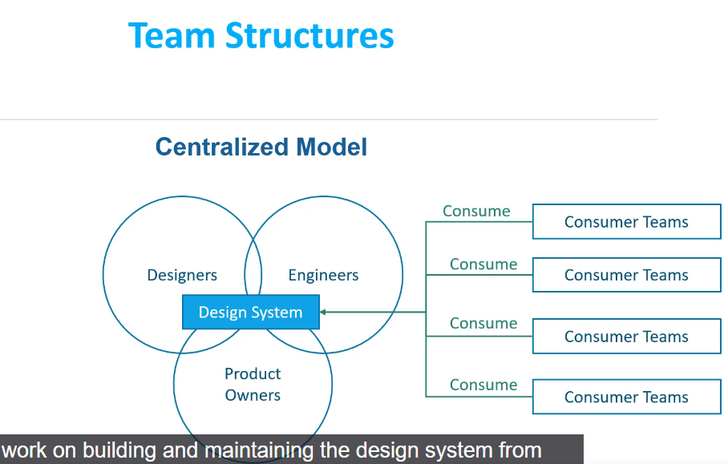
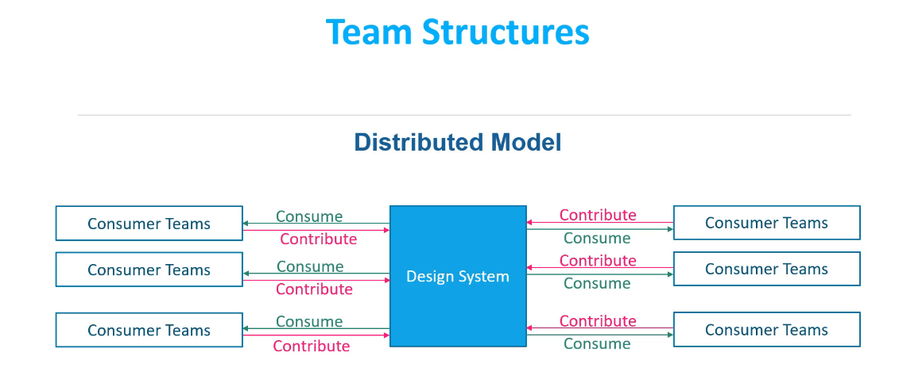
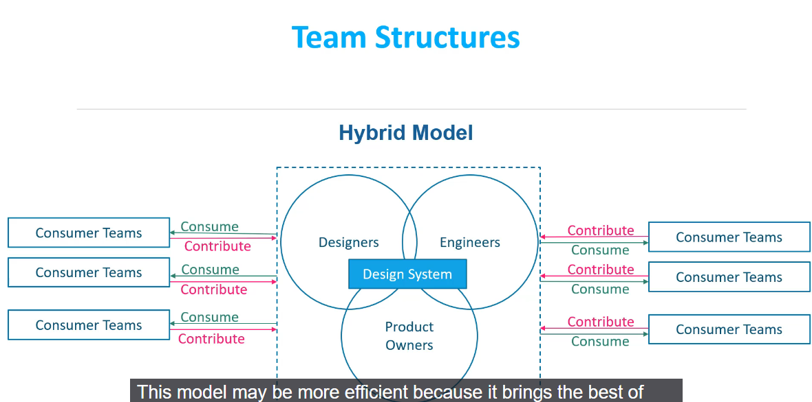
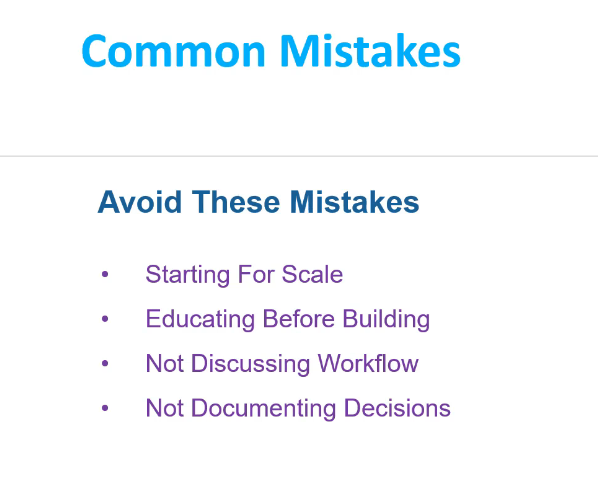
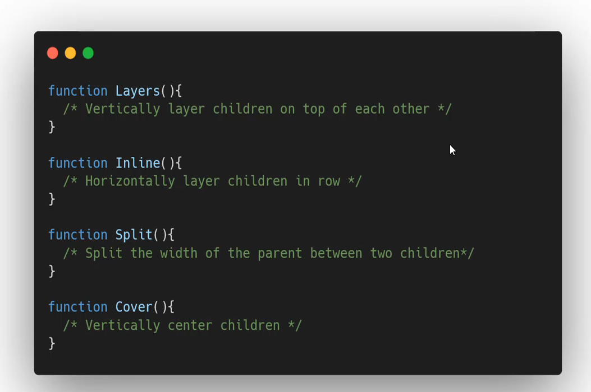
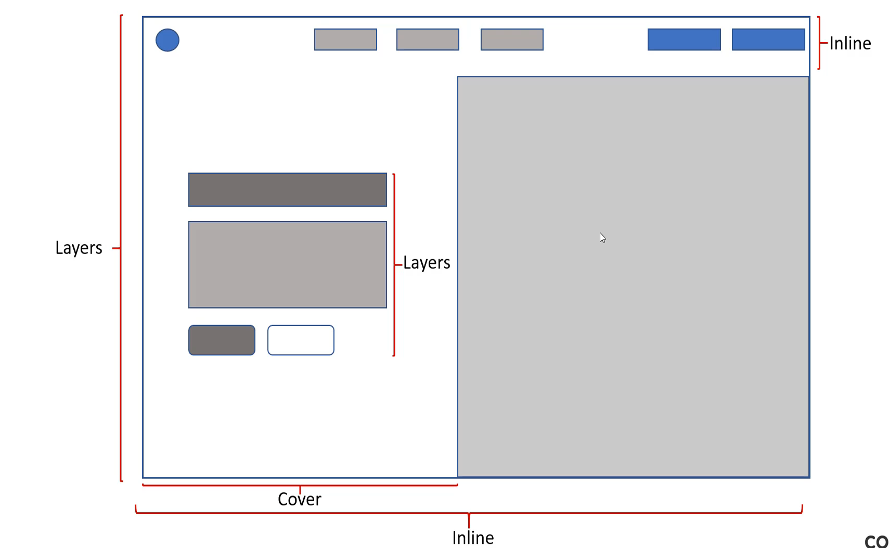
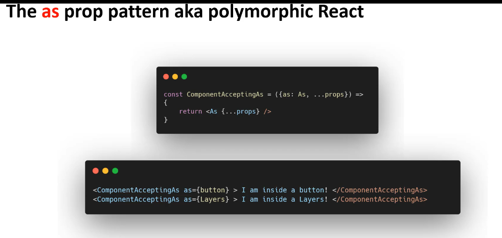

# Understanding React Design Systems

This guide explains a **React Design System** for a beginner preparing for an interview, using a simple analogy and example. It connects to your `SearchMeal` and `TasksBoard` code, addresses `abortRef` confusion indirectly, and provides key points for clear interview answers.

---

## What is a React Design System?
A **React Design System** is a collection of reusable React components, styles, and guidelines to build consistent, efficient, and user-friendly app interfaces.

- **Analogy**: A LEGO instruction manual with pre-designed pieces (components), colors, and rules to ensure all parts of an app look cohesive.

**Interview Key Point**: A design system is a shared toolkit for consistent UI, like using the same button style across an app.

---

## Key Components
- **Reusable Components**: React components like buttons or inputs (e.g., `<Button>`).
- **Styles/Tokens**: Colors, fonts, sizes (e.g., `#34d399` from `TasksBoard`).
- **Guidelines**: Rules for usage (e.g., “Use primary buttons for main actions”).
- **Documentation**: Tools like Storybook to showcase components.

**Interview Key Point**: Explain that components and styles ensure uniformity, while guidelines align teams.

---

## Why Use It?
- **Consistency**: Same look across

- 
- 
- 
# Design Systems: The Million Dollar Button Problem - Key Points

## The Problem: Expensive Component Development

Your transcript illustrates a powerful business case for design systems through the example of building simple button components.

### The Hidden Costs of Button Development

**A "simple" button actually requires:**

- Multiple properties (padding, font size, colors, typography)
- Various states (hover, active, disabled, focused)
- Different types (primary, secondary, tertiary)
- Icon variations (with/without text)
- Multiple sizes (small, medium, large)
- Theme support (light/dark modes)
- Responsive behavior
- Accessibility compliance


### Cost Calculation Example

**Per Team (3 people - Designer, Engineer, QA):**

- 150 hours total work @ \$100/hour each
- **Cost per team: \$15,000**

**Enterprise Scale (50 teams):**

- 50 teams × \$15,000 = **\$750,000 - \$1,000,000**
- **Just for buttons across all products!**


### Additional Problems

- **Inconsistent UX** - Each team creates different button styles
- **Duplicated effort** - 50 teams solving the same problems
- **Maintenance nightmare** - Updates needed across all implementations
- **Brand fragmentation** - No unified visual identity


## The Solution: Design Systems

A **design system** is a centralized collection of reusable components, design tokens, guidelines, and documentation that ensures consistency across products.

### Key Components

1. **Design Tokens** - Colors, typography, spacing, shadows
2. **Components** - Buttons, inputs, cards, navigation
3. **Patterns** - Layout grids, common UI patterns
4. **Guidelines** - Usage rules, accessibility standards
5. **Documentation** - Implementation guides, examples

### Real-World Benefits

**Time Savings:**

- Up to **60% reduction** in development time (Airbnb case study)
- **37% faster** development cycles
- **50% faster** design-to-development handoff

**Cost Reduction:**

- **\$102,600 annual savings** per designer
- **30-35% reduction** in technical costs
- **534 days of engineering effort saved** (Eventbrite)

**Quality Improvements:**

- **18% improvement** in product quality
- **27% reduction** in design production time
- **23% potential revenue increase** from consistency


## Interview Points

### Business Value

1. **Cost Efficiency** - Eliminate duplicate work across teams
2. **Consistency** - Unified brand experience across products
3. **Speed** - Faster development with pre-built components
4. **Quality** - Tested, accessible components reduce bugs
5. **Scalability** - Easy to expand and maintain

### Technical Benefits

1. **Component Reusability** - Build once, use everywhere
2. **Maintenance** - Single source of truth for updates
3. **Developer Experience** - Clear documentation and examples
4. **Testing** - Pre-tested components reduce QA time

### Common Challenges

1. **Initial Investment** - Upfront cost to build the system
2. **Adoption** - Teams need to change workflows
3. **Governance** - Maintaining standards across teams
4. **Evolution** - Keeping system updated with product needs

### Examples of Successful Design Systems

- **Google Material Design** - Comprehensive system for Android/web
- **Apple Human Interface Guidelines** - iOS design standards
- **Atlassian Design System** - Used across Jira, Confluence, etc.
- **Shopify Polaris** - Powers all Shopify admin interfaces


## Key Takeaway

**Design systems transform UI development from expensive, repetitive work into efficient, consistent, scalable processes.** The upfront investment pays massive dividends in reduced costs, improved quality, and faster delivery across an entire organization.

**ROI Formula:** Initial system cost vs. (Number of teams × Component development cost × Number of components) = Substantial savings

This makes design systems not just a nice-to-have, but a business necessity for any organization building multiple digital products! 🚀

# Design Language in Design Systems - Key Points

## Definition

**Design Language** = A set of standards and elements that define a brand's identity through product design. Think of it as the "personality" of your brand expressed through UI components and visual elements.

## Core Components of Design Language

### 1. **Foundation** (The Visual Identity)

- **Principles** - Guidelines that showcase brand personality
- **Color Palettes** - Primary, secondary, semantic colors
- **Typography** - Font families, sizes, weights, line spacing
- **Grid Systems** - Layout structure and spacing rules
- **Icons** - Consistent iconography style and usage
- **Motion \& Interactions** - Animation principles and transitions


### 2. **Components** (The Building Blocks)

- **UI Components** - Built in frameworks like React, Vue, Angular
- **Button variations** - Primary, secondary, sizes, states
- **Form inputs** - Text fields, dropdowns, checkboxes
- **Navigation elements** - Menus, breadcrumbs, tabs
- **Data display** - Cards, tables, lists
- **Feedback components** - Alerts, modals, tooltips


### 3. **Documentation** (The Style Guide)

- **Usage guidelines** - When and how to use components
- **Code examples** - Implementation instructions
- **Design tokens** - Standardized values for colors, spacing, etc.
- **Accessibility standards** - WCAG compliance guidelines


## Documentation Tools

### Popular Tools for Building Style Guides:

- **Storybook** - Component development and documentation
- **Gatsby.js** - Static site generator for design systems
- **Zeroheight** - Design system documentation platform
- **Figma** - Design tool with component libraries
- **Confluence** - Wiki-style documentation
- **Notion** - Collaborative documentation


## Why Design Language Matters

### **Business Benefits:**

- **Consistency** - Unified brand experience across products
- **Efficiency** - Faster development with reusable components
- **Cost Savings** - Reduced duplicate work across teams
- **Quality** - Tested, standardized components reduce bugs


### **Development Benefits:**

- **Faster onboarding** - New developers understand standards quickly
- **Easier maintenance** - Single source of truth for updates
- **Better collaboration** - Designers and developers speak same language
- **Scalability** - Easy to extend and maintain across products


## Real-World Examples

### **Foundation Examples:**

- Netflix's red (\#E50914) for primary actions
- Google's Roboto font family across products
- Apple's minimalist iconography style
- Airbnb's consistent spacing and grid system


### **Component Examples:**

- Material Design buttons with consistent states
- Bootstrap's card components
- Ant Design's form components
- Carbon Design System's data tables


## Interview Points

1. **Definition** - Standards and elements defining brand identity through design
2. **Structure** - Foundation (colors, typography) + Components (UI elements) + Documentation
3. **Tools** - Storybook, Figma, Gatsby for building and documenting systems
4. **Benefits** - Consistency, efficiency, cost savings, better collaboration
5. **Implementation** - How components are built in frameworks like React/Vue
6. **Documentation** - Importance of style guides for adoption and maintenance

**Key Insight**: Design language bridges the gap between brand identity and actual product implementation, ensuring every user touchpoint feels cohesive and intentional.

This systematic approach transforms design from subjective decisions into standardized, reusable patterns that scale across entire organizations! 🎨


# Component Design \& Development Checklist - Essential Quality Gates

## Design Phase Checklist

Before any component moves to development, ensure these design criteria are met:

### 1. **Accessibility First** ♿

- **Universal Design** - All users, including those with visual, motor, or cognitive disabilities, must have equal access
- **Screen Reader Support** - Design with assistive technologies in mind
- **Color Independence** - Don't rely solely on color to convey information
- **Focus Management** - Clear visual focus indicators for keyboard navigation


### 2. **Interaction Definition** 🎯

- **Clear Feedback** - What happens when users interact with the component?
- **Expected Behavior** - Define hover, click, drag, and other interaction states
- **User Guidance** - How does the component communicate its purpose?
- **Error Handling** - What feedback appears when something goes wrong?


### 3. **Context \& Usage** 📍

- **When to Use** - Primary button vs. secondary button vs. link
- **Content Guidelines** - What type of content belongs in this component?
- **Placement Rules** - Where should this component appear in layouts?
- **Relationship to Other Components** - How does it work with existing elements?


### 4. **States \& Variants** 🔄

- **All States Defined** - Default, hover, active, focus, disabled, loading
- **Visual Variations** - Size options (small, medium, large)
- **Content States** - Empty, loading, error, success states
- **Brand Alignment** - Does it reinforce brand identity?


### 5. **Customization Parameters** ⚙️

- **Flexible Properties** - Colors, sizes, icons that can adapt across products
- **Configuration Limits** - What can/cannot be customized?
- **Default Values** - Sensible defaults that work in most cases
- **Override Patterns** - How teams can extend functionality safely


### 6. **Responsive Behavior** 📱

- **Breakpoint Behavior** - How does layout change across screen sizes?
- **Mobile Considerations** - Touch targets, gesture support
- **Content Overflow** - How does component handle varying content lengths?
- **Performance Impact** - Does responsive behavior affect loading speed?


## Development Phase Checklist

Once design is approved, developers must verify:

### 1. **Semantic HTML \& Accessibility** 🏗️

```jsx
// ✅ Good - Semantic, accessible button
<button 
  type="button"
  aria-label="Add item to cart"
  disabled={isLoading}
  onKeyDown={handleKeyPress}
>
  {isLoading ? 'Adding...' : 'Add to Cart'}
</button>

// ❌ Bad - Non-semantic, inaccessible
<div className="button" onClick={onClick}>
  Add to Cart
</div>
```


### 2. **Keyboard Navigation** ⌨️

- **Tab Order** - Logical focus progression through interface
- **Enter/Space** - Standard activation keys work as expected
- **Escape Key** - Closes modals, dropdowns appropriately
- **Arrow Keys** - Navigation within component (for complex components)


### 3. **Responsive Implementation** 📐

```jsx
// ✅ Responsive component example
const Button = ({ size = 'medium', fullWidth = false }) => (
  <button 
    className={`
      btn 
      btn-${size} 
      ${fullWidth ? 'w-full' : 'w-auto'}
      sm:px-4 md:px-6 lg:px-8
    `}
  >
    Click me
  </button>
);
```


### 4. **Customization Implementation** 🎨

```jsx
// ✅ Flexible, well-defined props
interface ButtonProps {
  variant?: 'primary' | 'secondary' | 'danger';
  size?: 'small' | 'medium' | 'large';
  icon?: React.ReactNode;
  disabled?: boolean;
  loading?: boolean;
  onClick?: () => void;
  children: React.ReactNode;
}
```


### 5. **Error Handling \& Edge Cases** 🛡️

```jsx
const Button = ({ children, onClick, loading = false }) => {
  const handleClick = () => {
    try {
      onClick?.();
    } catch (error) {
      console.error('Button click error:', error);
      // Graceful fallback behavior
    }
  };

  // Handle edge cases
  if (!children) return null;
  
  return (
    <button 
      onClick={handleClick}
      disabled={loading}
      aria-busy={loading}
    >
      {loading ? 'Loading...' : children}
    </button>
  );
};
```


### 6. **Type Safety \& Validation** 🔍

```jsx
// ✅ TypeScript for compile-time safety
interface ButtonProps {
  variant: 'primary' | 'secondary';
  onClick: () => void;
  children: React.ReactNode;
}

// ✅ Runtime validation for JavaScript
Button.propTypes = {
  variant: PropTypes.oneOf(['primary', 'secondary']).isRequired,
  onClick: PropTypes.func.isRequired,
  children: PropTypes.node.isRequired
};
```


### 7. **Cross-Browser Compatibility** 🌐

- **CSS Prefixes** - Vendor prefixes for newer CSS properties
- **Polyfills** - Support for older browsers when needed
- **Feature Detection** - Graceful degradation for unsupported features
- **Testing Matrix** - Verify functionality across target browsers


## Quality Gates Before Release

### ✅ **Must-Have Verification**

- [ ] Accessibility audit passed (WCAG 2.1 AA minimum)
- [ ] All interaction states working correctly
- [ ] Responsive behavior verified on multiple devices
- [ ] Cross-browser testing completed
- [ ] Performance benchmarks met
- [ ] Documentation updated with usage examples
- [ ] Type definitions accurate and complete
- [ ] Error cases handled gracefully


### 🚫 **Common Failure Points**

- Missing keyboard navigation
- Insufficient color contrast ratios
- Broken responsive layouts
- Unclear error messages
- Missing loading states
- Inconsistent prop naming
- Poor performance with large datasets


## Interview Key Points

1. **Quality First** - Components aren't "done" until they pass both design and development checklists
2. **Accessibility Integration** - Not an afterthought; built in from the start
3. **Responsive by Default** - Every component must work across all screen sizes
4. **Customization Balance** - Flexible enough for different products, constrained enough to maintain consistency
5. **Cross-functional Collaboration** - Designers, developers, and QA must work together throughout the process

**Bottom Line**: A systematic checklist prevents expensive rework, ensures consistent quality, and creates components that truly serve all users across all contexts! 🎯

- 

# React Design System Setup - Foundation \& Global Styles

Your transcript shows the essential first steps for building a React design system with styled-components. Here are the key concepts:

## Setting Up Global Styles

### 1. Create Global CSS Reset

```jsx
// utils/globalStyles.js
import { createGlobalStyle } from 'styled-components';
import { normalize } from 'polished';

export const GlobalStyles = createGlobalStyle`
  ${normalize()}  // CSS reset from polished library
  
  html {
    font-size: 16px;
    box-sizing: border-box;
  }
  
  *, *::before, *::after {
    box-sizing: inherit;
  }
  
  body {
    margin: 20px;  // For demo purposes
    font-family: 'Roboto', sans-serif;
  }
`;
```


### 2. Apply Globally in App

```jsx
// App.js
import { GlobalStyles } from './utils/globalStyles';

function App() {
  return (
    <>
      <GlobalStyles />  {/* Apply once at root */}
      {/* Your app content */}
    </>
  );
}
```


## Design Tokens - Single Source of Truth

### 1. Color Tokens

```jsx
// utils/colors.util.js
export const blue = {
  100: '#cce4f7',
  200: '#99c8ef', 
  300: '#66ace7',
  400: '#3390de',
  500: '#0074d9'
};

export const red = {
  100: '#ffe6e6',
  200: '#ffcccc',
  300: '#ff9999',
  400: '#ff6666',
  500: '#ff3333'
};

export const neutral = {
  100: '#ffffff',
  200: '#f7f7f7',
  300: '#e1e1e1',
  400: '#737373',
  500: '#4a4a4a'
};
```


### 2. Typography Scales

```jsx
// utils/typeScales.util.js
export const typeScale = {
  header1: '32px',
  header2: '24px', 
  header3: '20px',
  header4: '18px',
  header5: '16px',
  paragraph: '14px',
  helper: '12px',
  copyright: '10px'
};
```


### 3. Centralized Exports

```jsx
// utils/index.js - Barrel export
export * from './colors.util';
export * from './typeScales.util';
export * from './globalStyles';
```


### 4. Clean Imports

```jsx
// Now you can import everything from one place
import { GlobalStyles, blue, typeScale } from './utils';

// Usage in components
const Button = styled.button`
  background-color: ${blue[^500]};
  font-size: ${typeScale.paragraph};
`;
```


## Key Benefits

### ✅ **Consistency**

- All colors/fonts defined once
- No magic numbers or hex codes scattered around
- Easy to maintain brand identity


### ✅ **Maintainability**

- Change one value, updates everywhere
- Clear naming conventions
- Easy to find and modify design decisions


### ✅ **Developer Experience**

- Autocomplete for design tokens
- TypeScript support possible
- Clear project structure


### ✅ **Scalability**

- Easy to add new tokens
- Works across large teams
- Supports multiple themes


## Best Practices from Your Setup

1. **Normalize CSS** - Use libraries like `polished` for consistent cross-browser defaults
2. **Design Tokens** - Store colors, typography, spacing in JavaScript objects
3. **Barrel Exports** - Use index files to simplify imports
4. **CSS-in-JS** - Styled-components for scoped, dynamic styling
5. **Global Styles** - Handle resets and base styles centrally

## Next Steps Mentioned

- Build actual Button component using these tokens
- Create Modal component with consistent styling
- Implement proper component patterns for reusability

This foundation setup ensures your React design system has a solid base for consistent, maintainable styling across all components! 🎨

# React Button Component with Styled-Components - Design System Foundation

Your transcript shows building a scalable button component system using styled-components and design tokens. Here are the key concepts:

## Base Button Component

### 1. Foundation Setup

```jsx
// components/Button.jsx
import styled from 'styled-components';
import { typeScale, blue, neutral } from '../utils';

export const Button = styled.button`
  font-size: ${typeScale.header4};
  padding: 9px 20px;
  border-radius: 3px;
  cursor: pointer;
  transition: all 0.3s ease;
  
  // Interactive states
  &:hover {
    background-color: ${blue[^400]};
    color: ${neutral[^100]};
  }
  
  &:focus {
    outline: ${blue[^100]} 3px solid;
  }
  
  &:active {
    background-color: ${blue[^500]};
  }
  
  &:disabled {
    cursor: not-allowed;
    background-color: ${neutral[^300]};
    color: ${neutral[^500]};
  }
`;
```


## Component Inheritance \& Variants

### 2. Primary Button (Extends Base)

```jsx
export const PrimaryButton = styled(Button)`
  background-color: ${blue[^400]};
  color: ${neutral[^100]};
  border: 2px solid transparent;
  
  &:disabled {
    background-color: ${neutral[^200]};
    color: ${neutral[^400]};
    border: 2px solid ${neutral[^300]};
  }
`;
```


## Size \& Context Variations

### 3. Size Classes

```jsx
export const Button = styled.button`
  // Base styles...
  
  &.large {
    font-size: ${typeScale.header4};
    padding: 14px 28px;
  }
  
  &.small {
    font-size: ${typeScale.helper};
    padding: 4px 8px;
  }
`;
```


### 4. Context Variations

```jsx
export const Button = styled.button`
  // Base styles...
  
  &.warning {
    background-color: ${yellow[^300]};
    color: ${neutral[^100]};
    
    &:hover {
      background-color: ${yellow[^400]};
    }
    
    &:focus {
      outline: ${yellow[^200]} 3px solid;
    }
  }
`;
```


## Usage Examples

### 5. Component Implementation

```jsx
// App.js
import { PrimaryButton } from './components/Button';

function App() {
  return (
    <div>
      <PrimaryButton>Default Primary</PrimaryButton>
      <PrimaryButton className="large">Large Primary</PrimaryButton>
      <PrimaryButton className="small warning">Small Warning</PrimaryButton>
      <PrimaryButton disabled>Disabled Primary</PrimaryButton>
    </div>
  );
}
```


## Key Design Principles

### ✅ **Foundation First**

- Start with base component containing common styles
- Use design tokens (colors, typography) for consistency
- Define all interaction states (hover, focus, active, disabled)


### ✅ **Styled-Components Benefits**

- CSS-in-JS with full JavaScript power
- Component inheritance using `styled(BaseComponent)`
- Dynamic styling with template literals
- Scoped styles prevent conflicts


### ✅ **Accessibility \& States**

- Focus outlines for keyboard navigation
- Disabled states with proper cursor behavior
- Semantic HTML with proper button element
- Hover feedback for mouse interactions


### ✅ **Scalable Patterns**

- Class-based variants for size and context
- Color inheritance and override system
- Consistent animation/transition timing
- Reusable across different button types


## Next Steps Mentioned

Your transcript hints at upcoming topics:

- **Encapsulated Styles** - Better patterns for style organization
- **Composite Components** - Building complex components from simple ones
- **Clean Architecture** - Separation of concerns in component design

This foundation creates a robust, extensible button system that can grow with your design system while maintaining consistency and accessibility! 🎨

The key insight is starting with a solid base component that handles common behavior, then using inheritance and variants to create specialized versions without duplicating code.

# React Modal Component Implementation - Building from Figma Design

Your transcript shows building a modal component using styled-components, converting a Figma design into functional React code. Here's the complete implementation with analysis:

## Modal Component Structure

### 1. Container \& Layout

```jsx
// components/Modal.jsx
import styled from 'styled-components';
import { neutral, typeScale } from '../utils';
import closeImg from '../images/close.svg';
import registerImg from '../images/register.svg';
import { PrimaryButton } from './Button';

const ContainerStyle = styled.div`
  width: 700px;
  height: 400px;
  box-shadow: 0px 8px 20px rgba(0, 0, 0, 0.15);
  background-color: ${neutral[^100]};
  color: ${neutral[^500]};
  display: flex;
  flex-direction: column;
  justify-content: center;
  align-items: center;
  
  // Center modal on screen
  position: absolute;
  top: 100px;
  left: 50%;
  margin-left: -350px; // Half of width
`;
```


### 2. Close Icon \& Positioning

```jsx
const CloseIconWrapper = styled.div`
  position: absolute;
  top: 15px;
  right: 15px;
  width: 25px;
  height: 25px;
  padding: 0;
  cursor: pointer;
`;
```


### 3. Header \& Text Components

```jsx
const ModalHeader = styled.h3`
  position: relative;
  font-size: ${typeScale.header3};
  margin-bottom: 8px;
`;

const ModalHelper = styled.p`
  position: relative;
  margin-top: 0;
  font-size: ${typeScale.header4};
`;
```


### 4. Complete Modal Component

```jsx
const Modal = () => {
  return (
    <ContainerStyle>
      <CloseIconWrapper>
        
      </CloseIconWrapper>
      
      
      
      <ModalHeader>Register</ModalHeader>
      
      <ModalHelper>
        Create your account to access exclusive features
      </ModalHelper>
      
      <PrimaryButton onClick={() => alert('Clicked')}>
        Register
      </PrimaryButton>
    </ContainerStyle>
  );
};

export default Modal;
```


## Implementation Analysis

### ✅ **What Works Well**

- **Visual Accuracy** - Matches Figma design closely
- **Component Reuse** - Leverages existing PrimaryButton component
- **Design Tokens** - Uses consistent colors and typography scales
- **Styled-Components** - Clean CSS-in-JS implementation
- **Asset Management** - Proper image imports and usage


### ❌ **Issues with This Approach**

Based on your transcript's hint about problems:

1. **Hardcoded Values** - Fixed width (700px), height (400px), positioning
2. **No Flexibility** - Can't easily change modal size or content
3. **Poor Reusability** - Specific to register modal only
4. **Accessibility Missing** - No keyboard navigation, focus management
5. **No Portal Usage** - Modal rendered in component tree, not document root
6. **No Backdrop** - Missing overlay to prevent background interaction

## The Real Problems (As Hinted in Transcript)

### **Hard-coded Styling**

```jsx
// ❌ Bad - Fixed dimensions
width: 700px;
height: 400px;

// ❌ Bad - Magic numbers for positioning
top: 100px;
left: 50%;
margin-left: -350px;
```


### **Limited Reusability**

```jsx
// ❌ Bad - Specific content baked into component
<ModalHeader>Register</ModalHeader>
<ModalHelper>Create your account...</ModalHelper>
```


### **Scaling Issues**

- What happens with 100+ modal variations?
- How do different teams customize this modal?
- How to handle responsive sizing across devices?


## Better Approach Preview

Your transcript hints at addressing these issues in upcoming sections:

### **Encapsulated Styles**

- Separating styling concerns from component logic
- Making styles more configurable and reusable


### **Component Patterns**

- Building composable modal systems
- Creating flexible, prop-driven components


### **Clean Architecture**

- Better separation of presentation and behavior
- More maintainable component hierarchies


## Key Takeaways

### **Current State**

- ✅ Functional modal that matches design
- ✅ Uses design tokens for consistency
- ✅ Leverages existing button component


### **Next Steps Needed**

- 🔄 Make dimensions and positioning flexible
- 🔄 Extract content to props for reusability
- 🔄 Add proper modal behavior (backdrop, portals)
- 🔄 Implement accessibility features
- 🔄 Create composable modal system

**The lesson:** Converting Figma to React is straightforward, but building **scalable, reusable components** requires deeper architectural thinking - which your transcript promises to address in the following sections about encapsulated styles and component patterns! 🎯

# Encapsulating Styles in React - The Foundation for Reusable Components

Your transcript introduces a crucial concept for building scalable design systems: **encapsulating styles**. This is the principle that will guide the upcoming sections on building truly reusable components.

## The Core Problem with Current Modal

Looking at the modal component you built, several layout styles break reusability:

```jsx
const ContainerStyle = styled.div`
  width: 700px;        // ❌ Fixed width
  height: 400px;       // ❌ Fixed height
  position: absolute;  // ❌ Layout positioning
  top: 100px;          // ❌ External margins/positioning
  left: 50%;
  margin-left: -350px;
`;
```

**These are "layout styles"** - they affect how the component relates to its surroundings and parent elements, making it impossible to reuse in different contexts.

## The Encapsulation Principle

### ✅ **What Components Should Style**

- **Appearance properties**: colors, fonts, borders, padding (internal spacing)
- **Internal layout**: how content is arranged within the component
- **Visual states**: hover, focus, disabled styles


### ❌ **What Components Should NOT Style**

- **External positioning**: margins, absolute/relative positioning
- **Fixed dimensions**: width, height (unless it's intrinsic to the component)
- **Layout behavior**: how the component fits into its parent's layout


## The Vocabulary Analogy

Just like you use a limited set of common words daily, components follow patterns:

### **Common Layout Needs**

- Centering content (horizontal/vertical)
- Flexible spacing and padding
- Responsive grid layouts
- Stacked or side-by-side arrangements


### **Solution: Pattern Components**

Instead of rebuilding these layouts in every component, create reusable **pattern components** that handle common layout concerns.

## Better Approach Preview

### **Before (Encapsulated)**

```jsx
// ❌ Bad - Modal handles its own positioning
const Modal = styled.div`
  width: 700px;
  position: absolute;
  top: 100px;
  left: 50%;
`;
```


### **After (Composable)**

```jsx
// ✅ Good - Separate concerns
const Modal = styled.div`
  background: white;
  border-radius: 8px;
  padding: 24px;
  box-shadow: 0 8px 20px rgba(0,0,0,0.15);
  // Only styles the modal's appearance
`;

const CenterContainer = styled.div`
  display: flex;
  align-items: center;
  justify-content: center;
  position: fixed;
  top: 0;
  left: 0;
  right: 0;
  bottom: 0;
  // Handles positioning and centering
`;

// Usage - compose together
<CenterContainer>
  <Modal>
    Modal content here
  </Modal>
</CenterContainer>
```


## Benefits of This Approach

### **Reusability**

- Modal can be used in different layouts (centered, sidebar, inline)
- CenterContainer can center any content, not just modals
- Components work in different screen sizes and contexts


### **Maintainability**

- Separation of concerns makes code easier to understand
- Changes to layout don't affect component appearance
- Easier to debug and modify specific aspects


### **Composability**

- Mix and match pattern components like building blocks
- Create complex layouts from simple, focused components
- Reduce code duplication across components


## What's Coming Next

Your transcript promises to cover:

1. **Theory**: Deep dive into encapsulation principles
2. **Pattern Components**: Building common layout utilities with styled-components
3. **Practical Application**: Rebuilding the modal using these patterns
4. **Larger Project**: Applying these concepts to a more complex component

## Interview Key Points

1. **Encapsulation Definition**: Components only style themselves, not their layout context
2. **Layout vs Appearance**: Understanding which properties belong where
3. **Composition Benefits**: How small focused components create flexible systems
4. **Reusability Impact**: Why layout styles kill component reusability
5. **Pattern Components**: Building a library of composable layout primitives

**The Big Idea**: By treating styling like vocabulary - creating a library of common "words" (pattern components) that can be combined to "speak" any layout - you build systems that are both powerful and maintainable.

This foundational concept will transform how you approach component design, moving from monolithic components to flexible, composable systems! 🎯


# React Style Composition: Building Flexible UI with Pattern Components

Your transcript introduces the powerful concept of **style composition** - the foundation for building truly scalable and reusable React components.

## The Composition Principle

### What is Style Composition?

**Style composition** means breaking down complex layouts into smaller, single-purpose components that can be combined to create any desired layout. Just like human language uses a limited vocabulary of words to express infinite ideas, UI layouts use common patterns repeatedly.

### The Problem with Traditional CSS

```css
/* ❌ Traditional approach - unique styles for each component */
.hero-container { /* specific to hero page */ }
.hero-top-section { /* only works in hero context */ }
.hero-bottom-section { /* tightly coupled to this page */ }
.hero-menu { /* can't reuse elsewhere */ }
```

**Issues:**

- Every new page requires writing new CSS
- Styles are tightly coupled to specific components
- No reusability across different contexts
- Breaks the core React principle of component reusability


## The Better Way: Pattern Components

### Common Layout Patterns

Based on your transcript, here are the core pattern components:

1. **Layers** - Stacks children vertically (like CSS flexbox column)
2. **Inline** - Places children horizontally in a row
3. **Split** - Divides container into sections (left/right, top/bottom)
4. **Cover** - Centers content within its container

### Hero Page Example - Before \& After

**❌ Before (Traditional CSS):**

```jsx
<div className="hero-container">
  <div className="hero-top-section">
    <div className="menu-items">Logo</div>
    <div className="menu-buttons">Login | Register</div>
  </div>
  <div className="hero-bottom-section">
    <div className="hero-content">
      <h1>Welcome</h1>
      <button>Get Started</button>
    </div>
    <div className="hero-image">
      
    </div>
  </div>
</div>
```

**✅ After (Composition Pattern):**

```jsx
<Layers>
  {/* Menu section */}
  <Inline>
    <Logo />
    <MenuItems />
    <LoginButtons />
  </Inline>
  
  {/* Main content */}
  <Split>
    <Cover>
      <Layers>
        <h1>Welcome</h1>
        <button>Get Started</button>
      </Layers>
    </Cover>
    <HeroImage />
  </Split>
</Layers>
```


## How Pattern Components Work

- 
- 
### Each Pattern Has One Job

- **Layers**: `display: flex; flex-direction: column;`
- **Inline**: `display: flex; flex-direction: row;`
- **Split**: Divides space between children (50/50, 70/30, etc.)
- **Cover**: Centers content using absolute positioning or flexbox


### Composition in Action

```jsx
// Building complex layouts by composing simple patterns
<Layers>           {/* Stack everything vertically */}
  <Header />       {/* Top layer */}
  <Split>          {/* Divide remaining space */}
    <Sidebar />    {/* Left side */}
    <Cover>        {/* Right side - center content */}
      <MainContent />
    </Cover>
  </Split>
</Layers>
```


## Key Benefits

### ✅ **True Reusability**

- `Layers` works for hero pages, blog posts, forms, anywhere
- `Split` can divide any content, not just hero sections
- Components work in any context without modification


### ✅ **Composability**

- Mix and match patterns like building blocks
- Create infinite layouts from finite components
- Nest patterns inside each other naturally


### ✅ **Maintainability**

- One component = one responsibility
- Easy to debug specific layout issues
- Changes to one pattern affect all uses consistently


### ✅ **Developer Experience**

- Intuitive, readable JSX structure
- Self-documenting layout intentions
- No more wrestling with CSS specificity


## The Mental Model

Think of it like spoken language:

- **Traditional CSS** = Creating a new language for each conversation
- **Style Composition** = Using a vocabulary of common words (patterns) to express any idea


### Common Layout "Words" (Patterns)

- **Layers** = "put things on top of each other"
- **Inline** = "put things side by side"
- **Split** = "divide the space"
- **Cover** = "center this content"


## What's Coming Next

Your transcript promises:

1. **Building the Patterns** - Implementing Layers, Inline, Split, Cover components
2. **Modal Refactor** - Rebuilding the modal using these patterns
3. **Complex Project** - Applying composition to a larger application

## Interview Key Points

1. **Style Composition Definition** - Breaking layouts into reusable, single-purpose components
2. **Pattern Examples** - Understanding Layers, Inline, Split, Cover concepts
3. **Composition Benefits** - Reusability, maintainability, flexibility
4. **Traditional CSS Problems** - Tight coupling, poor reusability, repetitive code
5. **Mental Model** - Thinking in terms of layout vocabulary rather than unique styles

**The Big Insight**: Most layouts are variations of the same fundamental patterns. By creating a library of these patterns, you can build any layout by composing simple, focused components - just like building sentences from a vocabulary of words.

This approach transforms CSS from a source of frustration into a powerful, predictable system for creating flexible UIs! 🎯

# React Style Encapsulation: Two Core Principles for Robust Design Systems

Your transcript introduces the fundamental principles that make style composition possible. These are the rules that will guide everything you build in the course.

## Understanding Encapsulation

### Definition from Programming

**Encapsulation** means restricting access to internal details and exposing only what's necessary through controlled interfaces.

**Java Example:**

```java
public class Car {
    private String model;  // Hidden internal state
    
    public String getModel() {  // Controlled access
        return this.model;
    }
}
```


### Why Encapsulation Matters in CSS

The main issue with CSS is **style conflicts** - you style a component, but mysterious margins or positioning appear from unknown sources. This happens because components apply styles that affect their environment.

## The Two Core Principles

### Principle 1: Components Should NOT Lay Themselves Out

**❌ Components should NEVER set:**

- **Position** (absolute, relative, fixed)
- **Size** (width, height)
- **Margin** (all variants)

**Why?** These properties affect how the component relates to its parent and siblings - that's the parent's responsibility, not the component's.

**✅ Parent controls layout:**

```jsx
// ❌ Bad - Component controls its own layout
const Button = styled.button`
  margin: 20px;        // Affects parent layout
  width: 200px;        // Dictates size to parent
  position: absolute;  // Breaks parent's layout system
`;

// ✅ Good - Component only styles itself
const Button = styled.button`
  padding: 12px 24px;     // Internal spacing
  border: 1px solid blue; // Visual appearance
  background: white;      // Component styling
  border-radius: 4px;     // Visual styling
`;

// Parent controls layout
<Container>
  <Button>Click me</Button>  {/* Container decides positioning */}
</Container>
```


### Principle 2: Style Only Self + Immediate Children

**Components can style:**

- **Themselves** - border, padding, background, font properties
- **Immediate children only** - direct descendants

**❌ Never style:**

- Deep nested children (grandchildren, etc.)
- Elements beyond the component boundary

**The Border Boundary Rule:**
The `border` represents the maximum boundary of what a component can style. Everything beyond the border (margin, position, size) belongs to the parent.

```jsx
// ✅ Good - Styles within border boundary
const Card = styled.div`
  border: 1px solid gray;     // Component boundary
  padding: 16px;              // Inside component
  background: white;          // Inside component
  border-radius: 8px;         // Visual styling
  
  // Style immediate children only
  > h2 {
    margin-top: 0;            // Safe - immediate child
    color: darkblue;
  }
  
  > p {
    color: gray;              // Safe - immediate child
  }
`;

// ❌ Bad - Styles beyond component boundary
const Card = styled.div`
  margin: 20px;               // Layout - parent's job
  width: 300px;               // Size - parent's job
  
  // Deep nesting - dangerous
  h2 span {                   // Grandchild - too deep
    color: red;
  }
`;
```


## Visual Boundary Guide

### ✅ **Component Can Style (Within Border)**

- `padding` - Internal spacing
- `border` - Component boundary
- `background-color` - Component appearance
- `font-family`, `font-size`, `color` - Text styling
- `box-shadow` - Visual effects
- `border-radius` - Shape styling


### ❌ **Component Cannot Style (Beyond Border)**

- `margin` - External spacing (parent's job)
- `width`, `height` - Size constraints (parent's job)
- `position` - Layout behavior (parent's job)
- `top`, `left`, `right`, `bottom` - Positioning (parent's job)


## Real-World Example

### Before (Encapsulation Broken)

```jsx
// ❌ Bad - Modal styles itself AND its layout
const Modal = styled.div`
  width: 500px;           // Dictates size
  height: 300px;          // Dictates size
  position: absolute;     // Controls positioning
  top: 50%;              // Controls positioning
  left: 50%;             // Controls positioning
  margin: -150px 0 0 -250px; // Layout mathematics
  
  background: white;      // Component styling ✓
  border-radius: 8px;     // Component styling ✓
  padding: 24px;          // Component styling ✓
`;
```

**Problems:**

- Can only be used in one size
- Forces absolute positioning on parents
- Breaks when parent layout changes
- Cannot be reused in different contexts


### After (Properly Encapsulated)

```jsx
// ✅ Good - Modal only styles itself
const Modal = styled.div`
  background: white;      // Component appearance
  border-radius: 8px;     // Component styling
  padding: 24px;          // Internal spacing
  box-shadow: 0 8px 20px rgba(0,0,0,0.15);
  
  // Styles immediate children only
  > h2 {
    margin-top: 0;
  }
`;

// Parent handles layout
const ModalContainer = styled.div`
  position: fixed;        // Layout responsibility
  top: 0;
  left: 0;
  right: 0;
  bottom: 0;
  display: flex;
  align-items: center;    // Centering logic
  justify-content: center;
`;

// Usage - composable and flexible
<ModalContainer>
  <Modal>
    <h2>Title</h2>
    <p>Content</p>
  </Modal>
</ModalContainer>
```


## Benefits of Following These Rules

### ✅ **True Reusability**

Components work in any layout context without modification

### ✅ **No Style Conflicts**

No mysterious spacing or positioning issues

### ✅ **Composability**

Components can be combined safely in any arrangement

### ✅ **Maintainability**

Clear separation of concerns - layout vs. appearance

## When to Break the Rules

Your transcript mentions that sometimes you need to break these rules, but **only consciously and with clear rationale**:

### Acceptable Exceptions:

- Performance optimizations
- Third-party library constraints
- Specific design system requirements
- Legacy code integration


### Key Point:

**Know WHY you're breaking the rule** - not just breaking it randomly.

## Interview Key Points

1. **Encapsulation Definition** - Components expose only necessary interfaces, hide internal complexity
2. **Style Conflicts** - Main problem solved by proper encapsulation
3. **Border Boundary Rule** - Component can style within its border, not beyond
4. **Two Principles** - No layout styling, only self + immediate children
5. **Conscious Rule Breaking** - Sometimes necessary, but must be intentional

**The Foundation:** These two principles are the bedrock that makes style composition possible. By following them, you create components that truly work anywhere, laying the groundwork for the powerful pattern components coming next! 🎯


# React Spacing Patterns: Building Reusable Layout Components

Your transcript introduces the practical implementation phase - building **spacing pattern components** using styled-components. This section is where theory meets practice as you create the foundational building blocks for composable UI layouts.

## The Goal: Pattern Components for Spacing

Instead of writing unique CSS for every layout, you're building a **library of reusable spacing patterns** that handle common layout scenarios:

### Core Spacing Patterns to Build

1. **Layers** - Vertical stacking with controlled spacing
2. **Inline** - Horizontal arrangement with spacing
3. **Split** - Dividing container into sections
4. **Cover** - Centering and positioning content

## What You're About to Create

### Traditional Approach (What to Avoid)

```jsx
// ❌ Unique CSS for every layout
const HeroSection = styled.div`
  display: flex;
  flex-direction: column;
  align-items: center;
  gap: 24px;
  margin: 48px 0;
`;

const MenuBar = styled.div`
  display: flex;
  flex-direction: row;
  justify-content: space-between;
  padding: 16px 32px;
`;

// Every new layout = more unique CSS
```


### Pattern Component Approach (Your Goal)

```jsx
// ✅ Compose layouts using reusable patterns
<Layers spacing="large">
  <Inline justify="space-between" padding="medium">
    <Logo />
    <MenuItems />
    <LoginButton />
  </Inline>
  
  <Split ratio="60/40">
    <Cover center>
      <CallToAction />
    </Cover>
    <HeroImage />
  </Split>
</Layers>
```


## Pattern Component Benefits

### ✅ **Consistency**

- Same spacing patterns used throughout the app
- Design tokens ensure consistent visual rhythm
- Reduces visual inconsistencies


### ✅ **Reusability**

- `Layers` works for hero sections, forms, cards, anything
- `Inline` handles navigation, button groups, any horizontal layout
- No need to rewrite flexbox properties repeatedly


### ✅ **Maintainability**

- Update spacing logic in one place
- Easy to modify spacing patterns globally
- Clear separation of layout concerns


### ✅ **Developer Experience**

- Intuitive, self-documenting component names
- Compose complex layouts from simple building blocks
- Less CSS knowledge required for complex layouts


## Styled-Components Implementation Preview

Based on your transcript direction, here's what you'll likely build:

### Layers Pattern (Vertical Stacking)

```jsx
import styled from 'styled-components';

const Layers = styled.div`
  display: flex;
  flex-direction: column;
  
  // Add spacing between children
  > * + * {
    margin-top: ${props => props.spacing || '16px'};
  }
`;

// Usage
<Layers spacing="24px">
  <Header />
  <MainContent />
  <Footer />
</Layers>
```


### Inline Pattern (Horizontal Layout)

```jsx
const Inline = styled.div`
  display: flex;
  flex-direction: row;
  align-items: ${props => props.align || 'center'};
  justify-content: ${props => props.justify || 'flex-start'};
  gap: ${props => props.spacing || '16px'};
`;

// Usage  
<Inline justify="space-between" spacing="20px">
  <Logo />
  <Navigation />
  <UserMenu />
</Inline>
```


### Split Pattern (Section Division)

```jsx
const Split = styled.div`
  display: flex;
  flex-direction: row;
  
  > *:nth-child(1) {
    flex: ${props => props.leftRatio || 1};
  }
  
  > *:nth-child(2) {
    flex: ${props => props.rightRatio || 1};
  }
`;

// Usage
<Split leftRatio={2} rightRatio={1}>
  <MainContent />
  <Sidebar />
</Split>
```


### Cover Pattern (Centering)

```jsx
const Cover = styled.div`
  display: flex;
  align-items: center;
  justify-content: center;
  min-height: ${props => props.minHeight || 'auto'};
`;

// Usage
<Cover minHeight="400px">
  <CallToActionCard />
</Cover>
```


## Best Practices You'll Learn

### **Single Responsibility**

- Each pattern component handles one layout concern
- `Layers` only does vertical stacking
- `Inline` only does horizontal arrangement


### **Configurable via Props**

- Accept spacing, alignment, and size props
- Use design tokens for consistent spacing values
- Provide sensible defaults


### **Composable Design**

- Patterns can be nested inside each other
- Build complex layouts by combining simple patterns
- No restrictions on how patterns are combined


## What This Enables

### Complex Layouts Made Simple

```jsx
// A complete page layout using just pattern components
<Layers>
  {/* Header */}
  <Inline justify="space-between" padding="medium">
    <Logo />
    <Navigation />
    <UserActions />
  </Inline>
  
  {/* Main Content */}
  <Split ratio="70/30">
    {/* Left: Content */}
    <Layers spacing="large">
      <ArticleTitle />
      <ArticleContent />
      <ShareButtons />
    </Layers>
    
    {/* Right: Sidebar */}
    <Layers spacing="medium">
      <RelatedPosts />
      <Newsletter />
    </Layers>
  </Split>
  
  {/* Footer */}
  <Cover>
    <FooterContent />
  </Cover>
</Layers>
```


## Why Styled-Components?

### **CSS-in-JS Benefits**

- Scoped styles prevent conflicts
- Dynamic styling based on props
- Dead code elimination
- TypeScript support


### **Component-Based Styling**

- Perfect for pattern components
- Easy prop-based customization
- Excellent developer experience


## Interview Key Points

1. **Pattern Components** - Reusable layout primitives for common spacing scenarios
2. **Styled-Components** - CSS-in-JS library enabling dynamic, component-based styling
3. **Composition Benefits** - Build complex layouts from simple, focused components
4. **Spacing Consistency** - Centralized spacing logic using design tokens
5. **Maintenance Advantage** - Update spacing patterns in one place, affects entire app

**The Big Picture**: You're building the foundation that will transform how you approach layout in React - moving from writing custom CSS for every layout to composing layouts from a library of battle-tested patterns.

This is the practical implementation of the encapsulation principles you learned, using styled-components as the tool to bring composable design to life! 🎯


# React Layers Pattern: Building Your First Spacing Component

Your transcript shows the practical implementation of the **Layers pattern** - the first building block in your composable styling system. This is where theory meets practice as you create a reusable component for vertical stacking with controlled spacing.

## The Problem Being Solved

### Before Layers Pattern

```jsx
// ❌ Basic form without proper spacing
<div>
  <h2>Subscribe to newsletter</h2>
  <p>Get the latest updates</p>
  <div>
    <label>Name</label>
    <input type="text" />
  </div>
  <div>
    <label>Email</label>
    <input type="email" />
  </div>
  <button>Subscribe</button>
</div>
```

**Issues:**

- Elements stuck together without proper spacing
- No consistent spacing between sections
- Hardcoded margins needed everywhere


## The Layers Pattern Implementation

### Step 1: Basic Layers Component

```jsx
// components/spaces.js
import styled from 'styled-components';

const Layers = styled.div`
  display: grid;
  grid-auto-flow: row;  // Each child gets its own row
  gap: ${props => props.gutter ?? '1rem'};
`;

export { Layers };
```

**Key Insight:** Using CSS Grid with `grid-auto-flow: row` automatically stacks children vertically, regardless of their original display type (inline, block, etc.).

### Step 2: Making Spacing Configurable

```jsx
const Layers = styled.div`
  display: grid;
  gap: ${props => props.gutter ?? '1rem'};
`;

// Usage with custom spacing
<Layers gutter="0.25rem">
  <label>Name</label>
  <input type="text" />
</Layers>
```


### Step 3: Creating a Spacing Scale

```jsx
// Spacing scheme for consistency
const spaceScale = {
  none: '0',
  xs: '0.25rem',
  small: '0.5rem', 
  medium: '1rem',
  large: '1.5rem',
  xl: '2rem'
};

const Layers = styled.div`
  display: grid;
  gap: ${props => 
    spaceScale[props.gutter] ?? spaceScale.large
  };
`;
```


### Step 4: Complete Implementation

```jsx
// components/spaces.js
import styled from 'styled-components';

const spaceScale = {
  none: '0',
  xs: '0.25rem',
  small: '0.5rem',
  medium: '1rem', 
  large: '1.5rem',
  xl: '2rem'
};

const Layers = styled.div`
  display: grid;
  gap: ${props => 
    spaceScale[props.gutter] ?? spaceScale.large
  };
`;

export { Layers };
```


## Using Layers in Practice

### Subscribe Form Refactored

```jsx
import { Layers } from './components/spaces';

const SubscribeForm = () => (
  <Layers gutter="xl">
    {/* Header section */}
    <Layers gutter="medium">
      <h2>Subscribe to newsletter</h2>
      <p>Get the latest updates</p>
    </Layers>
    
    {/* Form inputs */}
    <Layers gutter="small">
      <Layers gutter="xs">
        <label>Name</label>
        <input type="text" />
      </Layers>
      
      <Layers gutter="xs">
        <label>Email</label>
        <input type="email" />
      </Layers>
    </Layers>
    
    {/* Action */}
    <button>Subscribe</button>
  </Layers>
);
```


## Key Benefits Achieved

### ✅ **Consistent Spacing**

- Uses predefined spacing scale instead of random values
- `xs`, `small`, `medium`, `large`, `xl` create visual hierarchy
- Design tokens ensure consistency across entire app


### ✅ **Composability**

- Layers can be nested inside other Layers
- Each handles its own spacing responsibility
- Build complex layouts by composing simple patterns


### ✅ **Maintainability**

- Change spacing scale in one place, affects entire app
- Clear, semantic spacing names instead of pixel values
- Easy to understand component relationships


### ✅ **Flexibility**

- Works with any content (text, inputs, buttons, other components)
- Handles different display types automatically
- No need to worry about margins or positioning


## The Magic of CSS Grid

### Why Grid Over Flexbox?

```jsx
// Grid approach (what you built)
display: grid;
gap: 1rem;

// Flexbox equivalent would need:
display: flex;
flex-direction: column;
> * + * {
  margin-top: 1rem;
}
```

**Grid advantages:**

- `gap` property handles spacing cleanly
- No margin collapsing issues
- Works regardless of child element types
- More predictable behavior


## Scaling the Pattern

### Multiple Spacing Components

```jsx
// You're building a library of these:
<Layers gutter="large">     // Vertical stacking
  <Inline spacing="medium"> // Horizontal arrangement
    <Logo />
    <Navigation />
  </Inline>
  
  <Split ratio="70/30">     // Section division
    <MainContent />
    <Sidebar />
  </Split>
</Layers>
```


## Best Practices Demonstrated

### **Props with Defaults**

```jsx
gap: ${props => props.gutter ?? '1rem'};
```

- Always provide sensible defaults
- Allow customization when needed


### **Spacing Scales**

```jsx
spaceScale[props.gutter] ?? spaceScale.large
```

- Constrained choices prevent inconsistency
- Fallback to default for invalid values


### **Semantic Naming**

- `xs`, `small`, `medium` > `4px`, `8px`, `16px`
- Self-documenting component usage


## Interview Key Points

1. **Layers Pattern Purpose** - Vertical stacking with consistent spacing
2. **CSS Grid Choice** - Clean gap handling, automatic row creation
3. **Spacing Scale** - Predefined tokens for consistency
4. **Composability** - Layers can be nested and combined
5. **Props Pattern** - Configurable with sensible defaults
6. **Encapsulation** - Component only handles its own spacing, not layout

**The Foundation**: Layers is the first building block in your composable styling system. It solves the universal problem of vertical spacing while establishing patterns for the other components (Inline, Split, Cover) you'll build next.

This is style composition in action - taking a common layout need (stacking things with space) and creating a reusable, configurable solution that works everywhere! 🎯

# React Split Pattern: Dividing Space with CSS Grid Fractions

Your transcript shows building the **Split pattern** - a powerful layout component that divides available space into configurable columns with controlled gutters. This is your second pattern component in the composable styling system.

## The Problem Being Solved

### Before Split Pattern

```jsx
// ❌ Manual column layouts with hardcoded widths
<div style={{ display: 'flex' }}>
  <div style={{ width: '33.33%', marginRight: '20px' }}>
    <p>Labels here</p>
  </div>
  <div style={{ width: '66.67%' }}>
    <form>...</form>
  </div>
</div>
```

**Issues:**

- Hardcoded percentages don't account for gutters
- Inflexible ratios
- Manual margin calculations
- Overflow problems


## The Split Pattern Implementation

### Step 1: Basic Split with CSS Grid

```jsx
import styled from 'styled-components';
import { spaceScale } from './spaces';

const Split = styled.div`
  display: grid;
  grid-template-columns: 1fr 1fr;  // Two equal columns
  gap: ${props => 
    spaceScale[props.gutter] ?? spaceScale.large
  };
`;
```


### Step 2: Adding Fraction Configuration

```jsx
const fractions = {
  'one_one': '1fr 1fr',         // 50/50 split
  'one_two': '1fr 2fr',         // 33/67 split  
  'two_one': '2fr 1fr',         // 67/33 split
  'one_two_three': '1fr 2fr 3fr', // Three columns
  'auto_one': 'auto 1fr',       // Content width + remaining
  'one_auto': '1fr auto',       // Remaining + content width
};

const Split = styled.div`
  display: grid;
  grid-template-columns: ${props => 
    fractions[props.fraction] ?? fractions.one_one
  };
  gap: ${props => 
    spaceScale[props.gutter] ?? spaceScale.large
  };
`;
```


### Step 3: Complete Implementation

```jsx
// components/spaces.js
import styled from 'styled-components';

const spaceScale = {
  none: '0',
  xs: '0.25rem',
  small: '0.5rem',
  medium: '1rem',
  large: '1.5rem',
  xl: '2rem'
};

const fractions = {
  'one_one': '1fr 1fr',
  'one_two': '1fr 2fr', 
  'two_one': '2fr 1fr',
  'one_two_three': '1fr 2fr 3fr',
  'auto_one': 'auto 1fr',
  'one_auto': '1fr auto'
};

const Split = styled.div`
  display: grid;
  grid-template-columns: ${props => 
    fractions[props.fraction] ?? fractions.one_one
  };
  gap: ${props => 
    spaceScale[props.gutter] ?? spaceScale.large
  };
`;

export { Split };
```


## CSS Grid Fractions Explained

### Understanding `fr` Units

- **`1fr`** = 1 fraction of remaining space
- **`1fr 1fr`** = Two equal columns (50/50)
- **`1fr 2fr`** = First column gets 1/3, second gets 2/3
- **`2fr 1fr`** = First column gets 2/3, second gets 1/3


### Why Fractions > Percentages?

```jsx
// ❌ Percentages don't account for gaps
grid-template-columns: 50% 50%;  // Overflow with gap
gap: 20px;

// ✅ Fractions work perfectly with gaps  
grid-template-columns: 1fr 1fr;  // Accounts for gap automatically
gap: 20px;
```


### Auto Sizing Options

```jsx
// Left: content width, Right: remaining space
grid-template-columns: auto 1fr;

// Left: remaining space, Right: content width  
grid-template-columns: 1fr auto;
```


## Real-World Usage Examples

### Form with Labels

```jsx
<Split fraction="one_two" gutter="xl">
  {/* Left: Labels */}
  <div>
    <p>Name</p>
    <p>Email</p>  
    <p>Phone</p>
  </div>
  
  {/* Right: Form */}
  <div>
    <input type="text" placeholder="Name" />
    <input type="email" placeholder="Email" />
    <input type="tel" placeholder="Phone" />
  </div>
</Split>
```


### Dashboard Layout

```jsx
<Split fraction="two_one" gutter="large">
  {/* Main content area */}
  <Layers gutter="medium">
    <DashboardHeader />
    <MetricsCards />
    <ReportsTable />
  </Layers>
  
  {/* Sidebar */}
  <Layers gutter="small">
    <UserProfile />
    <RecentActivity />
    <Notifications />
  </Layers>
</Split>
```


### Three Column Layout

```jsx
<Split fraction="one_two_three" gutter="medium">
  <Sidebar />
  <MainContent />
  <DetailsPanel />
</Split>
```


## Key Benefits

### ✅ **Flexible Ratios**

- Easy to change column proportions
- Predefined ratios prevent inconsistency
- Supports any number of columns


### ✅ **Gap Handling**

- CSS `gap` property handles spacing cleanly
- No margin calculations or overflow issues
- Uses consistent spacing scale


### ✅ **Content-Aware Sizing**

- `auto` keyword sizes columns to content
- Remaining space distributed to `fr` columns
- Perfect for mixed content scenarios


### ✅ **Composability**

- Works with Layers for nested layouts
- Can contain any content or components
- Easily nest Splits inside other Splits


## Advanced Patterns

### Responsive Splits

```jsx
const ResponsiveSplit = styled(Split)`
  @media (max-width: 768px) {
    grid-template-columns: 1fr;  // Stack on mobile
  }
`;
```


### Nested Layout Composition

```jsx
<Split fraction="one_two" gutter="xl">
  <Layers gutter="medium">
    <Navigation />
    <UserInfo />
  </Layers>
  
  <Split fraction="two_one" gutter="large">
    <MainContent />
    <Sidebar />
  </Split>
</Split>
```


## Interview Key Points

1. **CSS Grid Mastery** - Understanding `fr` units and how they work with `gap`
2. **Fraction Schemes** - Predefined ratios for consistency and flexibility
3. **Props API Design** - Exposing `fraction` and `gutter` props with defaults
4. **Layout Flexibility** - Supporting equal, proportional, and content-based sizing
5. **Composability** - How Split works with other pattern components
6. **Responsive Considerations** - Adapting layouts for different screen sizes

**The Power**: Split transforms complex CSS grid layouts into simple, declarative components. Instead of calculating percentages and managing gaps manually, you compose layouts using semantic fraction names like `one_two` or `auto_one`.

This is the second building block in your composable styling system - combining with Layers to create sophisticated layouts from simple, focused components! 🎯


# React Columns Pattern: Dynamic Grid Layouts with CSS Variables

Your transcript shows building the **Columns pattern** - a sophisticated grid system that allows elements to span multiple columns with intelligent validation. This is your most advanced pattern component yet.

## The Problem Being Solved

### Before Columns Pattern

```jsx
// ❌ Manual grid layouts with hardcoded column spans
<div style={{ display: 'grid', gridTemplateColumns: '1fr 1fr 1fr 1fr' }}>
  <input />  {/* Takes 1 column */}
  <input />  {/* Takes 1 column */}
  <input style={{ gridColumn: 'span 2' }} />  {/* Takes 2 columns - hardcoded */}
</div>
```

**Issues:**

- Hardcoded column counts and spans
- No validation for span overflow
- Manual calculations for responsive layouts
- No consistent spacing system


## The Columns Pattern Implementation

### Step 1: Parent Columns Component

```jsx
import styled from 'styled-components';
import { spaceScale } from './spaces';

const Columns = styled.div`
  display: grid;
  grid-template-columns: repeat(${props => props.columns || 1}, 1fr);
  gap: ${props => spaceScale[props.gutter] ?? spaceScale.large};
  
  /* CSS variable for child communication */
  --columns: ${props => props.columns || 1};
`;
```


### Step 2: Child Column Component with Validation

```jsx
const Column = styled.div`
  grid-column: span ${props => {
    const span = props.$span || 1;  // $ prefix to avoid DOM pollution
    return `min(${span}, var(--columns))`;
  }};
`;
```


### Step 3: Complete Implementation

```jsx
// components/spaces.js
import styled from 'styled-components';

const spaceScale = {
  none: '0',
  xs: '0.25rem',
  small: '0.5rem',
  medium: '1rem',
  large: '1.5rem',
  xl: '2rem'
};

const Columns = styled.div`
  display: grid;
  grid-template-columns: repeat(${props => props.columns || 1}, 1fr);
  gap: ${props => spaceScale[props.gutter] ?? spaceScale.large};
  --columns: ${props => props.columns || 1};
`;

const Column = styled.div`
  grid-column: span ${props => {
    const span = props.$span || 1;
    return `min(${span}, var(--columns))`;
  }};
`;

export { Columns, Column };
```


## Key Innovations

### CSS Variables for Parent-Child Communication

```jsx
/* Parent sets CSS variable */
--columns: ${props => props.columns || 1};

/* Child reads CSS variable */
grid-column: span min(${span}, var(--columns));
```

**Why this matters:**

- Avoids prop drilling
- Enables runtime validation
- Cleaner component API


### Smart Span Validation

```jsx
/* Without validation - can cause layout breakage */
grid-column: span 4;  /* On 2-column grid = overflow */

/* With validation - prevents layout breakage */
grid-column: span min(4, var(--columns));  /* Returns span 2 */
```


### CSS `repeat()` Function

```jsx
/* Dynamic column creation */
grid-template-columns: repeat(4, 1fr);  /* Creates 4 equal columns */
grid-template-columns: repeat(6, 1fr);  /* Creates 6 equal columns */
```


## Real-World Usage Examples

### Responsive Form Layout

```jsx
import { Columns, Column } from './components/spaces';

const ContactForm = () => (
  <Columns columns={4} gutter="medium">
    <Column $span={2}>
      <input placeholder="First Name" />
    </Column>
    
    <Column $span={2}>
      <input placeholder="Last Name" />
    </Column>
    
    <Column $span={3}>
      <input placeholder="Email Address" />
    </Column>
    
    <Column $span={1}>
      <select>
        <option>Country</option>
      </select>
    </Column>
    
    <Column $span={4}>  {/* Full width - validated automatically */}
      <textarea placeholder="Message" />
    </Column>
  </Columns>
);
```

# Grid Pattern Component Summary

This transcript covers building a **responsive grid pattern** using CSS Grid and styled-components for flexible layouts without media queries.

## Key Implementation Points

### Basic Setup

```javascript
import styled from 'styled-components';

const Grid = styled.div`
  display: grid;
  gap: ${props => props.gutter ? spaceScheme[props.gutter] : spaceScheme.large};
  grid-template-columns: repeat(auto-fit, minmax(${props => props.minItemWidth || '310px'}, 1fr));
`;
```


### Core CSS Grid Properties

- **`display: grid`** - Enables grid layout
- **`gap`** - Controls spacing between items (uses space schema)
- **`grid-template-columns`** - Defines column behavior


### Auto-Responsive Pattern

```css
grid-template-columns: repeat(auto-fit, minmax(24rem, 1fr));
```

**Breaking it down:**

- `repeat()` - Creates repeating columns
- `auto-fit` - Browser calculates optimal number of columns based on available space
- `minmax(24rem, 1fr)` - Each item has minimum width of 24rem, can expand to fill remaining space


### Enhanced Responsive Behavior

```css
grid-template-columns: repeat(auto-fit, minmax(min(100%, 310px), 1fr));
```

The `min(100%, 310px)` ensures items don't overflow on very small screens - uses full width when screen is smaller than minimum item width.

## Usage Example

```jsx
<Grid gutter="x-large" minItemWidth="24rem">
  {/* Your grid items */}
</Grid>
```


## Interview Points to Remember

### Technical Benefits

- **No media queries needed** - Grid automatically adjusts columns based on available space
- **Flexible minimum widths** - Customizable via props
- **Prevents overflow** - `min(100%, value)` pattern handles edge cases
- **Clean API** - Simple props for gutter spacing and minimum widths


### Key Concepts to Mention

1. **`auto-fit` vs `auto-fill`** - `auto-fit` collapses empty tracks, `auto-fill` maintains them
2. **`minmax()` function** - Sets flexible sizing constraints
3. **`1fr` unit** - Represents one fraction of available space
4. **Responsive without breakpoints** - CSS Grid handles responsiveness natively

### When to Use This Pattern

- Card layouts, image galleries, product grids
- When you need consistent minimum item sizes
- Avoiding complex responsive CSS with multiple breakpoints
- Building reusable grid components


### Performance Consideration

This approach is **more performant** than JavaScript-based solutions since layout calculations happen in CSS engine, not JavaScript runtime.


### Product Grid

```jsx
<Columns columns={6} gutter="large">
  <Column $span={2}>
    <ProductCard featured />  {/* Large product */}
  </Column>
  
  <Column $span={1}>
    <ProductCard />  {/* Regular products */}
  </Column>
  
  <Column $span={1}>
    <ProductCard />
  </Column>
  
  <Column $span={2}>
    <ProductCard featured />  {/* Another large product */}
  </Column>
</Columns>
```


### Dashboard Layout

```jsx
<Columns columns={12} gutter="xl">  {/* 12-column grid like Bootstrap */}
  <Column $span={8}>
    <MainDashboard />  {/* Takes 8/12 columns */}
  </Column>
  
  <Column $span={4}>
    <SidebarWidgets />  {/* Takes 4/12 columns */}
  </Column>
  
  <Column $span={6}>
    <MetricsChart />  {/* Takes 6/12 columns */}
  </Column>
  
  <Column $span={6}>
    <ActivityFeed />  {/* Takes 6/12 columns */}
  </Column>
</Columns>
```


## Advanced Features

### Responsive Column Counts

```jsx
const ResponsiveColumns = styled(Columns)`
  /* Desktop: 4 columns */
  grid-template-columns: repeat(${props => props.columns || 4}, 1fr);
  
  /* Tablet: 2 columns */
  @media (max-width: 768px) {
    grid-template-columns: repeat(2, 1fr);
    --columns: 2;  /* Update CSS variable */
  }
  
  /* Mobile: 1 column */
  @media (max-width: 480px) {
    grid-template-columns: 1fr;
    --columns: 1;  /* Update CSS variable */
  }
`;
```


### Mixed Span Sizes

```jsx
<Columns columns={6} gutter="medium">
  <Column $span={1}>Small</Column>
  <Column $span={2}>Medium</Column>  
  <Column $span={3}>Large</Column>
  <Column $span={6}>Full Width</Column>  {/* Will be clamped to 6 */}
  <Column $span={4}>Medium-Large</Column>
  <Column $span={2}>Medium</Column>
</Columns>
```


## Key Benefits

### ✅ **Intelligent Validation**

- `min()` function prevents span overflow
- CSS variables enable runtime validation
- Layouts never break regardless of span values


### ✅ **Flexible Grid System**

- Any number of columns (1, 2, 4, 6, 12, etc.)
- Elements can span multiple columns
- Works like CSS frameworks but composable


### ✅ **Design Token Integration**

- Uses consistent spacing scale for gutters
- Maintains visual consistency
- Easy to theme and modify globally


### ✅ **Responsive Ready**

- Column counts can change at breakpoints
- CSS variables update automatically
- Spans adjust to available columns


## Interview Key Points

1. **CSS Grid Mastery** - Understanding `repeat()`, `span`, and `fr` units
2. **CSS Variables** - Using custom properties for parent-child communication
3. **Validation Strategy** - Using `min()` to prevent layout overflow
4. **Props Design** - `$span` prefix to avoid DOM pollution
5. **Responsive Patterns** - Adapting column counts at different breakpoints
6. **Composability** - How Columns works with other pattern components

**The Innovation**: The Columns pattern combines CSS Grid's power with React's component model, adding intelligent validation and responsive behavior. The use of CSS variables for parent-child communication is particularly elegant - it avoids prop drilling while enabling runtime layout validation.

This is the most sophisticated pattern component in your library, demonstrating advanced CSS-in-JS techniques and responsive design principles! 🎯

# Grid Pattern Component Summary

This transcript covers building a **responsive grid pattern** using CSS Grid and styled-components for flexible layouts without media queries.

## Key Implementation Points

### Basic Setup

```javascript
import styled from 'styled-components';

const Grid = styled.div`
  display: grid;
  gap: ${props => props.gutter ? spaceScheme[props.gutter] : spaceScheme.large};
  grid-template-columns: repeat(auto-fit, minmax(${props => props.minItemWidth || '310px'}, 1fr));
`;
```


### Core CSS Grid Properties

- **`display: grid`** - Enables grid layout
- **`gap`** - Controls spacing between items (uses space schema)
- **`grid-template-columns`** - Defines column behavior


### Auto-Responsive Pattern

```css
grid-template-columns: repeat(auto-fit, minmax(24rem, 1fr));
```

**Breaking it down:**

- `repeat()` - Creates repeating columns
- `auto-fit` - Browser calculates optimal number of columns based on available space
- `minmax(24rem, 1fr)` - Each item has minimum width of 24rem, can expand to fill remaining space


### Enhanced Responsive Behavior

```css
grid-template-columns: repeat(auto-fit, minmax(min(100%, 310px), 1fr));
```

The `min(100%, 310px)` ensures items don't overflow on very small screens - uses full width when screen is smaller than minimum item width.

## Usage Example

```jsx
<Grid gutter="x-large" minItemWidth="24rem">
  {/* Your grid items */}
</Grid>
```


## Interview Points to Remember

### Technical Benefits

- **No media queries needed** - Grid automatically adjusts columns based on available space
- **Flexible minimum widths** - Customizable via props
- **Prevents overflow** - `min(100%, value)` pattern handles edge cases
- **Clean API** - Simple props for gutter spacing and minimum widths


### Key Concepts to Mention

1. **`auto-fit` vs `auto-fill`** - `auto-fit` collapses empty tracks, `auto-fill` maintains them
2. **`minmax()` function** - Sets flexible sizing constraints
3. **`1fr` unit** - Represents one fraction of available space
4. **Responsive without breakpoints** - CSS Grid handles responsiveness natively

### When to Use This Pattern

- Card layouts, image galleries, product grids
- When you need consistent minimum item sizes
- Avoiding complex responsive CSS with multiple breakpoints
- Building reusable grid components


### Performance Consideration

This approach is **more performant** than JavaScript-based solutions since layout calculations happen in CSS engine, not JavaScript runtime.

# Inline Bundle Pattern Summary

This transcript covers building an **inline bundle pattern** using Flexbox to create responsive navigation menus that wrap items into "bundles" when space is limited.

## Key Implementation Points

### Basic Setup

```javascript
import styled from 'styled-components';

const InlineBundle = styled.div`
  display: flex;
  flex-wrap: wrap;
  justify-content: ${props => justifyScheme[props.justify] || justifyScheme.start};
  align-items: ${props => alignScheme[props.align] || alignScheme.start};
  gap: ${props => props.gutter ? spaceScheme[props.gutter] : spaceScheme.large};
`;
```


### Core Flexbox Properties

- **`display: flex`** - Best for handling inline elements
- **`flex-wrap: wrap`** - Items wrap to next line when no space available
- **`justify-content`** - Controls horizontal alignment
- **`align-items`** - Controls vertical alignment (cross-axis)
- **`gap`** - Consistent spacing between items


### Configuration Schemes

```javascript
const justifyScheme = {
  start: 'flex-start',
  end: 'flex-end', 
  center: 'center'
};

const alignScheme = {
  start: 'flex-start',
  end: 'flex-end',
  center: 'center'
};
```


## Usage Example

```jsx
<InlineBundle 
  justify="end" 
  align="center" 
  gutter="large"
>
  {/* Menu items that will bundle responsively */}
</InlineBundle>
```


## How It Works

### The "Bundle" Effect

- Items stay **inline** (side by side) as long as space permits
- When width decreases, items **wrap to new lines** in groups
- Each line becomes a "bundle" of inline elements
- Example: `[Product, Features] [Marketplace, Company] [Login]`


### Responsive Behavior

- **Wide screen**: All items on one line
- **Medium screen**: Items split into 2-3 bundles
- **Narrow screen**: Each item might be its own bundle


## Interview Points to Remember

### Technical Benefits

- **No media queries needed** - Flexbox handles responsiveness automatically
- **Maintains inline relationships** - Items in same bundle stay together
- **Flexible alignment** - Customizable horizontal/vertical positioning
- **Consistent spacing** - Gap property ensures uniform spacing


### Key Concepts to Mention

1. **`flex-wrap: wrap`** - Essential for the bundling behavior
2. **Cross-axis alignment** - `align-items` controls vertical centering
3. **Main-axis justification** - `justify-content` controls horizontal positioning
4. **Gap property** - Modern spacing solution, better than margins

### When to Use This Pattern

- **Navigation menus** that need to adapt to different screen sizes
- **Tag lists** or **button groups**
- **Toolbar layouts** with multiple actions
- Any **horizontal list** that should wrap gracefully


### Flexbox vs Grid Comparison

- **Flexbox** (this pattern): Better for **one-dimensional** layouts, natural wrapping
- **CSS Grid**: Better for **two-dimensional** layouts, explicit grid structure


### Performance Advantage

Flexbox calculations are **highly optimized** in modern browsers - more efficient than JavaScript-based responsive solutions.


# Inline Pattern Summary

This transcript covers building an **inline pattern** that extends the inline bundle pattern to create responsive layouts with **flexible item sizing** and **layer stacking** behavior.

## Key Implementation Points

### Basic Setup (Extends Inline Bundle)

```javascript
import styled, { css } from 'styled-components';

const Inline = styled(InlineBundle)`
  flex-wrap: nowrap;
  
  > * {
    flex: ${props => stretchScheme[props.stretch] || ''};
    min-width: fit-content;
  }
  
  ${props => props.switchAt && responsive}
`;
```


### Stretch Configuration

```javascript
const stretchScheme = {
  all: '1',        // All children get flex: 1
  start: '&:first-child { flex: 1; }',  // Only first child flexible
  end: '&:last-child { flex: 1; }'      // Only last child flexible
};

// Or pass a number for nth-child
<Inline stretch={1}>  // Second child (index 1) gets flex: 1
```


### Layer Stacking Magic Math

```javascript
const responsive = css`
  > * {
    flex-basis: calc((${props => props.switchAt || '40rem'} - 100% - var(--gutter)) * 999);
  }
  flex-wrap: wrap;
`;
```


### How the Math Works

- **When width > switchAt**: Result is negative → multiplied by 999 → becomes 0 → items stay inline
- **When width < switchAt**: Result is positive → multiplied by 999 → items take full width → stack vertically


## Usage Examples

### Basic Inline with Flexible Center

```jsx
<Inline stretch={1} align="center">
  <Logo />
  <MenuItems />  {/* This takes all available space */}
  <ButtonGroup />
</Inline>
```


### With Layer Stacking

```jsx
<Inline 
  stretch={1} 
  switchAt="40rem" 
  justify="end" 
  align="center"
>
  <Logo />
  <MenuItems />
  <ButtonGroup />
</Inline>
```


## Interview Points to Remember

### Key Differences from Inline Bundle

1. **No random wrapping** - Items stack in order when space runs out
2. **Flexible sizing** - Specific items can take available space while others take minimum
3. **Layer effect** - Items stack vertically instead of wrapping horizontally

### Technical Concepts

1. **`flex-wrap: nowrap`** - Prevents random bundling behavior
2. **Conditional CSS** - Uses styled-components `css` helper for dynamic styles
3. **CSS Custom Properties** - References `--gutter` variable for consistent spacing
4. **nth-child calculations** - JavaScript index (0-based) + 1 for CSS (1-based)

### The "Magic Math" Explained

```css
flex-basis: calc((40rem - 100% - var(--gutter)) * 999)
```

- **Threshold-based**: Compares available width to breakpoint
- **Amplification**: Multiplying by 999 creates extreme positive/negative values
- **Flexbox behavior**: Negative values become 0, large positive values take full width


### When to Use This Pattern

- **Navigation bars** with flexible center content
- **Header layouts** where logo/buttons need minimum space, content area is flexible
- **Toolbar interfaces** that switch between horizontal and vertical layouts
- **Responsive content** that needs predictable stacking order


### Performance Considerations

- **CSS-only solution** - No JavaScript calculations needed
- **Single reflow** - Layout changes happen in one CSS recalculation
- **Extensible** - Inherits all inline bundle functionality


### Common Use Cases

- **Three-section layouts**: Logo | Flexible Content | Actions
- **Responsive menus** that stack predictably on mobile
- **Dashboard headers** with flexible middle sections


# Wrapper Component Patterns Summary

This transcript introduces **wrapper component patterns** that focus on creating reusable layout components beyond just spacing, using the **"as prop" pattern** (polymorphic React components).

## Key Concepts

### Purpose of Wrapper Components

- **Layout-focused**: Create components that wrap other elements to produce desired layouts
- **Beyond spacing**: More comprehensive styling than just gaps and margins
- **Reusable patterns**: Consistent layout behaviors across applications


### Component Composition Strategies

#### 1. Nested Component Patterns (Previous Section)

```jsx
<Menu>
  <InlineBundle>
    <MenuItem />
  </InlineBundle>
</Menu>
```


#### 2. Same-Level Pairing (This Section)

```jsx
<Center as={Layers}>
  Content
</Center>
```


## The "As Prop" Pattern (Polymorphic React)

### Basic Implementation

```javascript
const Component = ({ as: Element = 'div', ...props }) => {
  return <Element {...props} />;
};
```


### Usage Examples

```jsx
// Returns a button element with Component's styling
<Component as="button">Click me</Component>

// Returns a Layers component with Component's styling  
<Component as={Layers}>Layered content</Component>
```


### Combined Pattern Benefits

```jsx
<Center as={Layers}>
  {/* This element now has BOTH:
      - Center pattern functionality
      - Layers pattern functionality */}
</Center>
```


## Interview Points to Remember

### Technical Benefits

1. **Component composition** - Combine multiple pattern behaviors
2. **Same-level pairing** - Avoid deep nesting issues
3. **Polymorphic flexibility** - One component, multiple element types
4. **Props spreading** - All additional props pass through seamlessly

### When to Use As Prop Pattern

- **Multiple layout behaviors** needed on same element
- **Avoiding wrapper div soup** - reduces DOM nesting
- **Component library design** - maximizes reusability
- **Performance optimization** - fewer DOM nodes


### Key Advantages Over Nesting

- **Flatter DOM structure** - Better performance
- **Combined behaviors** - Multiple patterns work together
- **Cleaner code** - Less component hierarchy
- **Styling conflicts avoided** - No CSS cascade issues from nested wrappers


### Common Use Cases

- **Layout + styling combinations**: `<Center as={Card}>`
- **Semantic elements**: `<Wrapper as="section">`
- **Component enhancement**: `<BaseButton as={StyledButton}>`


### Implementation Details to Mention

1. **Default element** - Usually `div` if no `as` prop provided
2. **Props spreading** - `{...props}` ensures all props pass through
3. **TypeScript support** - Can be strongly typed for better DX
4. **Styled-components integration** - Works seamlessly with styled-components

This pattern is **essential for modern React component libraries** and shows understanding of **advanced composition patterns** beyond basic component nesting.

- 

# Pad Pattern Summary

This creates a **padding component pattern** that applies consistent spacing using your design system's space schema.

## Basic Implementation

```javascript
import styled from 'styled-components';
import { spaceScheme } from './space-scheme';

export const Pad = styled.div`
  padding: ${props => 
    [].concat(props.padding || [])
      .map(key => spaceScheme[key])
      .join(' ')
  };
`;
```


## Usage Examples

### Single Value (All Sides)

```jsx
<Pad padding={['large']}>Content</Pad>
// Results in: padding: 2rem;
```


### Two Values (Top/Bottom, Left/Right)

```jsx
<Pad padding={['small', 'large']}>Content</Pad>
// Results in: padding: 1rem 2rem;
```


### CSS Padding Syntax Support

- **1 value**: All sides
- **2 values**: Top/bottom, Left/right
- **3 values**: Top, Left/right, Bottom
- **4 values**: Top, Right, Bottom, Left (clockwise)


## Advanced Composition

### With Polymorphic Pattern

```jsx
<Pad as="button" padding={['small', 'large']}>
  Click me
</Pad>
```


### Creating Custom Components

```javascript
const StyledButton = styled(Pad).attrs({
  as: 'button',
  padding: ['small', 'large']
})`
  background: crimson;
  color: white;
  border: none;
  border-radius: 4px;
`;
```


## Key Interview Points

### Technical Benefits

- **Design system integration** - Uses consistent spacing tokens
- **Flexible padding syntax** - Supports 1-4 values like native CSS
- **Component composition** - Works with polymorphic `as` prop
- **No hardcoded values** - All spacing comes from space schema


### Implementation Details

1. **Array handling** - `[].concat()` ensures always working with arrays
2. **Space schema mapping** - Converts design tokens to actual values
3. **String joining** - Creates valid CSS padding values
4. **Polymorphic support** - Can render as any element/component

### When to Use

- **Consistent spacing** across components
- **Design system compliance** - Enforces spacing tokens
- **Wrapper components** - Add padding without modifying child components
- **Component composition** - Combine with other patterns


### Advantages Over Direct CSS

- **Design token enforcement** - Can't use arbitrary values
- **Reusable pattern** - Consistent across codebase
- **Type safety** - Can be typed with design tokens
- **Easy refactoring** - Change spacing system in one place

This pattern is essential for **maintaining spacing consistency** in design systems and shows understanding of **component composition patterns**.

# Center Pattern Summary

Creates a **horizontal centering component** that centers itself and optionally its children using modern CSS logical properties.

## Basic Implementation

```javascript
import styled from 'styled-components';

export const Center = styled.div`
  box-sizing: content-box;
  margin-inline-start: auto;
  margin-inline-end: auto;
  max-inline-size: ${props => props.maxWidth || ''};
  
  ${props => props.centerText && `text-align: center;`}
  
  ${props => props.centerChildren && `
    display: flex;
    flex-direction: column;
    align-items: center;
  `}
`;
```


## Usage Examples

### Basic Horizontal Centering

```jsx
<Center maxWidth="60ch">
  <Profile />
</Center>
```


### With Text Centering

```jsx
<Center maxWidth="60ch" centerText>
  <h1>Title</h1>
  <p>Description</p>
</Center>
```


### With Child Centering

```jsx
<Center maxWidth="60ch" centerChildren>
  <Image />
  <Title />
  <Description />
</Center>
```


### Combined with Other Patterns

```jsx
<Center as={Layers} gutter="small" maxWidth="60ch" centerChildren>
  <Content />
</Center>
```


## Key Technical Details

### Modern CSS Properties

- **`margin-inline-start/end: auto`** - Logical properties for horizontal centering
- **`max-inline-size`** - Logical property for max-width
- **`box-sizing: content-box`** - Makes margins part of component


### Why Not `margin: 0 auto`?

```css
/* ❌ Bad - hardcodes vertical margins */
margin: 0 auto;

/* ✅ Good - only sets horizontal margins */
margin-inline-start: auto;
margin-inline-end: auto;
```


## Interview Points to Remember

### Technical Benefits

1. **No hardcoded values** - Doesn't force vertical margins to 0
2. **Logical properties** - Better internationalization support
3. **Flexible centering** - Text and children centering optional
4. **Component composition** - Works with `as` prop pattern

### Design Principle Compliance

- **`content-box` makes margins internal** - Doesn't violate "no margin" principle
- **No layout interference** - Doesn't force spacing on parent/siblings
- **Self-contained** - Component manages its own centering behavior


### When to Use

- **Content containers** that need horizontal centering
- **Profile cards, modals, forms** - content that should be centered
- **Reading-optimized layouts** - text with optimal line length
- **Component composition** - combine with spacing patterns


### Key Advantages

- **Logical properties** - Better for RTL languages
- **Conditional features** - Only adds CSS when needed
- **Max-width control** - Prevents overly wide content
- **Pattern composition** - Easily combines with other wrapper patterns

This pattern demonstrates understanding of **modern CSS logical properties** and **component design principles**.

# Media Wrapper Pattern Summary

Creates a **responsive media container** that handles aspect ratios and image/video display with fallback support for older browsers.

## Basic Implementation

```javascript
import styled from 'styled-components';

export const MediaWrapper = styled.div`
  position: relative;
  
  ${props => props.ratio && `
    aspect-ratio: ${props.ratio[^0]} / ${props.ratio[^1]};
    
    @supports not (aspect-ratio: 1/1) {
      padding-bottom: calc((${props.ratio[^1]} / ${props.ratio[^0]}) * 100%);
    }
  `}
  
  > img, > video {
    position: absolute;
    top: 0;
    left: 0;
    width: 100%;
    height: 100%;
    object-fit: cover;
  }
  
  > div {
    position: absolute;
    top: 0;
    left: 0;
    width: 100%;
    height: 100%;
    overflow: hidden;
    display: flex;
    justify-content: center;
    align-items: center;
  }
`;
```


## Usage Examples

### Square Images

```jsx
<MediaWrapper ratio={[1, 1]}>
  
</MediaWrapper>
```


### Widescreen Video

```jsx
<MediaWrapper ratio={[16, 9]}>
  <video src="video.mp4" />
</MediaWrapper>
```


### Background Image Div

```jsx
<MediaWrapper ratio={[4, 3]}>
  <div style={{ backgroundImage: 'url(image.jpg)' }} />
</MediaWrapper>
```


## Key Technical Features

### Modern CSS with Fallback

- **`aspect-ratio` property** - Modern browsers (Chrome 88+, Firefox 87+, Safari 15+)[^1][^2]
- **Padding-bottom hack** - Fallback for older Safari versions[^3][^4]
- **Feature detection** - `@supports` queries for graceful degradation


### Cross-Browser Compatibility

```css
/* Modern browsers */
aspect-ratio: 16 / 9;

/* Fallback for Safari < 15 */
@supports not (aspect-ratio: 1/1) {
  padding-bottom: calc((9 / 16) * 100%);
}
```


### Media Handling

- **`object-fit: cover`** - Crops image to fill container while maintaining aspect ratio[^5]
- **Absolute positioning** - Ensures media fills the wrapper exactly
- **Div support** - Handles background images and other content types


## Interview Points to Remember

### Technical Benefits

1. **Cross-browser compatibility** - Works in Safari < 15 and modern browsers
2. **Flexible aspect ratios** - Pass any ratio as `[width, height]` array
3. **Multiple media types** - Supports images, videos, and div containers
4. **Responsive by default** - Scales with container while maintaining ratio

### The Padding-Bottom Hack

- **Formula**: `(height / width) * 100%`
- **1:1 ratio**: `(1 / 1) * 100% = 100%`
- **16:9 ratio**: `(9 / 16) * 100% = 56.25%`
- **Why it works**: Percentage padding is based on **container width**[^6][^3]


### Safari Compatibility Issues

- **Safari < 15**: No `aspect-ratio` support[^2][^1]
- **Feature detection**: Use `@supports` queries
- **Fallback strategy**: Padding-bottom calculation for older browsers


### When to Use

- **Product galleries** with consistent image sizes
- **Video containers** that need specific aspect ratios
- **Card layouts** where media needs uniform dimensions
- **Responsive grids** with mixed media content


### Performance Advantages

- **CSS-only solution** - No JavaScript required
- **Hardware acceleration** - Uses CSS transforms and positioning
- **Minimal DOM** - Single wrapper container approach

This pattern is **essential for responsive media handling** and demonstrates understanding of **cross-browser compatibility strategies** and **CSS fallback techniques**.


# Cover Pattern Summary

Creates a **vertical centering wrapper** with optional top/bottom sections using CSS Grid and render props pattern.

## Basic Implementation

```javascript
import styled from 'styled-components';
import { spaceScheme } from './space-scheme';

export const Cover = styled.div.attrs(({ children, top, bottom, ...props }) => ({
  children: (
    <>
      {top && <div>{top}</div>}
      <div data-cover="child">{children}</div>
      {bottom && <div>{bottom}</div>}
    </>
  ),
  ...props
}))`
  display: grid;
  min-height: ${props => props.minHeight || '100vh'};
  gap: ${props => spaceScheme[props.gutter] || spaceScheme.large};
  
  grid-template-rows: ${props => {
    if (props.top && props.bottom) return 'auto 1fr auto';
    if (props.top) return 'auto 1fr';
    if (props.bottom) return '1fr auto';
    return '1fr';
  }};
  
  [data-cover="child"] {
    align-self: center;
  }
`;
```


## Usage Examples

### Basic Vertical Centering

```jsx
<Cover>
  <HeroSection />
</Cover>
```


### With Top and Bottom Sections

```jsx
<Cover 
  top={<Navigation />} 
  bottom={<Footer />}
  minHeight="100vh"
  gutter="large"
>
  <MainContent />
</Cover>
```


### Combined with Other Patterns

```jsx
<Cover as={Pad} padding={['large']} top={<Header />}>
  <CenteredContent />
</Cover>
```


## Key Technical Features

### Dynamic Grid Template Rows

- **Both sections**: `auto 1fr auto` - Top/bottom take needed space, middle gets remaining
- **Top only**: `auto 1fr` - Top takes space, middle gets rest
- **Bottom only**: `1fr auto` - Middle gets space, bottom takes needed
- **Neither**: `1fr` - Middle takes all available height


### Render Props Pattern

Uses `styled.attrs()` to **modify children structure**:

- Conditionally adds top/bottom divs
- Wraps original children with data attribute
- Maintains component reusability


### Data Attributes for Targeting

```css
[data-cover="child"] {
  align-self: center;
}
```

- **Avoids class name conflicts**
- **Better than IDs** (not unique requirement)
- **Semantic targeting** for styling


## Interview Points to Remember

### Technical Benefits

1. **Full viewport centering** - Uses `100vh` by default
2. **Flexible sections** - Optional top/bottom with auto sizing
3. **Grid-based layout** - Modern CSS Grid approach
4. **Component composition** - Works with `as` prop pattern

### Advanced Patterns Used

- **Render props** - Modifies children structure dynamically
- **Data attributes** - Clean CSS targeting without conflicts
- **Conditional CSS** - Grid rows change based on props
- **Design system integration** - Uses space schema for consistency


### Why CSS Grid Over Flexbox?

- **Explicit row control** - `grid-template-rows` gives precise layout
- **Better centering** - `align-self: center` on specific child
- **Section management** - Auto sizing with `1fr` for flexible space


### Common Use Cases

- **Hero sections** - Full-screen centered content
- **Landing pages** - Header, main content, footer layout
- **Modal dialogs** - Centered content with optional header/footer
- **Dashboard layouts** - Flexible main area with fixed sections


### Performance Advantages

- **CSS-only centering** - No JavaScript calculations
- **Single container** - Minimal DOM structure
- **Hardware acceleration** - Uses CSS Grid optimizations

This pattern demonstrates **advanced styled-components usage** with **render props** and **CSS Grid mastery** for complex layout requirements.

# Modal Composition with Patterns Summary

This demonstrates **pattern composition** to rebuild a complex modal using the created layout patterns instead of traditional CSS.

## Pattern Composition Structure

```javascript
// Main modal structure
<Cover as={Center} maxWidth="50rem">
  <ContentArea>
    <Inline justify="end">
      <CloseButton />
    </Inline>
    <StyledImg maxWidth="30rem" src={registerImage} alt="Person opening door" />
    <Layers gutter="large">
      <Layers gutter="small">
        <Text fontSize="2rem">Register</Text>
        <Text fontSize="1.2rem">Unlock all features</Text>
      </Layers>
      <Pad padding={['medium', 'xlarge']}>
        <Button>Get Started</Button>
      </Pad>
    </Layers>
  </ContentArea>
</Cover>
```


## Component Definitions

### Content Area (Multi-pattern Composition)

```javascript
const ContentArea = styled(Layers).attrs({
  as: Pad,
  padding: ['large'],
  gutter: 'small'
})`
  box-shadow: 0 4px 20px rgba(0, 0, 0, 0.3);
  background: white;
  border-radius: 8px;
`;
```


### Reusable Text Component

```javascript
const Text = styled(Center).attrs({
  as: 'span'
})`
  font-size: ${props => props.fontSize};
`;
```


### Styled Image with Centering

```javascript
const StyledImg = styled(Center).attrs({
  as: 'img'
})`
  max-width: ${props => props.maxWidth};
`;
```


## Key Interview Points

### Pattern Composition Benefits

1. **Minimal custom CSS** - Only ~10 lines of actual CSS written
2. **Maximum reusability** - Components can be used elsewhere
3. **Consistent spacing** - All using design system tokens
4. **Clean composition** - Clear hierarchy and relationships

### Multi-level Pattern Usage

- **Cover + Center** - Vertical and horizontal centering
- **Layers + Pad** - Stacking with padding in one component
- **Nested Layers** - Different spacing for text vs. button sections


### Comparison to Traditional Approach

**Before (Traditional CSS)**:

- Custom positioning and centering CSS
- Hardcoded spacing values
- Component-specific styles
- Difficult to maintain consistency

**After (Pattern Composition)**:

- Declarative pattern combinations
- Design system spacing
- Reusable components
- Self-documenting structure


### Advanced Composition Techniques

1. **Multi-pattern inheritance** - `styled(Layers).attrs({ as: Pad })`
2. **Prop-driven styling** - Font sizes, max widths as props
3. **Semantic structuring** - Clear content hierarchy
4. **Pattern nesting** - Layers within Layers for different spacing

### Maintainability Advantages

- **Design system changes** propagate automatically
- **Spacing consistency** across entire application
- **Component reusability** - Text, Button, ContentArea can be used elsewhere
- **Clear intent** - Code reads like design specifications

This approach demonstrates **advanced component composition** and shows how **well-designed patterns** can dramatically reduce custom CSS while improving maintainability and consistency.
