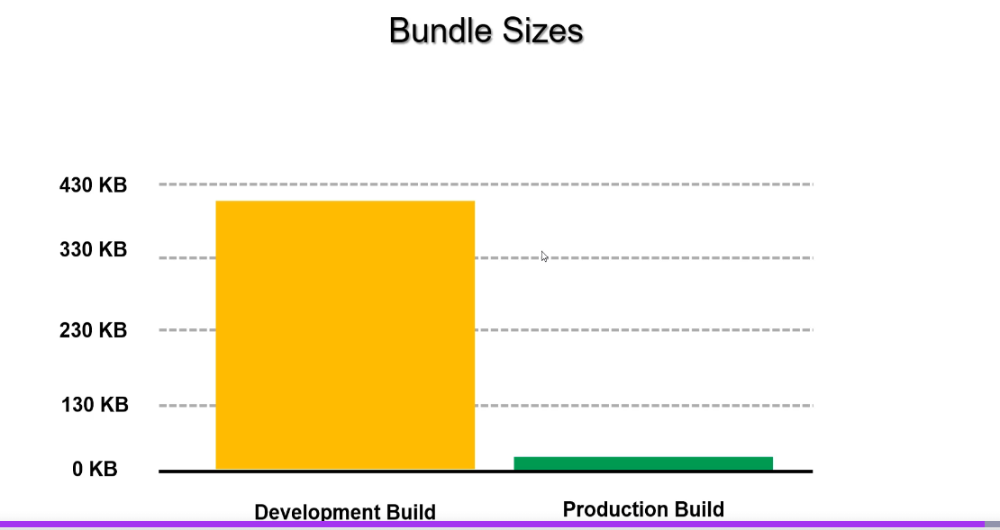

# Legacy Performance Optimizations

## The transcript explains how to use the React DevTools Profiler to find performance issues in an application.

- Action: You start the profiler, interact with the app (in this case, moving a single star), and then stop the recording.

- Problem Found: The profiler showed that even though only one star was moved, many other unrelated components—like an info box, buttons, and all the other stars—also re-rendered.

- Conclusion: This is inefficient and causes poor performance due to "wasted renders." The goal is to fix this so that only the component that actually changes gets re-rendered.

# How React Renders Efficiently: The Virtual DOM and Reconciliation

This document explains React's core rendering strategy, which prevents slow and inefficient updates to the browser.

### The Basic Render Process

When a state change occurs in a React application (e.g., a user clicks a button), React re-renders the component and its children to get an updated view of the UI.

### The Inefficient Approach (What React Avoids)

If React took this new UI description and directly rewrote the entire browser DOM every single time, applications would be extremely slow. Manipulating the real DOM is an expensive operation.

### React's Smart Solution: Reconciliation

React uses a "Virtual DOM" to solve this problem. It's a lightweight copy of the real DOM that exists only in memory. The process works like this:

1. **Generate a New "Snapshot":** After a state change, React creates a new Virtual DOM snapshot representing the updated UI.
2. **Compare Snapshots:** React then compares this new snapshot with the previous one it has in memory. This comparison process is called **"reconciliation."**
3. **Create a List of Changes:** By comparing the two versions, React generates a minimal list of specific changes (or "mutations") needed to make the real DOM match the new UI. It figures out exactly:
    * Which components need to be **added**.
    * Which components need to be **deleted**.
    * Which components were **updated** (and what exactly changed inside them).
4. **Update the Real DOM:** Finally, React applies this small, optimized batch of changes to the real browser DOM.

This process ensures that only the necessary parts of the page are updated, making React applications fast and efficient.

## React's Smart Updates: Batching with the Virtual DOM

This document explains how React groups, or "batches," multiple changes together to perform efficient updates to the browser.

### The Problem: Frequent DOM Changes are Slow

Directly changing the browser's DOM is an expensive operation. If multiple state changes happen in quick succession, updating the real DOM after each one would make the application feel sluggish and inefficient.

### React's Solution: Batching Updates

React uses its in-memory **Virtual DOM** to intelligently batch updates before touching the real DOM.

Here's the process:

1. **Multiple Changes Occur:** Imagine two changes happen very quickly. For example, a new orange element is added, and then immediately after, a new blue element is added.
2. **React Waits and Batches:** Instead of updating the real DOM twice, React is smart. It records the first change (the orange element) in its Virtual DOM and waits briefly to see if more changes are coming. It collects all these rapid changes together.
3. **A Single, Optimized Update:** Once React has batched all the changes (both the orange and blue elements), it calculates the most efficient way to update the browser. It then performs a **single update** to the real DOM to apply all the changes at once.

### The Benefit

This batching process is extremely fast because all the complex work and comparisons happen in memory using the Virtual DOM. By minimizing direct and repeated manipulations of the real DOM, React keeps the application fast and responsive.


# Optimizing Components with `PureComponent` and `useCallback`

This document explains how to prevent wasted renders in a class component that receives functions as props from a functional parent component.

### The Problem: Wasted Renders in `NewButton`

Using the React DevTools Profiler, we identified that the `NewButton` component was re-rendering every time a star was moved, even though the button itself was not interacted with.

### Attempt 1: Using `React.PureComponent`

The first step was to convert `NewButton` from a `React.Component` to a `React.PureComponent`.

- **What `PureComponent` does:** It performs a shallow comparison of props and state. If the props and state are the same as the previous render, it skips re-rendering.

```jsx
// In NewButton.js
import { PureComponent } from 'react';

class NewButton extends PureComponent {
  // ...
}
```

**Result:** This did **not** solve the problem. The button still re-rendered.

### The Root Cause: Unstable Function Props

The issue was in the parent `App` component. The `onClick` prop passed to `NewButton` was an inline arrow function.

```jsx
// In App.js (Parent Component)
<NewButton onClick={() => this.setState({ showDialog: true })} />
```

Every time the `App` component re-renders, a **brand new instance** of this arrow function is created. Because the function's reference changes, `PureComponent` sees it as a "new" prop and re-renders the `NewButton`.

### The Solution: `useCallback`

To fix this, we need to provide a stable function reference from the parent `App` component. Since `App` is a functional component, we can use the `useCallback` hook.

- **What `useCallback` does:** It memoizes a function, returning the exact same function instance across re-renders unless its dependencies change.

We created the handler in the `App` component and wrapped it in `useCallback` with an empty dependency array `[]`.

```jsx
// In App.js (Parent Component)
import { useCallback } from 'react';

// ... inside the App component
const showDialog = useCallback(() => {
  setDialogVisible(true);
}, []); // Empty array means this function is created only once.

// ... in the JSX
<NewButton onClick={showDialog} />
```


### The Final Result

With `useCallback`, the `NewButton` now receives the same `onClick` function instance every time. The `PureComponent` shallow comparison works correctly, and the wasted re-render is eliminated. The profiler confirms this by showing the `NewButton` component as grayed out (meaning it did not render).


# Optimizing Functional Components with `React.memo`

This document explains how to prevent wasted renders in a functional component, which cannot use the `PureComponent` class.

### The Problem: No `PureComponent` for Functional Components

When our `NewButton` was converted from a class to a functional component, it lost the performance optimization from `PureComponent`. The profiler confirms that it goes back to re-rendering unnecessarily every time its parent (`App`) updates.

### The Solution: `React.memo`

React provides a **Higher-Order Component (HOC)** called `React.memo` specifically for this purpose. It is the functional component equivalent of `PureComponent`.

- **What it does:** It memoizes the component. It performs a shallow comparison of the component's props and prevents it from re-rendering if the props have not changed.


### How to Use `React.memo`

You wrap your functional component with `React.memo` upon export.

1. **Wrap the Component:**

```jsx
// In NewButton.js
import { memo } from 'react';

const NewButton = ({ onClick }) => {
  // ... component logic
};

// Export the memoized version as the default
export default memo(NewButton);
```

2. **Update the Import:** Since we are now using a `default` export, the import statement in the parent component must be updated.

```jsx
// In App.js
// Change this:
// import { NewButton } from './components/NewButton';

// To this:
import NewButton from './components/NewButton';
```


### The Final Result

After applying `React.memo` (and assuming the `onClick` prop from the parent is already stable, e.g., from `useCallback`), the profiler shows that the `NewButton` no longer re-renders when a star moves. The problem of wasted renders is solved for the functional component.

# Do not mutate state directly in React

# Custom Render Logic with `shouldComponentUpdate`

This document explains how to implement custom logic to prevent wasted renders in a class component with complex props.

### The Problem: Wasted Renders in `InfoBox`

The `InfoBox` component displays the number of stars, but the profiler shows it re-renders every time a star is *moved*, even though the star count doesn't change. A `PureComponent` is not sufficient here because the `stars` prop is an object, and its reference changes on every parent render, causing a shallow comparison to fail.

### Solution Part 1: `shouldComponentUpdate`

We can use the `shouldComponentUpdate` lifecycle method in our class component to define custom logic for when to re-render. We'll tell it to only re-render if the number of stars has changed.

```jsx
// In InfoBox.js
shouldComponentUpdate(nextProps) {
  const oldStarCount = Object.keys(this.props.stars).length;
  const newStarCount = Object.keys(nextProps.stars).length;

  // Only re-render if the number of stars is different.
  return oldStarCount !== newStarCount;
}
```

**Result:** This works perfectly for preventing re-renders when moving a star. The profiler shows the `InfoBox` is no longer rendering unnecessarily.

### A New Bug: Component Doesn't Update on Deletion

A new problem appears: when a star is **deleted**, the `InfoBox` does not update its count.

### The Root Cause: State Mutation in the Parent Component

The problem lies in the `handleDelete` function in the parent `App` component.

**Problematic Code in `App.js`:**

```javascript
const handleDelete = (id) => {
  const { stars } = this.state;
  delete stars[id]; // <-- DIRECT MUTATION of the state object
  this.setState({ stars });
};
```

**Why this breaks `shouldComponentUpdate`:**

1. When `handleDelete` is called, it directly mutates the `stars` object in the current state.
2. It then calls `setState` with this same, already-changed object.
3. When React gets to the `InfoBox`'s `shouldComponentUpdate` method, the "old props" (`this.props.stars`) and the "new props" (`nextProps.stars`) are referencing the **exact same mutated object**.
4. Therefore, `oldStarCount` and `newStarCount` are identical, the method returns `false`, and the component incorrectly skips the update.

**The lesson is critical: Never mutate state directly in React.** State should always be treated as immutable.

# Immutability and Custom Comparison with `React.memo`

This document explains the importance of immutability and how to implement custom rendering logic for functional components.

### Part 1: Fixing the Bug with Immutability

The previous implementation of `shouldComponentUpdate` failed when deleting a star because the state was being mutated directly.

**The Fix: Immutable Updates**

Instead of modifying the original `stars` object, we must create a **new** object.

**Old (Incorrect) Code - Mutating State:**

```javascript
const handleDelete = (id) => {
  const { stars } = this.state;
  delete stars[id]; // <-- Problem: This mutates the original object
  this.setState({ stars });
};
```

**New (Correct) Code - Immutable Update:**

```javascript
const handleDelete = (id) => {
  const { stars } = this.state;
  const newStars = { ...stars }; // 1. Create a shallow copy
  delete newStars[id];           // 2. Mutate the copy, not the original
  this.setState({ stars: newStars }); // 3. Set state with the new object
};
```

By providing a new object reference, our `shouldComponentUpdate` comparison now works correctly, and the component updates properly upon deletion.

**Key Lesson:** Never mutate state directly. Always create a new object or array for updates.

### Part 2: Custom Comparison for Functional Components

To achieve the same custom render logic in a functional `InfoBox` component, we use `React.memo` with a custom comparison function.

#### The Problem

Using `React.memo` alone is not enough. Like `PureComponent`, it performs a shallow comparison. Since the parent component creates a new `stars` object on every render, the reference always changes, and the component re-renders unnecessarily.

#### The Solution: Custom Comparison Function

`React.memo` accepts an optional second argument: a function that compares the previous and next props. This function lets you define exactly when the component should re-render.

**How it works:**

- The function receives `prevProps` and `nextProps`.
- It should return `true` if the props are considered **equal**, which will **prevent** a re-render.
- It should return `false` if the props are different, which will **trigger** a re-render.

```jsx
// In InfoBox.js

const Info = ({ stars }) => {
  // ...component logic
};

// The custom comparison function
const areStarsEqual = (prevProps, nextProps) => {
  const oldStarCount = Object.keys(prevProps.stars).length;
  const newStarCount = Object.keys(nextProps.stars).length;

  // Return true if the counts are the same to SKIP the render
  return oldStarCount === newStarCount;
};

// Export the memoized component with our custom logic
export default memo(Info, areStarsEqual);
```


### The Final Result

With this change, the functional `InfoBox` component now has the same performance optimization as the class-based version. It correctly avoids re-rendering when a star is moved but updates properly when a star is added or deleted.


# Optimizing Lists: Memoizing Repeated Components

This document explains how to prevent wasted renders in a list of components, ensuring that only the item that changes is re-rendered.

### The Problem: All Stars Re-Render

The profiler shows that when a single `Star` component is moved, many other `Star` components in the list also re-render. This is a common and significant performance issue in applications that render lists of data.

### The Solution: `React.memo` with a Custom Comparison

The `Star` component is a functional component, so we can use `React.memo` to optimize it. However, since the parent passes a new `onMove` function on every render, `memo`'s default shallow comparison is not enough. We need to provide a custom comparison function that tells React exactly when a `Star` should be considered "unchanged."

**The Logic:**
A `Star` component should only re-render if its visual properties (`id`, `left`, `top`) have actually changed.

We create a custom comparison function that checks if these key props are identical between the old and new props.

```jsx
// In Star.js

const Star = ({ id, onMove, left, top }) => {
  // ...component logic
};

// The custom comparison function
const areStarsEqual = (prevProps, nextProps) => {
  // Return `true` (skip render) if the star's identity and position are the same
  return (
    prevProps.id === nextProps.id &&
    prevProps.left === nextProps.left &&
    prevProps.top === nextProps.top
  );
};

// Export the memoized component with our custom logic
export default memo(Star, areStarsEqual);
```


### The Final Result

After applying `React.memo` with this custom comparison logic, the profiler confirms the fix. When a single star is moved, **only that star re-renders**. All other stars in the list are grayed out, indicating that the wasted renders have been successfully eliminated.


# Optimizing Expensive Calculations with `useMemo`

This document explains how to use the `useMemo` hook to prevent performance bottlenecks caused by heavy, CPU-intensive calculations that run on every render.

### The Problem: Expensive Operations on Every Render

Our `InfoBox` component contains a "heavy" calculation (in this case, looping through star data). The React DevTools Profiler revealed that even a simple UI change, like expanding the box's width, was taking nearly two seconds to render.

This happens because the expensive calculation is re-executed **every time the component re-renders**, even when the data it depends on hasn't changed.

### The Solution: Caching the Result with `useMemo`

The `useMemo` hook is the perfect tool for this scenario. It memoizes (or caches) the result of a calculation, re-running it only when its dependencies have changed.

**How it works:**

1. You wrap your expensive calculation in a function and pass it to `useMemo`.
2. You provide a dependency array, similar to `useEffect`.
3. `useMemo` will only re-execute the calculation if a value in the dependency array changes. Otherwise, it returns the cached result from the previous render.

### How to Implement `useMemo`

We isolated the heavy logic and wrapped it in `useMemo`, telling it to only re-calculate when the number of stars changes.

```jsx
// In InfoBox.js
import { useMemo } from 'react';

const Info = ({ stars }) => {
  // ...

  // Memoize the result of the expensive calculation
  const distances = useMemo(() => {
    console.log('Running expensive calculation...');

    // --- All the heavy calculation logic goes here ---
    const distancesCalc = /* ... a lot of looping and math ... */;

    return distancesCalc;
  }, [Object.keys(stars).length]); // <-- The Dependency Array

  // ... rest of the component JSX that uses `distances`
};
```

**The Dependency Array:**
By using `[Object.keys(stars).length]` as the dependency, we ensure the heavy calculation only runs when a star is added or deleted. For all other re-renders (like expanding the box), `useMemo` will instantly return the cached `distances` value.

### The Final Result

After implementing `useMemo`, expanding the `InfoBox` is instantaneous. The profiler confirms that the render time is now a fraction of what it was before, as the expensive logic is correctly skipped unless its specific dependencies change.

# Reducing Bundle Size with Production Builds

This document explains how to significantly reduce your application's file size by creating a production build. Smaller files lead to faster load times for your users.

### The Problem: Large Development Bundles

When you run a React app in development mode (using `npm start`), it includes extra tools for debugging and detailed error messages. This makes the main JavaScript file (`bundle.js`) very large.

- **Example Development Size:** `~394 kB`

This size is not suitable for a live application.

### The Solution: Create a Production Build

React build tools (like Create React App) have a specific command to create an optimized "production build." This process:

- Removes development-only code.
- Minifies the JavaScript (removes whitespace, shortens variable names).
- Applies other optimizations to make the files as small as possible.


### How to Create and Serve a Production Build

1. **Build the Project:**
   Stop the development server and run the following command in your terminal. This creates a highly optimized `build` folder.

```sh
npm run build
```

2. **Serve the Build Folder:**
   To test the production build locally, you can use a simple static server package like `serve`.

```sh
npx serve -s build
```

This will start a server hosting the contents of your `build` folder.

### The Result: A Drastic Reduction in Size

After creating a production build, inspect the file sizes in the browser's **Network** tab.

- **Example Production Size:** `~58 kB`

As you can see, switching to a production build resulted in a dramatic decrease in bundle size.

**Conclusion:** Always deploy the **production build** of your application to ensure the fastest possible experience for your users.

- 


# Improving Load Times with Code-Splitting (`React.lazy` and `Suspense`)

This document explains how to "lazy load" components to reduce the initial bundle size and improve your application's startup performance.

### The Problem: Loading Unnecessary Code

By default, React applications bundle all component code into a single file that is downloaded on the initial page load. This is inefficient for components that are not immediately visible, such as a modal dialog that only appears after a button click. The user is forced to download code they may never use, which slows down the initial experience.

### The Solution: Lazy Loading

"Lazy loading" (or code-splitting) is the practice of downloading a component's code only when it is actually needed. React provides two built-in features to make this easy: `React.lazy` and `<Suspense>`.

### Implementation Steps

Here’s how to lazy-load a modal component that appears on demand.

#### 1. Ensure the Component is a Default Export

The component you want to lazy-load **must** be exported as a `default` export.

```jsx
// In NewStarModal.js
const NewStarModal = (props) => {
  // ...
};

export default NewStarModal; // Must be a default export
```


#### 2. Use `React.lazy` for Dynamic Import

In the parent component (`App.js`), change how you import the modal. Instead of a standard `import`, use `React.lazy` combined with a dynamic `import()` statement.

```jsx
// In App.js

// Before: Standard import
// import NewStarModal from './components/NewStarModal';

// After: Lazy-loaded import
import { lazy, Suspense } from 'react';

const AddModel = lazy(() => import('./components/NewStarModal'));
```


#### 3. Wrap with `<Suspense>` and Provide a `fallback`

Now, wherever you render the lazy-loaded component, you must wrap it in a `<Suspense>` component. `Suspense` lets you specify a `fallback` UI to show while the component's code is being downloaded.

```jsx
// A simple loading component to show as a fallback
const ModalLoader = () => <div>Loading...</div>;

// In your App.js render method...
{dialogVisible && (
  <Suspense fallback={<ModalLoader />}>
    <AddModel onSubmit={handleSubmit} />
  </Suspense>
)}
```


### How It Works

1. When the application first loads, the code for `AddModel` is **not** downloaded.
2. When `dialogVisible` becomes `true`, React attempts to render `<AddModel>`.
3. `Suspense` "catches" this and displays the `fallback` UI (`<ModalLoader />`).
4. In the background, React downloads the JavaScript file for the `AddModel` component.
5. Once the download is complete, `Suspense` replaces the `fallback` UI with the fully-rendered `<AddModel>` component.

### Verification

You can see this in action by opening the browser's **Network** tab. Clear the log, then click the button to show the modal. You will see a new JavaScript "chunk" (file) being downloaded at that moment.

