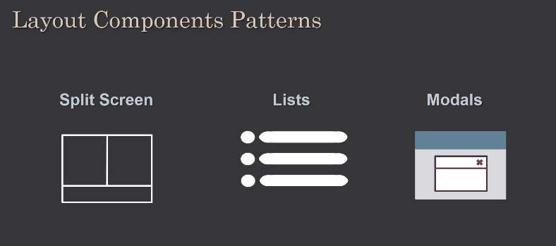
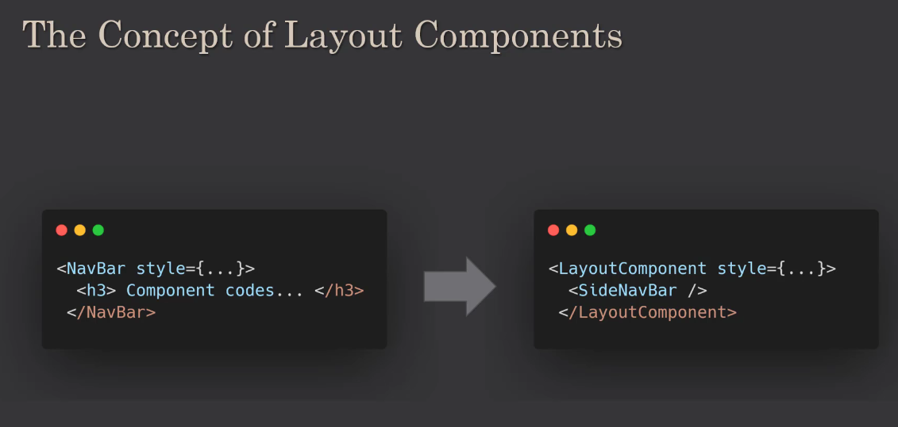

# Advanced React Design Patterns

- With respect to naming conventions, React JS is un-opinionated
- Common naming conventions are Pascal Case, camelCase and kebab-case


# Design Patterns: Layout Components
- 
- 

# React Layout Components - Summary

## Overview

Layout components in React are specialized components designed to organize and structure other components within a web page. They follow a separation of concerns principle, where the layout logic is decoupled from the content components, providing flexibility and reusability.

## Core Concept of Layout Components

### Definition

**Layout Components**: Specialized React components that focus on organizing and positioning other components within a web page structure, separating layout concerns from content logic.

### Key Principle

> **Components should function independently of their placement on the page**

This means individual components should not contain positioning or layout-specific logic, making them more flexible and reusable across different contexts.

## Architecture Comparison

### Traditional Approach (Tightly Coupled)

```jsx
// ❌ Component contains both content AND layout styling
const SideNavigation = () => {
  return (
    <div 
      style={{
        position: 'fixed',
        left: 0,
        top: 0,
        width: '250px',
        height: '100vh',
        backgroundColor: '#f0f0f0',
        padding: '20px'
      }}
    >
      <nav>
        <ul>
          <li><a href="/home">Home</a></li>
          <li><a href="/about">About</a></li>
          <li><a href="/contact">Contact</a></li>
        </ul>
      </nav>
    </div>
  );
};

// Problems:
// - Layout styles mixed with content logic
// - Hard to reuse in different layouts
// - Component "knows" where it should be positioned
```


### Layout Components Approach (Decoupled)

```jsx
// ✅ Pure content component (layout-agnostic)
const SideNavigation = () => {
  return (
    <nav>
      <ul>
        <li><a href="/home">Home</a></li>
        <li><a href="/about">About</a></li>
        <li><a href="/contact">Contact</a></li>
      </ul>
    </nav>
  );
};

// ✅ Layout component handles positioning
const SidebarLayout = ({ sidebar, content }) => {
  return (
    <div className="sidebar-layout">
      <aside className="sidebar">
        {sidebar}
      </aside>
      <main className="content">
        {content}
      </main>
    </div>
  );
};

// CSS for layout positioning
const styles = `
.sidebar-layout {
  display: flex;
  min-height: 100vh;
}

.sidebar {
  width: 250px;
  background-color: #f0f0f0;
  padding: 20px;
  position: fixed;
  height: 100vh;
}

.content {
  margin-left: 250px;
  flex: 1;
  padding: 20px;
}
`;

// Usage - components are inserted into layout
const App = () => {
  return (
    <SidebarLayout
      sidebar={<SideNavigation />}
      content={<MainContent />}
    />
  );
};
```


## Common Layout Component Examples

### 1. Split Screen Layout

```jsx
const SplitScreenLayout = ({ left, right, leftWeight = 1, rightWeight = 1 }) => {
  return (
    <div className="split-screen">
      <div 
        className="left-pane"
        style={{ flex: leftWeight }}
      >
        {left}
      </div>
      <div 
        className="right-pane"
        style={{ flex: rightWeight }}
      >
        {right}
      </div>
    </div>
  );
};

// CSS
const styles = `
.split-screen {
  display: flex;
  height: 100vh;
}

.left-pane, .right-pane {
  padding: 20px;
}

.left-pane {
  background-color: #f8f9fa;
}

.right-pane {
  background-color: #ffffff;
}
`;

// Usage
const Dashboard = () => {
  return (
    <SplitScreenLayout
      left={<Sidebar />}
      right={<MainContent />}
      leftWeight={1}
      rightWeight={3}
    />
  );
};
```


### 2. Grid Layout Component

```jsx
const GridLayout = ({ children, columns = 12, gap = '1rem' }) => {
  return (
    <div 
      className="grid-layout"
      style={{
        display: 'grid',
        gridTemplateColumns: `repeat(${columns}, 1fr)`,
        gap: gap
      }}
    >
      {children}
    </div>
  );
};

const GridItem = ({ children, span = 1, start, end }) => {
  return (
    <div 
      className="grid-item"
      style={{
        gridColumn: start && end 
          ? `${start} / ${end}` 
          : span > 1 
            ? `span ${span}` 
            : undefined
      }}
    >
      {children}
    </div>
  );
};

// Usage
const ProductGrid = () => {
  return (
    <GridLayout columns={12} gap="2rem">
      <GridItem span={12}>
        <Header />
      </GridItem>
      <GridItem span={3}>
        <Sidebar />
      </GridItem>
      <GridItem span={9}>
        <ProductList />
      </GridItem>
      <GridItem span={12}>
        <Footer />
      </GridItem>
    </GridLayout>
  );
};
```


### 3. Modal Layout Component

```jsx
const Modal = ({ isOpen, onClose, children, title }) => {
  if (!isOpen) return null;

  return (
    <div className="modal-overlay" onClick={onClose}>
      <div 
        className="modal-content" 
        onClick={(e) => e.stopPropagation()}
      >
        <div className="modal-header">
          <h2>{title}</h2>
          <button 
            className="close-button" 
            onClick={onClose}
            aria-label="Close"
          >
            ×
          </button>
        </div>
        <div className="modal-body">
          {children}
        </div>
      </div>
    </div>
  );
};

// CSS
const styles = `
.modal-overlay {
  position: fixed;
  top: 0;
  left: 0;
  right: 0;
  bottom: 0;
  background-color: rgba(0, 0, 0, 0.5);
  display: flex;
  justify-content: center;
  align-items: center;
  z-index: 1000;
}

.modal-content {
  background: white;
  border-radius: 8px;
  max-width: 90vw;
  max-height: 90vh;
  overflow: auto;
  box-shadow: 0 4px 6px rgba(0, 0, 0, 0.1);
}

.modal-header {
  display: flex;
  justify-content: space-between;
  align-items: center;
  padding: 1rem;
  border-bottom: 1px solid #e0e0e0;
}

.modal-body {
  padding: 1rem;
}

.close-button {
  background: none;
  border: none;
  font-size: 1.5rem;
  cursor: pointer;
  padding: 0;
  width: 2rem;
  height: 2rem;
  border-radius: 50%;
}
`;

// Usage
const App = () => {
  const [showModal, setShowModal] = useState(false);

  return (
    <div>
      <button onClick={() => setShowModal(true)}>
        Open Modal
      </button>
      
      <Modal
        isOpen={showModal}
        onClose={() => setShowModal(false)}
        title="User Profile"
      >
        <UserProfileForm />
      </Modal>
    </div>
  );
};
```


### 4. List Layout Component

```jsx
const List = ({ items, renderItem, ItemComponent, spacing = 'medium' }) => {
  const spacingClasses = {
    small: 'list-spacing-small',
    medium: 'list-spacing-medium', 
    large: 'list-spacing-large'
  };

  return (
    <ul className={`list ${spacingClasses[spacing]}`}>
      {items.map((item, index) => (
        <li key={item.id || index} className="list-item">
          {ItemComponent ? (
            <ItemComponent {...item} />
          ) : (
            renderItem ? renderItem(item, index) : item
          )}
        </li>
      ))}
    </ul>
  );
};

// CSS
const styles = `
.list {
  list-style: none;
  padding: 0;
  margin: 0;
}

.list-spacing-small .list-item {
  margin-bottom: 0.5rem;
}

.list-spacing-medium .list-item {
  margin-bottom: 1rem;
}

.list-spacing-large .list-item {
  margin-bottom: 1.5rem;
}
`;

// Content components (layout-agnostic)
const ProductCard = ({ name, price, image }) => (
  <div className="product-card">
    
    <h3>{name}</h3>
    <p>${price}</p>
  </div>
);

// Usage
const ProductList = ({ products }) => {
  return (
    <List
      items={products}
      ItemComponent={ProductCard}
      spacing="large"
    />
  );
};
```


### 5. Responsive Layout Component

```jsx
const ResponsiveLayout = ({ children, breakpoints = {} }) => {
  const [windowSize, setWindowSize] = useState({
    width: window.innerWidth,
    height: window.innerHeight,
  });

  useEffect(() => {
    const handleResize = () => {
      setWindowSize({
        width: window.innerWidth,
        height: window.innerHeight,
      });
    };

    window.addEventListener('resize', handleResize);
    return () => window.removeEventListener('resize', handleResize);
  }, []);

  const getLayoutType = () => {
    const { width } = windowSize;
    const defaultBreakpoints = {
      mobile: 768,
      tablet: 1024,
      desktop: 1200,
      ...breakpoints
    };

    if (width < defaultBreakpoints.mobile) return 'mobile';
    if (width < defaultBreakpoints.tablet) return 'tablet';
    if (width < defaultBreakpoints.desktop) return 'desktop';
    return 'wide';
  };

  return (
    <div className={`responsive-layout layout-${getLayoutType()}`}>
      {children}
    </div>
  );
};

// CSS
const styles = `
.responsive-layout {
  padding: 1rem;
}

.layout-mobile {
  display: flex;
  flex-direction: column;
}

.layout-tablet {
  display: grid;
  grid-template-columns: 1fr 2fr;
  gap: 1rem;
}

.layout-desktop {
  display: grid;
  grid-template-columns: 250px 1fr 250px;
  gap: 2rem;
}

.layout-wide {
  display: grid;
  grid-template-columns: 300px 1fr 300px;
  gap: 3rem;
  max-width: 1400px;
  margin: 0 auto;
}
`;
```


## Benefits of Layout Components

### 1. **Separation of Concerns**

```jsx
// Content logic separated from layout logic
const UserProfile = ({ user }) => (
  <div>
    <h2>{user.name}</h2>
    <p>{user.email}</p>
  </div>
);

// Layout logic handles positioning
const CardLayout = ({ children }) => (
  <div className="card">
    {children}
  </div>
);
```


### 2. **Reusability**

```jsx
// Same content component used in different layouts
const ProductInfo = ({ product }) => (
  <div>
    <h3>{product.name}</h3>
    <p>{product.description}</p>
  </div>
);

// Different layout contexts
const GridView = () => (
  <GridLayout>
    {products.map(product => (
      <GridItem key={product.id}>
        <ProductInfo product={product} />
      </GridItem>
    ))}
  </GridLayout>
);

const ListView = () => (
  <List
    items={products}
    renderItem={(product) => <ProductInfo product={product} />}
  />
);
```


### 3. **Flexibility**

```jsx
// Easy to switch between different layouts
const Dashboard = ({ layoutType }) => {
  const layouts = {
    sidebar: (content) => (
      <SidebarLayout sidebar={<Navigation />} content={content} />
    ),
    split: (content) => (
      <SplitScreenLayout left={<Navigation />} right={content} />
    ),
    grid: (content) => (
      <GridLayout>{content}</GridLayout>
    )
  };

  const Layout = layouts[layoutType] || layouts.sidebar;

  return Layout(<MainContent />);
};
```


## Best Practices for Layout Components

### 1. **Keep Components Layout-Agnostic**

```jsx
// ❌ Component knows about its position
const Header = () => (
  <header style={{ position: 'fixed', top: 0, width: '100%' }}>
    <h1>My App</h1>
  </header>
);

// ✅ Component focuses only on content
const Header = () => (
  <header>
    <h1>My App</h1>
  </header>
);

// Layout component handles positioning
const FixedHeaderLayout = ({ header, content }) => (
  <div className="fixed-header-layout">
    <div className="fixed-header">
      {header}
    </div>
    <div className="content-with-header-offset">
      {content}
    </div>
  </div>
);
```


### 2. **Use Composition Over Configuration**

```jsx
// ✅ Flexible composition
const PageLayout = ({ header, sidebar, content, footer }) => (
  <div className="page-layout">
    {header && <header className="page-header">{header}</header>}
    <div className="page-main">
      {sidebar && <aside className="page-sidebar">{sidebar}</aside>}
      <main className="page-content">{content}</main>
    </div>
    {footer && <footer className="page-footer">{footer}</footer>}
  </div>
);

// Usage with different combinations
const HomePage = () => (
  <PageLayout
    header={<Header />}
    content={<HomeContent />}
    footer={<Footer />}
  />
);

const AdminPage = () => (
  <PageLayout
    header={<AdminHeader />}
    sidebar={<AdminSidebar />}
    content={<AdminContent />}
  />
);
```


### 3. **Provide Sensible Props for Customization**

```jsx
const FlexLayout = ({ 
  children, 
  direction = 'row', 
  justify = 'flex-start', 
  align = 'stretch',
  wrap = 'nowrap',
  gap = 0 
}) => (
  <div 
    style={{
      display: 'flex',
      flexDirection: direction,
      justifyContent: justify,
      alignItems: align,
      flexWrap: wrap,
      gap: gap
    }}
  >
    {children}
  </div>
);
```


## Key Takeaways

1. **Separation of Concerns**: Layout components separate positioning logic from content logic
2. **Component Independence**: Individual components should not know about their page placement
3. **Increased Reusability**: Content components can be used in multiple layout contexts
4. **Flexibility**: Easy to change layouts without modifying content components
5. **Maintainability**: Changes to layout don't affect content components and vice versa
6. **Composition Pattern**: Use component composition to build flexible layouts
7. **Responsive Design**: Layout components can handle responsive behavior centrally
8. **Accessibility**: Layout components can implement consistent accessibility patterns
9. **Performance**: Easier to optimize layouts without affecting content rendering
10. **Testing**: Layout and content logic can be tested independently

Layout components are a powerful pattern in React that promotes clean, maintainable, and flexible code by separating concerns and making components more reusable across different contexts and layouts.


# Split Screen Layout Component - React Implementation

## Setup and Installation

```bash
npm install styled-components
```


## Split Screen Component Implementation

```jsx
// components/SplitScreen.js
import styled from 'styled-components';

export const SplitScreen = ({ left, right }) => {
  return (
    <Container>
      <Panel>{left}</Panel>
      <Panel>{right}</Panel>
    </Container>
  );
};

// Styled Components
const Container = styled.div`
  display: flex;
`;

const Panel = styled.div`
  flex: 1;
`;
```


## Key Points

### 1. **Props Pattern**

```jsx
// Takes components as props, not data
<SplitScreen 
  left={<LeftSideComponent />}
  right={<RightSideComponent />}
/>
```


### 2. **Styled Components Syntax**

```jsx
const Container = styled.div`
  display: flex;
`;

// styled.elementType`CSS styles here`
```


### 3. **Equal Distribution**

```jsx
const Panel = styled.div`
  flex: 1;  // Each panel takes equal space
`;
```


## Usage Example

```jsx
// App.js
import { SplitScreen } from './components/SplitScreen';

const LeftSideComponent = () => (
  <h2 style={{ backgroundColor: 'crimson' }}>I am left</h2>
);

const RightSideComponent = () => (
  <h2 style={{ backgroundColor: 'brown' }}>I am right</h2>
);

function App() {
  return (
    <SplitScreen
      left={<LeftSideComponent />}
      right={<RightSideComponent />}
    />
  );
}
```


## Important Concepts

### **Layout vs Content Separation**

- `SplitScreen` handles layout (positioning, flex)
- `LeftSideComponent`/`RightSideComponent` handle content only
- Components don't know about their positioning


### **Component Composition**

- Pass entire components as props
- Flexible - can pass any React component
- Reusable across different contexts


### **Styled Components Benefits**

- CSS-in-JS approach
- Component-scoped styles
- Dynamic styling with props (covered later)


## Result

Two equal-width panels displayed side by side, each containing the passed component with different background colors for visual distinction.


# Enhanced Split Screen Component - Dynamic Widths \& Children Pattern

## Enhanced Split Screen with Custom Widths

```jsx
// components/SplitScreen.js
import styled from 'styled-components';

export const SplitScreen = ({ 
  children,
  leftWeight = 1, 
  rightWeight = 1 
}) => {
  const [left, right] = children;
  
  return (
    <Container>
      <Panel flex={leftWeight}>{left}</Panel>
      <Panel flex={rightWeight}>{right}</Panel>
    </Container>
  );
};

// Styled Components with Dynamic Props
const Container = styled.div`
  display: flex;
`;

const Panel = styled.div`
  flex: ${(p) => p.flex};
`;
```


## Key Points

### 1. **Dynamic Flex Values**

```jsx
// Styled component receives props
const Panel = styled.div`
  flex: ${(p) => p.flex};  // Access props with ${(props) => props.propName}
`;

// Usage in JSX
<Panel flex={leftWeight}>{left}</Panel>
<Panel flex={rightWeight}>{right}</Panel>
```


### 2. **Children Pattern (Preferred Approach)**

```jsx
// Instead of separate left/right props
const SplitScreen = ({ children, leftWeight = 1, rightWeight = 1 }) => {
  const [left, right] = children;  // Destructure children array
  return (
    <Container>
      <Panel flex={leftWeight}>{left}</Panel>
      <Panel flex={rightWeight}>{right}</Panel>
    </Container>
  );
};
```


### 3. **Cleaner Usage Syntax**

```jsx
// Clean children approach
<SplitScreen leftWeight={1} rightWeight={3}>
  <LeftSideComponent title="Right" />
  <RightSideComponent title="Left" />
</SplitScreen>

// vs older props approach
<SplitScreen 
  left={<LeftSideComponent />}
  right={<RightSideComponent />}
  leftWeight={1}
  rightWeight={3}
/>
```


## Updated Components with Props

```jsx
const LeftSideComponent = ({ title }) => (
  <h2 style={{ backgroundColor: 'crimson' }}>{title}</h2>
);

const RightSideComponent = ({ title }) => (
  <h2 style={{ backgroundColor: 'brown' }}>{title}</h2>
);
```


## Complete Usage Example

```jsx
// App.js
function App() {
  return (
    <SplitScreen leftWeight={1} rightWeight={3}>
      <LeftSideComponent title="Right" />
      <RightSideComponent title="Left" />
    </SplitScreen>
  );
}
```


## Benefits of Children Pattern

### **1. Cleaner Syntax**

- More natural component composition
- Easy to read and understand


### **2. Easy Props Passing**

```jsx
<SplitScreen leftWeight={1} rightWeight={2}>
  <LeftComponent title="Hello" color="red" />
  <RightComponent data={myData} onClick={handler} />
</SplitScreen>
```


### **3. Styled Components Props Access**

```jsx
// Access any prop passed to styled component
const Panel = styled.div`
  flex: ${(props) => props.flex};
  background: ${(props) => props.bg || 'white'};
  padding: ${(props) => props.padding || '0'};
`;
```


## Result

- Left panel: 25% width (flex: 1)
- Right panel: 75% width (flex: 3)
- Components can receive props easily
- Clean, composable syntax

# List and List Items Layout Components

## Project Setup

### Data Files

```js
// data/authors.js
export const authors = [
  { 
    name: "John Doe", 
    age: 35, 
    country: "USA", 
    books: ["Book 1", "Book 2"] 
  },
  // ... more authors
];

// data/books.js
export const books = [
  { title: "Book Title", author: "Author Name", pages: 200 },
  // ... more books
];
```


## List Item Components

### Small Author List Item

```jsx
// components/authors/SmallAuthorListItem.jsx
export const SmallAuthorListItem = ({ author }) => {
  const { name, age } = author;
  
  return (
    <p>Name: {name}, Age: {age}</p>
  );
};
```


### Large Author List Item

```jsx
// components/authors/LargeAuthorListItem.jsx
export const LargeAuthorListItem = ({ author }) => {
  const { name, age, country, books } = author;
  
  return (
    <>
      <h2>{name}</h2>
      <p>Age: {age}</p>
      <p>Country: {country}</p>
      <ul>
        {books.map(book => (
          <li key={book}>{book}</li>
        ))}
      </ul>
    </>
  );
};
```


## Generic List Component

```jsx
// components/lists/RegularList.jsx
export const RegularList = ({ 
  items, 
  sourceName, 
  ItemComponent 
}) => {
  return (
    <>
      {items.map((item, i) => (
        <ItemComponent 
          key={i}
          {...{[sourceName]: item}}
        />
      ))}
    </>
  );
};
```


## Key Points

### 1. **Dynamic Prop Spreading**

```jsx
// Creates dynamic prop names
{...{[sourceName]: item}}

// Runtime examples:
// If sourceName = "author": author={item}
// If sourceName = "book": book={item}
```


### 2. **Component Injection Pattern**

```jsx
// Pass component as prop
<RegularList 
  ItemComponent={SmallAuthorListItem}
  // ...
/>

// Component gets rendered inside list
<ItemComponent {...props} />
```


### 3. **Separation of Concerns**

- **List items**: Focus only on displaying data
- **List component**: Handles iteration and rendering
- **No styling**: Keep styling in parent components


## Usage Example

```jsx
// App.js
import { RegularList } from './components/lists/RegularList';
import { SmallAuthorListItem } from './components/authors/SmallAuthorListItem';
import { LargeAuthorListItem } from './components/authors/LargeAuthorListItem';
import { authors } from './data/authors';

function App() {
  return (
    <>
      <RegularList
        items={authors}
        sourceName="author"
        ItemComponent={SmallAuthorListItem}
      />
      
      <RegularList
        items={authors}
        sourceName="author" 
        ItemComponent={LargeAuthorListItem}
      />
    </>
  );
}
```


## Benefits

### **1. Reusability**

- Same `RegularList` works with any data type
- Different item components for different display needs


### **2. Flexibility**

- Easy to switch between small/large views
- Parent component controls styling


### **3. Separation of Concerns**

- List logic separate from item display logic
- Items don't care about positioning/styling


### **4. Component Injection**

- Pass components as props for dynamic rendering
- Runtime decision of which component to use


## Pattern Summary

- **RegularList**: Generic container handling iteration
- **ListItem components**: Focus on data display only
- **Dynamic props**: Use computed property names for flexibility
- **Component injection**: Pass components as props for flexibility


# Books List Items and Numbered List Component

## Book List Item Components

### Small Book List Item

```jsx
// components/books/SmallBookListItem.jsx
export const SmallBookListItem = ({ book }) => {
  const { name, price } = book;
  
  return (
    <h2>{name} - ${price}</h2>
  );
};
```


### Large Book List Item

```jsx
// components/books/LargeBookListItem.jsx
export const LargeBookListItem = ({ book }) => {
  const { name, price, title, pages } = book;
  
  return (
    <>
      <h2>{name}</h2>
      <p>Price: ${price}</p>
      <h2>{title}</h2>
      <p>Number of pages: {pages}</p>
    </>
  );
};
```


## Numbered List Component

```jsx
// components/lists/NumberedList.jsx
export const NumberedList = ({ 
  items, 
  sourceName, 
  ItemComponent 
}) => {
  return (
    <>
      {items.map((item, i) => (
        <>
          <h3>{i + 1}</h3>
          <ItemComponent 
            key={i}
            {...{[sourceName]: item}}
          />
        </>
      ))}
    </>
  );
};
```


## Complete App Usage

```jsx
// App.js
import { RegularList } from './components/lists/RegularList';
import { NumberedList } from './components/lists/NumberedList';
import { SmallAuthorListItem } from './components/authors/SmallAuthorListItem';
import { LargeAuthorListItem } from './components/authors/LargeAuthorListItem';
import { SmallBookListItem } from './components/books/SmallBookListItem';
import { LargeBookListItem } from './components/books/LargeBookListItem';
import { authors } from './data/authors';
import { books } from './data/books';

function App() {
  return (
    <>
      {/* Authors with Regular List */}
      <RegularList
        items={authors}
        sourceName="author"
        ItemComponent={SmallAuthorListItem}
      />
      
      {/* Books with Regular List */}
      <RegularList
        items={books}
        sourceName="book"
        ItemComponent={SmallBookListItem}
      />
      
      {/* Authors with Numbered List */}
      <NumberedList
        items={authors}
        sourceName="author" 
        ItemComponent={LargeAuthorListItem}
      />
      
      {/* Books with Numbered List */}
      <NumberedList
        items={books}
        sourceName="book"
        ItemComponent={LargeBookListItem}
      />
    </>
  );
}
```


## Key Points

### **1. Component Reusability**

```jsx
// Same RegularList works with different data types
<RegularList sourceName="author" ItemComponent={SmallAuthorListItem} />
<RegularList sourceName="book" ItemComponent={SmallBookListItem} />
```


### **2. List Type Variations**

```jsx
// Different list containers for same items
<RegularList />      // Plain list
<NumberedList />     // Numbered list
// Could add: <BulletList />, <GridList />, etc.
```


### **3. Component Combinations**

With 6 components, you can create multiple variations:

- 2 data types (authors, books)
- 2 item sizes (small, large)
- 2 list types (regular, numbered)
  = **8 different list combinations**


### **4. Pattern Benefits**

- **Separation of concerns**: List logic vs item display vs data
- **Easy to extend**: Add new list types or item components
- **Consistent interface**: All lists use same props pattern
- **Maintainable**: Changes to one component don't affect others


## Component Architecture

```
Lists (Container Logic)
├── RegularList
├── NumberedList
└── [Future: BulletList, GridList]

Items (Display Logic)  
├── Authors/
│   ├── SmallAuthorListItem
│   └── LargeAuthorListItem
└── Books/
    ├── SmallBookListItem  
    └── LargeBookListItem

Data (Static Data)
├── authors
└── books
```


## Result

- Authors and books displayed in both regular and numbered formats
- Small items show minimal info, large items show detailed info
- Easy to mix and match components for different use cases
- Scalable pattern for real-world applications


# Modal Layout Component Implementation

## Modal Component

```jsx
// components/Modal.jsx
import styled from 'styled-components';
import { useState } from 'react';

export const Modal = ({ children }) => {
  const [show, setShow] = useState(false);

  return (
    <>
      <button onClick={() => setShow(true)}>Show Modal</button>
      
      {show && (
        <ModalBackground onClick={() => setShow(false)}>
          <ModalContent onClick={(e) => e.stopPropagation()}>
            {children}
            <button onClick={() => setShow(false)}>Hide Modal</button>
          </ModalContent>
        </ModalBackground>
      )}
    </>
  );
};

// Styled Components
const ModalBackground = styled.div`
  position: absolute;
  left: 0;
  top: 0;
  overflow: auto;
  background-color: #00000067;
  width: 100%;
  height: 100%;
`;

const ModalContent = styled.div`
  margin: 12% auto;
  padding: 20px;
  background-color: wheat;
  width: 50%;
`;
```


## Key Points

### **1. Modal State Management**

```jsx
const [show, setShow] = useState(false);

// Show modal
<button onClick={() => setShow(true)}>Show Modal</button>

// Hide modal  
<button onClick={() => setShow(false)}>Hide Modal</button>
```


### **2. Conditional Rendering**

```jsx
{show && (
  <ModalBackground>
    <ModalContent>
      {children}
    </ModalContent>
  </ModalBackground>
)}
```


### **3. Event Propagation Control**

```jsx
// Background click closes modal
<ModalBackground onClick={() => setShow(false)}>
  
  {/* Content click doesn't close modal */}
  <ModalContent onClick={(e) => e.stopPropagation()}>
    {children}
  </ModalContent>
</ModalBackground>
```


### **4. Children Pattern Usage**

```jsx
// Modal accepts any content as children
<Modal>
  <LargeBookListItem book={books[0]} />
</Modal>
```


## Usage Example

```jsx
// App.js
import { Modal } from './components/Modal';
import { LargeBookListItem } from './components/books/LargeBookListItem';
import { books } from './data/books';

function App() {
  return (
    <Modal>
      <LargeBookListItem book={books[0]} />
    </Modal>
  );
}
```


## Modal Benefits

### **1. Reusable Container**

- Can display any content inside modal
- Same modal component for different data types


### **2. Event Handling**

- Click outside to close
- Close button functionality
- Prevents event conflicts with `stopPropagation()`


### **3. Flexible Content**

```jsx
// Different content types in same modal
<Modal><UserProfile /></Modal>
<Modal><BookDetails /></Modal>
<Modal><AuthorInfo /></Modal>
```


### **4. Layout Separation**

- Modal handles positioning/overlay logic
- Content components focus on data display
- No styling conflicts


## Component Architecture Pattern

```jsx
// Content Component (Layout-agnostic)
const BookInfo = ({ book }) => (
  <div>
    <h2>{book.name}</h2>
    <p>Price: ${book.price}</p>
  </div>
);

// Can be used in different contexts
<RegularList ItemComponent={BookInfo} />     // In list
<Modal><BookInfo book={book} /></Modal>      // In modal
<SplitScreen left={<BookInfo />} />          // In layout
```


## Key Features

- **Self-contained state management**
- **Background overlay with opacity**
- **Click-outside-to-close functionality**
- **Event propagation control**
- **Responsive positioning (12% from top, centered)**
- **Built from scratch (no external dependencies)**


## Result

A functional modal that can display any React component, with proper event handling and styling, demonstrating the layout component pattern where the modal handles positioning while content components remain layout-agnostic.

# If an interviewer asks about advanced React patterns, you can say:

- One powerful pattern I use is Layout Components. The core idea is to enforce a strict separation of concerns between a component's content and its position on the page. Content components are kept layout-agnostic—they don't know where they are. 
- Then, specialized Layout Components like SplitScreen, Modal, or GridLayout handle all the positioning logic.
- This is achieved through composition, typically by passing components as children or through named props. 
- For things like lists, I use component injection, where a generic List component takes an ItemComponent as a prop.
- The main benefits are huge: it dramatically increases reusability, flexibility, and maintainability. You can swap out layouts without ever touching the content components, and vice versa.

# React Design Patterns Course Summary

## What are Design Patterns?

**Effective solutions to common application development challenges** - emphasizing "effective" because not all solutions are equal. Poor solutions lead to anti-patterns (brittle code, poor performance, reduced maintainability).

## Course Focus

- **React-specific patterns** (not traditional OOP patterns like Gang of Four)
- Patterns from real-world React development experience
- Address common React development challenges


## Key Areas Covered:

### 1. **Reusable Layouts**

- Split screen components
- Modal components
- Component organization patterns


### 2. **Logic Reusability**

- Avoid code duplication
- Share complex logic between components
- Data fetching patterns

```jsx
// Example concept - sharing data fetching logic
const useApiData = (url) => {
  // Reusable data fetching logic
}
```


### 3. **Form Management**

- Form state management
- Validation patterns
- Form submission best practices

```jsx
// Form handling patterns
const FormComponent = () => {
  // State, validation, submission logic
}
```


### 4. **Functional Programming Integration**

- Recursive patterns in React
- Enhanced code organization
- Improved maintainability

```jsx
// Functional programming concepts
const RecursiveComponent = ({ data }) => {
  // Recursive rendering patterns
}
```


## Key Takeaway

Each common React challenge will be addressed with a specific, proven design pattern for optimal solutions.


# Container Components Pattern

## Definition

**React components responsible for handling data loading and data management on behalf of their child components.**

## The Problem

Junior/intermediate developers typically have each component load its own data:

```jsx
// Anti-pattern - each component loads its own data
const UserProfile = () => {
  const [user, setUser] = useState(null);
  
  useEffect(() => {
    fetch('/api/user')
      .then(res => res.json())
      .then(setUser);
  }, []);
  
  return <div>{user?.name}</div>;
};
```

**Challenge:** Multiple components needing the same data loading logic leads to code duplication.

## The Solution: Container Components

Extract data loading logic into a dedicated container component:

```jsx
// Container Component
const UserContainer = ({ children }) => {
  const [user, setUser] = useState(null);
  
  useEffect(() => {
    fetch('/api/user')
      .then(res => res.json())
      .then(setUser);
  }, []);
  
  return children(user); // Pass data to children
};

// Child Component (data-agnostic)
const UserProfile = ({ user }) => {
  return <div>{user?.name}</div>;
};

// Usage
<UserContainer>
  {user => <UserProfile user={user} />}
</UserContainer>
```


## Key Principle

**Data Separation:** Child components should be unaware of data source/management - they simply receive props and display content, similar to how layout components shield children from layout awareness.

## Benefits

- Eliminates data loading code duplication
- Centralizes data management
- Makes components more reusable and testable

# Container Components - Project Setup

## Project Structure

- **UserInfo Component**: Displays user data (name, age) - same as previous LargeListItem
- **BookInfo Component**: Displays book/product data
- Simple Express.js server for data simulation


## Installation Requirements

```bash
npm install express
npm install axios
```


## Server Setup (server.js)

```javascript
// Basic Express server with hardcoded data
const users = [/* user data */];
const books = [/* book data */];
const currentUser = {/* current user */};

// GET and POST endpoints
app.listen(1990); // Server runs on port 1990
```


## Running the Application

```bash
# Terminal 1 - Start server
node server.js
# Server listening on Port 1990

# Terminal 2 - Start React app  
npm start
```


## Configuration

Add to **package.json**:

```json
{
  "proxy": "http://localhost:1990"
}
```

*Enables communication between React app and Express server*

## Component Structure

```jsx
// UserInfo Component
const UserInfo = ({ user }) => {
  const { name, age } = user;
  return <div>{name}, {age}</div>;
};

// BookInfo Component  
const BookInfo = ({ book }) => {
  const { title, author } = book;
  return <div>{title} by {author}</div>;
};
```


## Purpose

These components will be used to display server data, setting up the foundation for container component patterns in upcoming lessons.

# Container Components - First Implementation

## Creating CurrentUserLoader Container

### File: `components/CurrentUserLoader.js`

```jsx
import React, { useState, useEffect } from 'react';
import axios from 'axios';

export const CurrentUserLoader = ({ children }) => {
  const [user, setUser] = useState(null);

  useEffect(() => {
    (async () => {
      const response = await axios.get('/current-user');
      setUser(response.data);
    })();
  }, []);

  return (
    <>
      {React.Children.map(children, (child) => {
        if (React.isValidElement(child)) {
          return React.cloneElement(child, { user });
        }
        return child;
      })}
    </>
  );
};
```


## Usage in App.js

```jsx
import { CurrentUserLoader } from './components/CurrentUserLoader';
import { UserInfo } from './components/UserInfo';

function App() {
  return (
    <CurrentUserLoader>
      <UserInfo />
    </CurrentUserLoader>
  );
}
```


## Key Concepts

### 1. **Container Pattern Structure**

- Uses `useState` for data storage
- Uses `useEffect` for data fetching
- Receives `children` as props


### 2. **Data Flow**

1. Container fetches data from `/current-user` endpoint
2. Stores data in `user` state
3. Passes data to children via props

### 3. **Children Manipulation**

```jsx
React.Children.map(children, (child) => {
  if (React.isValidElement(child)) {
    return React.cloneElement(child, { user }); // Attach user prop
  }
  return child;
});
```


### 4. **React.cloneElement()**

- Clones React element and adds extra props
- First param: the child element
- Second param: props to attach


## Result

- UserInfo component receives `user` prop automatically
- Displays current user data (Sarah Waters from server)
- Container handles all data loading logic


## Next Step

Make the container more generic to fetch users by ID, not just current user.


# Generic User Loader Container

## Creating UserLoader (More Flexible)

### File: `components/UserLoader.js`

```jsx
import React, { useState, useEffect } from 'react';
import axios from 'axios';

export const UserLoader = ({ userId, children }) => {
  const [user, setUser] = useState(null);

  useEffect(() => {
    (async () => {
      const response = await axios.get(`/users/${userId}`);
      setUser(response.data);
    })();
  }, [userId]); // Re-fetch when userId changes

  return (
    <>
      {React.Children.map(children, (child) => {
        if (React.isValidElement(child)) {
          return React.cloneElement(child, { user });
        }
        return child;
      })}
    </>
  );
};
```


## Key Improvements

### 1. **Dynamic URL Construction**

```jsx
// Before: Fixed endpoint
axios.get('/current-user')

// After: Dynamic endpoint  
axios.get(`/users/${userId}`)
```


### 2. **Props-Based Configuration**

- Accepts `userId` prop for flexibility
- Can fetch any user by ID


### 3. **Dependency Array**

```jsx
useEffect(() => {
  // fetch logic
}, [userId]); // Re-runs when userId changes
```


## Usage Examples

### Single User

```jsx
<UserLoader userId={3}>
  <UserInfo />
</UserLoader>
```


### Multiple Users

```jsx
<UserLoader userId={1}>
  <UserInfo />
</UserLoader>

<UserLoader userId={3}>
  <UserInfo />
</UserLoader>
```


## Server Endpoint

- **URL Pattern:** `/users/${id}`
- **Returns:** User object with specified ID
- **Example:** `/users/3` returns user with ID 3


## Benefits Over CurrentUserLoader

- ✅ Fetch any user by ID
- ✅ Reusable across different components
- ✅ Dynamic data loading
- ✅ Can display multiple users simultaneously


## Next Step

Make it even more generic to handle different types of data (not just users).

# Generic Resource Loader Container

## Creating ResourceLoader (Maximum Flexibility)

### File: `components/ResourceLoader.js`

```jsx
import React, { useState, useEffect } from 'react';
import axios from 'axios';

export const ResourceLoader = ({ resourceUrl, resourceName, children }) => {
  const [resource, setResource] = useState(null);

  useEffect(() => {
    (async () => {
      const response = await axios.get(resourceUrl);
      setResource(response.data);
    })();
  }, [resourceUrl]);

  return (
    <>
      {React.Children.map(children, (child) => {
        if (React.isValidElement(child)) {
          return React.cloneElement(child, { 
            [resourceName]: resource 
          });
        }
        return child;
      })}
    </>
  );
};
```


## Key Features

### 1. **Dynamic Props**

```jsx
// Dynamic prop name based on resourceName
{ [resourceName]: resource }

// Examples:
// resourceName="user" → { user: userData }
// resourceName="book" → { book: bookData }
```


### 2. **Flexible URL**

- Accepts any `resourceUrl`
- No hardcoded endpoints


### 3. **Generic State Management**

- Uses `resource` instead of specific data types
- Works with any data structure


## Usage Examples

### Loading Users

```jsx
<ResourceLoader 
  resourceUrl="/users/2" 
  resourceName="user"
>
  <UserInfo />
</ResourceLoader>
```


### Loading Books

```jsx
<ResourceLoader 
  resourceUrl="/books/1" 
  resourceName="book"
>
  <BookInfo />
</ResourceLoader>
```


### Multiple Resources

```jsx
{/* User data */}
<ResourceLoader resourceUrl="/users/2" resourceName="user">
  <UserInfo />
</ResourceLoader>

{/* Book data */}
<ResourceLoader resourceUrl="/books/1" resourceName="book">
  <BookInfo />
</ResourceLoader>
```


## Benefits

- ✅ **Single container** for all data types
- ✅ **No code duplication** across similar use cases
- ✅ **Reusable** for users, books, products, etc.
- ✅ **Dynamic prop naming** based on resource type
- ✅ **Flexible URL structure**


## Evolution Summary

1. **CurrentUserLoader** → Fixed current user only
2. **UserLoader** → Any user by ID
3. **ResourceLoader** → Any resource from any URL

## Next Step

Can we make it even more generic? Let's find out!

# Ultra-Generic DataSource Container

## Creating DataSource (Ultimate Flexibility)

### File: `components/DataSource.js`

```jsx
import React, { useState, useEffect } from 'react';

export const DataSource = ({ getData = () => {}, resourceName, children }) => {
  const [data, setData] = useState(null);

  useEffect(() => {
    (async () => {
      const result = await getData();
      setData(result);
    })();
  }, [getData]);

  return (
    <>
      {React.Children.map(children, (child) => {
        if (React.isValidElement(child)) {
          return React.cloneElement(child, { 
            [resourceName]: data 
          });
        }
        return child;
      })}
    </>
  );
};
```


## Key Innovation: Function-Based Data Fetching

### 1. **No Built-in Data Source Knowledge**

- Doesn't know about Axios, fetch, or any specific API
- Receives `getData` function as prop
- Completely agnostic about data origin


### 2. **Clean Implementation Pattern**

```jsx
// Separate data fetching logic
const getDataFromServer = async (url) => {
  const response = await axios.get(url);
  return response.data;
};

// Usage
<DataSource 
  getData={async () => await getDataFromServer('/users/2')}
  resourceName="user"
>
  <UserInfo />
</DataSource>
```


## Better Code Organization

### Extract Data Fetching Functions

```jsx
import axios from 'axios';

// Reusable data fetching functions
const getDataFromServer = async (url) => {
  const response = await axios.get(url);
  return response.data;
};

const getDataFromLocalStorage = (key) => {
  return JSON.parse(localStorage.getItem(key));
};

const getDataFromRedux = (selector) => {
  return useSelector(selector);
};
```


### Usage Examples

```jsx
// Server data
<DataSource 
  getData={() => getDataFromServer('/users/2')}
  resourceName="user"
>
  <UserInfo />
</DataSource>

// Local storage data  
<DataSource 
  getData={() => getDataFromLocalStorage('currentUser')}
  resourceName="user"
>
  <UserInfo />
</DataSource>
```


## Benefits Over Previous Patterns

- ✅ **Data source agnostic** - works with server, localStorage, Redux, etc.
- ✅ **Function injection** - complete control over data fetching
- ✅ **Clean separation** - data logic separate from container
- ✅ **Maximum reusability** - one container for all scenarios


## Evolution Summary

1. **CurrentUserLoader** → Fixed endpoint
2. **UserLoader** → Dynamic user ID
3. **ResourceLoader** → Any URL/resource
4. **DataSource** → Any data source via function injection

## Next Step

Demonstrate fetching from localStorage instead of server to show true flexibility.

# Container Components - Alternative Patterns

## Warning About React.cloneElement()

### ⚠️ **Use Sparingly**

- Don't use `React.cloneElement()` everywhere
- Can lead to **less maintainable code**
- May cause confusion: "Where is this data coming from?"
- **Only use in specific patterns** like containers


### ✅ **When It's Appropriate**

- Container components (like we've built)
- Clean separation of concerns
- Clear data flow patterns
- Obvious data collection and distribution


## Alternative: Render Props Pattern

### Traditional Children Approach

```jsx
<DataSource getData={getData} resourceName="user">
  <UserInfo />
</DataSource>
```


### Render Props Alternative

```jsx
<DataSource 
  getData={getData}
  render={(resource) => (
    <UserInfo user={resource} />
  )}
/>
```


## Implementation: DataSourceWithRender

### File: `components/DataSourceWithRender.js`

```jsx
import React, { useState, useEffect } from 'react';

export const DataSourceWithRender = ({ getData = () => {}, render }) => {
  const [resource, setResource] = useState(null);

  useEffect(() => {
    (async () => {
      const result = await getData();
      setResource(result);
    })();
  }, [getData]);

  return render(resource);
};
```


## Usage Comparison

### Children Pattern (Current)

```jsx
<DataSource getData={getData} resourceName="user">
  <UserInfo />
</DataSource>
```


### Render Props Pattern

```jsx
<DataSourceWithRender 
  getData={getData}
  render={(resource) => <UserInfo user={resource} />}
/>
```


## Key Differences

### Children Pattern

- Uses `React.Children.map()` and `React.cloneElement()`
- Automatically injects props
- More "magic" behavior
- Cleaner JSX syntax


### Render Props Pattern

- Explicit prop passing
- More transparent data flow
- Slightly more verbose
- Clear function interface


## Which to Choose?

### Depends on:

- **Team preference** and mental model
- **Codebase consistency**
- **Maintainability requirements**
- **Transparency needs**


### Both are valid:

- ✅ Clean and maintainable
- ✅ Clear separation of concerns
- ✅ Reusable patterns
- ✅ Well-established React patterns


## Next Chapter

These patterns will be used in **Controlled vs Uncontrolled Components** - you can practice converting between both approaches as an exercise.
